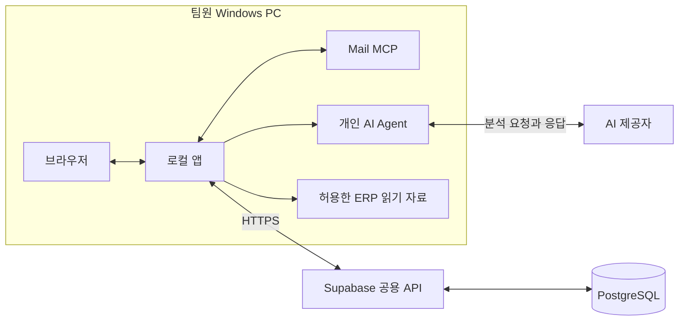

# 메일 분석실 · mail-triage-web

메일과 ERP 읽기 자료를 AI로 분석하고, 보고서·추가 질문·처리 상태를 팀과 공유하는 앱이다. **현재 팀용 구성은 Supabase 공용 API·PostgreSQL + 각 Windows PC의 로컬 앱·Mail MCP·개인 AI Agent**다. 브라우저는 화면을 제공하고, 분석 프로세스는 사용자 PC에서 실행한다.

최종 목표는 원격 SR 분석→구현→검증→PR 자동화다. 먼저 팀 배포와 피드백을 진행하며, 원격 실행·코드 수정·PR은 후속 단계다. 현재 ERP 코드·DB는 읽기 전용이다.

## 현재 상태

2026-09-22 확인 기준. 실시간 서비스 상태판은 아니다.

- Supabase `history` API·비공개 DB 배포와 실제 로그인·권한·보고서·Runner 재전송 합성 검증 완료.
- Windows `0.3.0-candidate.3` 설치 및 개발 PC에서 hosted 로그인 확인. `releaseApproved=false`인 검증 후보다.
- 개인 Mail MCP·Agent·ERP 자료 연결, 실제 두 PC 업무 파일럿, 팀원용 간편 설치 묶음은 남아 있다.
- 백업 설정은 사용자 요청으로 보류. 독립된 hosted 백업·복원 완료로 표시하지 않는다.
- 기존 단일 사용자 Docker 서비스(v0)는 보존한다. 공용 Supabase DB와 별개다.

완료 근거와 미완료 범위는 [현재 상태](docs/current-status.md), 작업 순서는 [통합 구현 계획](docs/implementation-plan.md)을 따른다.

## 구조



로컬 앱은 `127.0.0.1`에만 바인딩한다. DB 자격과 JWT 서명키는 서버에 두고, 팀원 PC는 사용자 로그인으로 API를 이용한다. 앱을 종료하거나 PC를 끄면 그 PC의 분석은 계속 실행되지 않는다. 저장된 공유 보고서는 권한이 있는 다른 PC에서 조회할 수 있다.

## 문서 읽는 순서

| 목적 | 문서 |
|---|---|
| 전체 문서 찾기 | [문서 안내](docs/README.md) |
| 배치와 역할 이해 | [아키텍처](docs/architecture.md) |
| 코드 구조와 수정 위치 찾기 | [내부 구조](docs/internals.md) |
| 로그인·분석·동기화·복구 이해 | [주요 흐름](docs/workflows.md) |
| 기능·제약·기술 스펙 확인 | [제품 스펙](docs/specification.md) |
| API와 DB 구조 확인 | [API 계약](docs/reference/api.md), [데이터 모델](docs/reference/data-model.md) |
| 자료 이동과 보안 경계 확인 | [보안과 데이터](docs/security.md) |
| 개발·설치·운영 | [개발 안내](docs/guides/development.md), [Windows 설치](docs/operations/windows.md), [Supabase 운영](docs/operations/supabase.md) |
| 제한 팀 배포 | [팀 파일럿 절차](docs/operations/team-pilot.md) |
| 기존 Docker 서비스 유지 | [v0 운영 진입점](docs/operations/legacy-v0.md) |

## 개발 시작

저장소 루트에서 Node.js 24 환경으로 실행한다. Windows 패키지 빌드는 Windows x64·Node v24.16.0으로 고정한다.

```powershell
npm.cmd ci --ignore-scripts --no-audit --no-fund
npm.cmd run check
npm.cmd run build
node scripts/build-edge.mjs
```

빌드는 배포나 서비스 재시작을 수행하지 않는다. **`npm start`와 루트 `compose.yaml`은 기존 v0용**이다. 팀용 공용 API·로컬 앱의 별도 진입점과 DB를 이용하는 검증 명령은 [개발 안내](docs/guides/development.md)를 따른다.

현재 팀원용 원클릭 설치기는 없다. 후보 설치·실행·정상 종료는 [Windows 안내](docs/operations/windows.md)에 정리했다. 팀원에게 개발자 설치 폴더 전체나 `secrets`·`work`를 복사하지 않는다.

## 운영 원칙

- 관리자 발급 사용자명 계정, 첫 비밀번호 변경, 서버의 현재 세션·자료 권한 검사를 사용한다. Auth0는 현재 인증 경로가 아니다.
- 메일 원문·비밀·운영 dump를 Git에 넣지 않는다. 로컬에서 AI를 실행해도 입력 자료는 AI 제공자에게 전송될 수 있다.
- ERP 쓰기, 메일 발송·삭제·읽음 변경, 자동 merge·운영 배포는 현재 범위 밖이다.
- 기존 DB·Worker·개인 AI/MCP 설정을 보존한다. `docker compose down -v`를 사용하지 않는다.
- 구현, 합성 검증, 실제 배포, 실제 업무 수용을 구분한다. 과거 기록은 [보존 문서](docs/archive/README.md)에서 찾는다.
