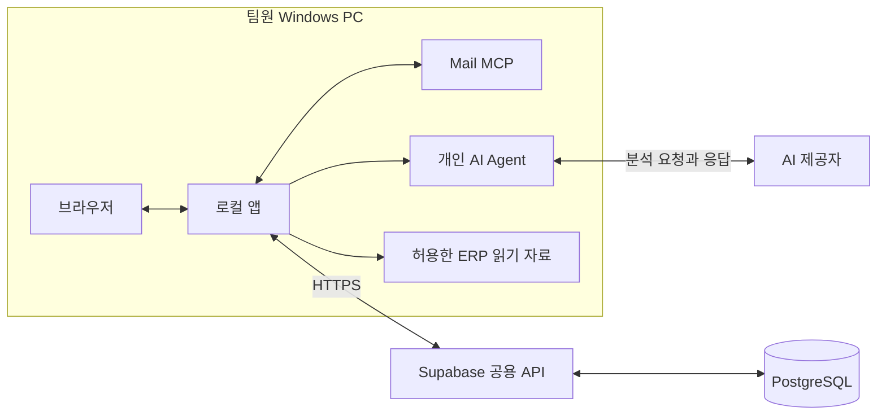

# 메일 분석실 · mail-triage-web

메일과 ERP 읽기 자료를 AI로 분석하고, 보고서·추가 질문·처리 상태를 팀과 공유하는 앱이다. **현재 팀용 구성은 Supabase 공용 API·PostgreSQL + 각 Windows PC의 로컬 앱·Mail MCP·개인 AI Agent**다. 브라우저는 화면을 제공하고, 분석 프로세스는 사용자 PC에서 실행한다.

최종 목표는 원격 SR 분석→구현→검증→PR 자동화다. 먼저 팀 배포와 피드백을 진행하며, 원격 실행·코드 수정·PR은 후속 단계다. 현재 ERP 코드·DB는 읽기 전용이다.

## 할 수 있는 일

- 개인 Mail MCP에 저장된 메일을 검색하고 본문·첨부를 확인한다.
- Codex 또는 Claude Code로 메일을 분석하고 보고서를 공용 저장소에 저장한다.
- 같은 메일을 받은 팀원이 공유한 분석을 자신의 메일함에서 조회한다.
- 보고서에 질문·의견을 남기고, 편집 권한이 있으면 새 버전을 저장한다. 동시 수정 시 초안을 보존하고 최신 버전과 비교한다.
- 메일 처리 완료 상태를 개인별로 관리한다.

## 설치 전 준비

| 준비 항목 | 용도 |
|---|---|
| Windows x64 PC | 로컬 앱 실행. 배포 패키지에 Node.js가 포함되어 별도 Node 설치는 필요 없다. |
| 앱 설치 파일과 팀 접속 정보 | 담당자에게 설치 파일, 공용 API URL, 인증 issuer URL을 받는다. |
| 앱 계정 | 관리자가 발급한 사용자명·임시 비밀번호로 로그인한다. 공개 회원가입은 없다. |
| 개인 Mail MCP | 메일함 조회에 필요하다. 기존에 쓰던 HTTP MCP와 그 메일 저장소를 그대로 사용할 수 있다. |
| 개인 AI 도구 | 새 분석·AI 질문에 필요하다. Codex 또는 Claude Code를 설치하고 해당 도구에서 제공자 로그인을 마친다. |
| ERP 읽기 자료·DB MCP | 해당 근거가 필요한 분석에만 연결한다. |

공유된 보고서 조회 자체에는 새 AI 분석이 필요하지 않다. 개인 AI 이용 자격과 Mail MCP는 앱 설치 파일에 포함되지 않는다.

### WSL에 설치한 Codex·Claude Code

**0.3.13부터 Codex와 Claude Code 각각 Windows/WSL 실행 환경을 선택**할 수 있다. 기존 0.3.11·0.3.12 사용자는 새 설치본으로 업데이트해야 한다. 실제 WSL의 로그인·분석·중지는 별도 수용 검증이 필요하다.

**설정 → 개인 연결 → 연결 환경**에서 사용할 도구의 실행 환경을 `WSL`로 바꾸고 배포판·Linux 실행 파일을 지정한다. 두 도구가 서로 다른 배포판을 사용하거나 Windows/WSL을 함께 사용해도 된다. 선택한 Linux 사용자로 CLI 설치·제공자 로그인과 Python 3 준비를 마쳐야 한다. **실행 확인**으로 경로·CLI 기능·Windows 앱 연결을 검사한 뒤 저장한다. 이 검사는 AI 로그인이나 실제 분석 성공까지 확인하지 않는다.

WSL에서 Windows 앱의 localhost에 접근할 수 있어야 한다. WSL2는 mirrored 네트워크가 필요하며 기본 NAT 환경은 이번 지원 범위에 포함하지 않는다. 앱이 WSL·방화벽 설정을 자동 변경하지 않는다. [WSL 설정 및 문제 해결](docs/operations/windows.md#wsl에서-codexclaude-code-실행)을 참고한다.

## 설치와 첫 실행

### 1. 설치 파일 받기

팀 담당자가 안내한 버전의 설치 파일을 받는다. 게시된 파일은 [GitHub Releases](https://github.com/srp-david/mail-triage-automation/releases)에서 확인할 수 있다.

**2026-09-28 기준, 최신 로컬 설치본은 0.3.5다.** 0.3.4의 공유 분석에 Codex exe 자동 찾기 보완을 포함하며 개발 PC 설치를 마쳤다. ZIP은 별도 전달 대상이고 아직 GitHub Release·자동 업데이트 catalog에 게시하지 않았다. 기존 candidate 릴리스를 내려받으면 아래 최신 기능이 모두 포함되지 않는다.

### 2. Windows에 설치하기

**담당자가 제공한 `버전-setup.exe`가 있는 경우:** 실행한 뒤 안내에 따라 설치한다. 최초 설치에서는 공용 API URL과 인증 issuer URL을 입력한다. 기본 설치 위치는 `%LOCALAPPDATA%\MailTriagePilot`이며 바탕화면에 **메일 분석실** 바로가기를 만든다. 업데이트할 때는 트레이에서 기존 앱을 종료하고 같은 위치에 설치한다.

**0.3.5 ZIP으로 설치하는 경우:** 전달받은 SHA-256과 파일 해시를 대조하고 빈 폴더에 압축을 푼다. 다음 명령은 PowerShell에서 실행하며 `$payload`를 실제 압축 해제 경로로 바꾼다. ZIP 루트에 `node.exe`, `manifest.json`, `installer`가 있어야 한다.

```powershell
# 압축 해제 전, 출력된 해시를 담당자가 전달한 SHA-256과 대조한다.
Get-FileHash -LiteralPath "$env:USERPROFILE\Downloads\0.3.5.zip" -Algorithm SHA256

$payload = Join-Path $env:USERPROFILE 'Downloads\0.3.5'
$installRoot = Join-Path $env:LOCALAPPDATA 'MailTriagePilot'
& (Join-Path $payload 'node.exe') (Join-Path $payload 'installer\manage.mjs') install $installRoot $payload --candidate
if ($LASTEXITCODE -ne 0) { throw '설치 실패: 오류를 확인하세요.' }
```

ZIP 최초 설치는 `%LOCALAPPDATA%\MailTriagePilot\config\settings.json`도 준비해야 한다. 아래 예시의 두 `PROJECT`를 담당자가 전달한 실제 값으로 바꾸고 UTF-8로 저장한다. 기존 파일이 있으면 덮어쓰지 않는다. EXE 설치에서는 이 기본 설정을 입력받아 생성한다.

```json
{
  "localPort": 43180,
  "historyUrl": "https://PROJECT.supabase.co/functions/v1/history",
  "auth": {
    "mode": "username",
    "issuer": "https://PROJECT.supabase.co/history-auth",
    "audience": "mail-triage"
  },
  "evidenceRoots": {}
}
```

팀마다 접속 정보가 다를 수 있으므로 [설정 예시](deploy/supabase/local-settings.example.json)를 기준으로 담당자에게 확인한다. 서버 DB 비밀번호·JWT 서명키는 PC 설정에 넣지 않는다.

### 3. 실행하고 로그인하기

EXE 설치는 **메일 분석실** 바로가기로 실행한다. ZIP 설치는 다음 명령으로 활성 버전을 실행한다. 앱이 브라우저를 열고, 이미 실행 중이면 기존 앱의 화면을 다시 연다.

```powershell
$installRoot = Join-Path $env:LOCALAPPDATA 'MailTriagePilot'
$active = Get-Content -LiteralPath (Join-Path $installRoot 'active.json') -Raw | ConvertFrom-Json
if ($active.version -notmatch '^\d+\.\d+\.\d+(-[a-z0-9.-]+)?$') { throw '잘못된 버전' }
$release = Join-Path (Join-Path $installRoot 'releases') $active.version
& (Join-Path $release 'node.exe') (Join-Path $release 'installer\lifecycle.mjs') start $installRoot --candidate
if ($LASTEXITCODE -ne 0) { throw '실행 실패: 오류를 확인하세요.' }
```

현재 시험용 패키지는 `releaseApproved=false`이므로 수동 설치·실행에 `--candidate`를 사용한다. manifest를 직접 수정하지 않는다. 일반 `launch.ps1`은 시험용 패키지 실행을 거절하므로 위 명령을 사용한다.

발급받은 사용자명·임시 비밀번호로 로그인하고 첫 비밀번호 변경을 완료한다. 이후 비밀번호는 **내 계정 → 비밀번호 변경**에서 바꾼다. 로그인 유지 조건은 [로그인 안내](docs/operations/login.md)를 참고한다.

## 처음 연결하기

1. **설정 → 연결 환경**에서 **이 PC에서 자동 찾기**를 실행하거나 Mail MCP 주소를 입력한다. 기존 MCP를 먼저 실행하고 **Mail MCP 연결 확인**으로 통신을 확인한다.
2. 새 분석을 사용할 경우 Codex 또는 Claude Code의 실행 경로·인수를 설정하고 실행 확인을 한다. Windows에서는 앱 버전 폴더 밖의 `codex.exe`·`claude.exe`를 사용한다. 0.3.5부터 Codex 자동 찾기는 npm 설치에서도 실제 `codex.exe`를 찾으며 앱에 포함된 `node.exe`를 추천하지 않는다. 기존 Node 기반 설정을 바꾸는 방법은 [Codex 경로 안내](docs/operations/windows.md#codex-실행-파일-자동-찾기-v035)를 참고한다. 필요하면 ERP 읽기 자료 폴더·DB MCP를 추가한다.
3. **연결 환경 저장** 후 **분석 준비** 탭으로 이동한다.
4. 자신의 메일 출처를 선택한다. 처음 사용하는 저장소라면 **처음 연결하는 메일 등록 → 현재 MCP 출처 등록**으로 등록한다. 기존 출처 복원은 화면의 원본 재연결 절차로 대조한다.
5. 분석할 AI 도구를 선택하고 **이 PC 실행 장치 등록**으로 장치를 등록·선택한다. 선택을 저장한 뒤 **실행 상태 확인 → 분석 실행 켜기**를 누른다.

동기화 작업을 앱에서 요청할 때는 **동기화 실행 켜기**도 사용한다. 설정을 변경하거나 로그아웃하면 실행이 중지되므로 필요한 실행을 다시 켠다. 상세 화면 설명은 [Windows 연결 안내](docs/operations/windows.md)를 참고한다.

## 메일 분석과 공유 보고서 사용하기

### 기존에 동기화한 메일 보기

이미 Mail MCP로 동기화했다면 **같은 MCP와 같은 메일 저장소**를 연결해 출처를 선택한다. 앱은 그 저장소의 목록을 조회하므로 기존 목록을 보기 위해 전체 메일을 다시 동기화할 필요는 없다. 새 메일을 가져오는 동기화는 별도 작업이다.

다른 PC나 새 MCP 저장소를 연결하면 그 저장소에 있는 메일이 표시된다. Supabase의 공유 보고서가 개인 메일함 원문·첨부를 복원해 주는 것은 아니다.

### 새 분석 시작하기

1. 메일함에서 검색하거나 목록의 메일을 선택해 본문·첨부를 확인한다.
2. 먼저 **공유 분석**에 기존 보고서가 있는지 확인한다.
3. 새 분석이 필요하면 분석을 요청한다. 이 PC의 분석 실행이 켜져 있어야 한다.
4. 완료 후 보고서를 열어 결과를 확인하고 필요한 질문·의견을 추가한다. 처리 완료 상태는 개인별로 관리된다.

### 같은 메일의 공유 분석 보기

보고서 소유자가 팀 읽기 또는 편집 공유를 설정하면, 같은 팀의 다른 사용자는 자신의 메일함에서 동일 메일을 클릭해 **공유 분석**을 열 수 있다. 이관된 기존 분석도 같은 방식으로 조회한다.

메일은 Message-ID·발신자·발송 시각·제목의 식별 정보를 함께 대조한다. 제목만 같거나 필요한 헤더가 부족하면 자동 연결하지 않는다. 팀 공유 권한과 동일 메일 연결이 모두 필요하며, 개인 원본 메일·첨부·처리 상태가 함께 공유되지는 않는다.

동일 메일로 연결된 분석이 이미 대기·실행 중이면 팀 내 중복 실행을 막는다. 완료된 보고서가 있다는 이유만으로 이후의 모든 재분석을 금지하지는 않는다.

### 질문·수정·버전 관리

보고서 대화에 질문·추가 조사·결정·회신 초안을 남길 수 있다. 개인 Agent 질문을 실행하면 답변은 대화에 저장된다. 보고서 본문에 반영하려면 편집 권한이 있는 사용자가 수정 내용을 명시적으로 저장한다.

수정할 때마다 새 버전이 생긴다. 다른 사용자가 먼저 저장했다면 덮어쓰지 않고 충돌을 알리며 초안을 보존한다. 최신 내용과 비교한 뒤 기준 버전을 갱신해 다시 저장한다. 자세한 동작과 권한은 [공용 분석 협업](docs/operations/shared-analysis.md)에 정리했다.

## 종료·업데이트·문제 해결

브라우저 창을 닫아도 로컬 앱은 계속 실행된다. Windows 알림 영역의 봉투 아이콘에서 **앱 종료**를 선택하면 분석·동기화와 로컬 서버를 종료한다. **작업 중지**는 화면을 유지하면서 실행을 멈추며 진행 중 작업도 중단될 수 있다.

수동 종료는 위 실행 예시에서 설정한 `$release`, `$installRoot`로 다음 명령을 실행한다.

```powershell
& (Join-Path $release 'node.exe') (Join-Path $release 'installer\lifecycle.mjs') stop $installRoot
```

업데이트는 실행 중 작업을 확인하고 앱을 정상 종료한 뒤, 새 버전을 기존 설치 위치에 설치한다. 설정·로그인·작업 기록을 보존하며 파일을 직접 덮어쓰거나 잠금 파일을 지우지 않는다. 앱 업데이트 화면은 서버가 제공한 버전만 안내하므로 별도 전달한 0.3.5가 자동으로 표시되지는 않는다.

| 증상 | 확인할 내용 |
|---|---|
| 메일 목록이 비어 있음 | MCP 실행·주소·선택한 출처·해당 저장소의 동기화 상태를 확인한다. |
| 공유 분석이 보이지 않음 | 같은 팀인지, 보고서 공유가 켜졌는지, 동일 메일 식별 정보가 있는지 확인한다. |
| 분석이 대기 중임 | 개인 AI 로그인, 실행 경로, 이 PC의 장치 선택과 분석 실행 상태를 확인한다. |
| 설치 시 실행 중이라고 표시됨 | 트레이에서 앱을 정상 종료한 뒤 다시 설치한다. 잠금 파일을 임의 삭제하지 않는다. |
| 앱 주소를 직접 열었는데 접근이 거절됨 | 바로가기 또는 위 실행 명령으로 화면을 열어 로컬 브라우저 세션을 발급받는다. |
| 중단된 작업이 있음 | **설정 → 중단 작업 복구**에서 기록을 확인한다. 분석을 무조건 재실행하지 않는다. |

진단·복구·롤백은 [Windows 운영 안내](docs/operations/windows.md)를 따른다. 다른 사람에게 자신의 설치 폴더 전체나 `config`·`secrets`·`work`를 복사해 주지 않는다.

## 현재 검증 범위

2026-09-28 확인 기준이며 실시간 서비스 상태판은 아니다.

- Supabase 공용 API 배포, 기존 공유 보고서 43건·메일 연결 39건 이관 및 원본 보존 확인.
- 개발 PC 0.3.2→0.3.4 설치·기동, 기존 설정·로그인 보존, 이관 보고서·협업 정보 조회 확인.
- 전체 테스트 164건, 로컬 Supabase Edge 검증 12군 통과. 실제 개인 MCP/Agent 분석·두 PC 업무 수용은 남아 있다.
- 개발 PC 0.3.4→0.3.5 설치와 Codex exe 설정·실행 옵션 검사 완료. 관련 테스트 8건·정적 검사·빌드 통과. 실제 AI 분석을 실행한 검증은 아니다.
- 0.3.4·0.3.5 GitHub 게시·자동 업데이트 catalog 갱신은 미실행. 외부 백업 설정은 보류 상태다.
- 기존 단일 사용자 Docker 서비스(v0)는 보존하며 공용 Supabase DB와 별개다.

완료 근거와 미완료 범위는 [현재 상태](docs/current-status.md), 작업 순서는 [통합 구현 계획](docs/implementation-plan.md)을 따른다.

## 구조


```mermaid
flowchart LR
  subgraph PC[팀원 Windows PC]
    UI[브라우저] <--> Local[로컬 앱]
    Local <--> MCP[Mail MCP]
    Local --> Agent[개인 AI Agent]
    Local --> Evidence[허용한 ERP 읽기 자료]
  end
  Local <-->|HTTPS| API[Supabase 공용 API]
  API <--> DB[(PostgreSQL)]
  Agent <-->|분석 요청과 응답| Provider[AI 제공자]
```

로컬 앱은 `127.0.0.1`에만 바인딩한다. DB 자격과 JWT 서명키는 서버에 두고, 팀원 PC는 사용자 로그인으로 API를 이용한다. 앱을 종료하거나 PC를 끄면 그 PC의 분석은 계속 실행되지 않는다. 저장된 공유 보고서는 권한이 있는 다른 PC에서 조회할 수 있다.

## 문서 읽는 순서

| 목적 | 문서 |
|---|---|
| 전체 문서 찾기 | [문서 안내](docs/README.md) |
| 배치와 역할 이해 | [아키텍처](docs/architecture.md) |
| 코드 구조와 수정 위치 찾기 | [내부 구조](docs/internals.md) |
| 로그인·분석·동기화·복구 이해 | [주요 흐름](docs/workflows.md) |
| 기능·제약·기술 스펙 확인 | [제품 스펙](docs/specification.md) |
| API와 DB 구조 확인 | [API 계약](docs/reference/api.md), [데이터 모델](docs/reference/data-model.md) |
| 자료 이동과 보안 경계 확인 | [보안과 데이터](docs/security.md) |
| 개발·설치·운영 | [개발 안내](docs/guides/development.md), [Windows 설치](docs/operations/windows.md), [Supabase 운영](docs/operations/supabase.md) |
| 제한 팀 배포 | [팀 파일럿 절차](docs/operations/team-pilot.md) |
| 기존 Docker 서비스 유지 | [v0 운영 진입점](docs/operations/legacy-v0.md) |

## 개발 시작

저장소 루트에서 Node.js 24 환경으로 실행한다. Windows 패키지 빌드는 Windows x64·Node v24.16.0으로 고정한다.

```powershell
npm.cmd ci --ignore-scripts --no-audit --no-fund
npm.cmd run check
npm.cmd run build
node scripts/build-edge.mjs
```

빌드는 배포나 서비스 재시작을 수행하지 않는다. **`npm start`와 루트 `compose.yaml`은 기존 v0용**이다. 팀용 공용 API·로컬 앱의 별도 진입점과 DB를 이용하는 검증 명령은 [개발 안내](docs/guides/development.md)를 따른다.

Windows 패키징·설치기와 배포 규칙은 [Release 운영](docs/operations/releases.md)을 따른다. 로컬 패키지 생성, GitHub 게시, 공용 API 배포는 별도 단계다.

## 운영 원칙

- 관리자 발급 사용자명 계정, 첫 비밀번호 변경, 서버의 현재 세션·자료 권한 검사를 사용한다. Auth0는 현재 인증 경로가 아니다.
- 메일 원문·비밀·운영 dump를 Git에 넣지 않는다. 로컬에서 AI를 실행해도 입력 자료는 AI 제공자에게 전송될 수 있다.
- ERP 쓰기, 메일 발송·삭제·읽음 변경, 자동 merge·운영 배포는 현재 범위 밖이다.
- 기존 DB·Worker·개인 AI/MCP 설정을 보존한다. `docker compose down -v`를 사용하지 않는다.
- 구현, 합성 검증, 실제 배포, 실제 업무 수용을 구분한다. 과거 기록은 [보존 문서](docs/archive/README.md)에서 찾는다.
