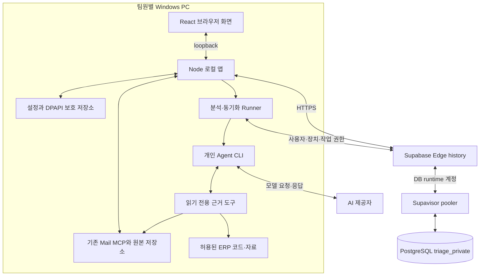

# 현재 아키텍처

기준: 2026-09-22 코드. 실제 연결·검증 범위는 [현재 상태](current-status.md), 미래 구성은 [통합 계획](implementation-plan.md)을 따른다.

## 1. 배치와 책임

Runner와 근거 도구는 로컬 앱이 사용하는 모듈이다. 그림의 상자가 각각 별도 Windows 서비스라는 뜻은 아니다. Agent CLI는 필요할 때 자식 프로세스로 실행하며, Mail MCP는 별도로 준비한 외부 프로세스다.

| 구성 요소 | 책임 | 맡지 않는 일 |
|---|---|---|
| 브라우저 | 검색·메일·보고서·설정 UI | DB 접속, 서버 비밀 보관, 직접 Agent 기동 |
| 로컬 앱 | 브라우저 세션, 공용 API 중계, 개인 MCP·자료·Runner 연결 | 공용 DB 소유, 자동 서버 배포 |
| Runner | 작업 claim, heartbeat, 실행·중지, 결과 outbox·복구 | 다른 PC의 장치 자격 사용 |
| 공용 API | 인증·현재 세션·자료 ACL, 작업·보고서·리뷰 저장 | 사용자 PC 파일 직접 접근, 장시간 AI 실행 |
| 공용 DB | 계정·권한·작업·분석 이력의 공용 원장 | 모든 PC의 메일 원본 자동 수집 |
| Mail MCP | 해당 환경의 메일 검색·본문·첨부·동기화 | 앱 계정·공유 권한 관리 |
| AI Agent | 허용된 근거를 읽고 결과 JSON 생성 | ERP 수정·운영 DB 쓰기·PR 발행 |

## 2. 로컬 앱의 형태

설치본은 Node 실행 파일과 JavaScript·React 정적 파일의 묶음이다. Electron/WebView 앱이나 설치형 DB가 아니다. 브라우저 UI는 같은 PC의 `127.0.0.1`로 접속하고, 앱은 HTTPS로 공용 API를 호출한다.

앱 기본 포트는 3080이고 Supabase 후보 설정은 기존 v0와 충돌하지 않는 43180이다. 일반 Node 공용 API의 개발 기본값은 `127.0.0.1:3081`이다. Supabase Edge 외부 경로는 `/functions/v1/history`다. 이 세 주소의 역할을 혼동하지 않는다.

시작 도구는 후보 승인·manifest·포트를 확인하고 백그라운드 앱을 실행한다. 브라우저는 60초 일회용 ticket으로 진입한다. 창을 닫아도 앱은 계속 실행될 수 있으며, 정상 종료는 별도 제어 API로 Runner와 HTTP listener를 정리한다. 현재 후보는 부팅 시 자동 실행·트레이 아이콘·일반 사용자용 원클릭 설치를 제공하지 않는다.

## 3. 공용 API와 저장 방식

Node 진입점과 Edge 진입점은 동일한 `createUsernameApp`과 도메인 로직을 사용한다. Edge는 실행 어댑터이며 Supabase Auth를 쓰는 것은 아니다. 사용자명/비밀번호와 자체 ES256 JWT·DB 세션을 사용한다.

DB는 PostgreSQL 전용 `pg` 드라이버, jsonb, advisory lock, 부분 unique index 등을 사용한다. 현재 `HISTORY_SCHEMA=triage_private`와 작은 연결 pool을 사용하며 트랜잭션마다 `search_path`를 지정한다. migration 계정과 실행 계정은 분리한다. Data API는 껐고 앱은 일반 Supabase 클라이언트 라이브러리로 테이블에 접근하지 않는다.

API의 원격 호출은 로컬 앱/CLI의 서버 간 호출이다. 일반 브라우저의 cross-origin 직접 접근을 거절한다. 따라서 API URL만 팀원에게 전달하는 것은 앱 배포가 아니다.

## 4. 식별자와 자료 소유

- `userId`: 앱 사용자. 계정 역할과 자료 소유 권한은 별개다.
- `sourceId`: 팀 안에서 권한을 부여하는 메일 출처. 원본 MCP 연결의 `instanceId`를 갖는다.
- `runnerId`: 사용자 소유 실행 장치. 허용 Agent와 source 목록을 갖는다.
- `runId`: 한 번의 분석. 보고서는 기존 결과를 덮어쓰지 않고 실행별로 저장한다.
- `requestId`: 같은 논리 요청의 재전송을 식별한다. 새 UUID로 무조건 재시도하지 않는다.

PC A의 123번 메일과 PC B의 123번 메일은 같은 메일로 간주하지 않는다. source·메일 ID·Message-ID 등 검증된 식별자를 함께 사용한다. 공유 보고서 권한은 원본 접근 경로를 자동 생성하지 않는다.

## 5. 실행 경계와 제약

메일 원문·추가 질문·읽기 자료는 분석 과정에서 AI 제공자에게 전달될 수 있다. 보고서와 사용자 답변에도 업무 내용이 저장되므로 클라우드에 원문이 전혀 남지 않는다고 보장하지 않는다. [데이터 이동과 보호](security.md)를 따른다.

현재 local-app은 Mail MCP와 파일 근거를 연결한다. DB 조회는 등록된 query provider만 허용하는 인터페이스가 있지만 진입점에서 실제 ERP DB provider를 주입하지 않는다. 기존 v0의 DB MCP 설정이 v1으로 자동 승계되지 않는다.

Edge에는 Agent·메일 동기화 장시간 프로세스를 두지 않는다. PC 종료·절전 동안 해당 PC의 작업은 계속 처리되지 않는다. 다른 사용자의 독립된 PC와 공용 API는 별도로 동작한다. 완전한 오프라인 제품은 아니다.

## 6. 기존 v0와 이후 원격 전환

| 구분 | 기존 v0 | 현재 v1 | 후속 M4/M5 |
|---|---|---|---|
| 화면·실행 | Docker API와 Codex Worker | PC의 브라우저·로컬 앱·개인 Agent | 공용 웹과 원격 실행 서버 계획 |
| 인증 | 기존 공유 토큰 | 관리자 발급 사용자명 계정 | 서비스 주체·원격 웹 세션 별도 설계 |
| DB | 기존 Docker PostgreSQL | Supabase PostgreSQL | 이전 플랫폼·엔진 별도 결정 |
| 코드 수정·PR | 현재 앱 범위 밖 | 미제공 | 격리 구현·검증·발행 단계 계획 |

기존 v0는 기본 `npm start`·루트 Compose 경로로 남아 있다. 사용자 데이터나 프로세스를 새 팀 구성으로 자동 전환하지 않는다. AWS 이전 시 공용 API/DB 이전과 원격 Runner 배치를 구분하며, `cvslog` MariaDB는 접속 주소만 바꿔 쓸 수 있는 호환 DB가 아니다.

근거 코드: [로컬 진입점](../apps/local-app/src/main.ts), [공용 앱](../apps/history-api/src/username-app.ts), [Edge 진입점](../apps/history-api/src/edge.ts), [DB 연결](../apps/history-api/src/db.ts).
