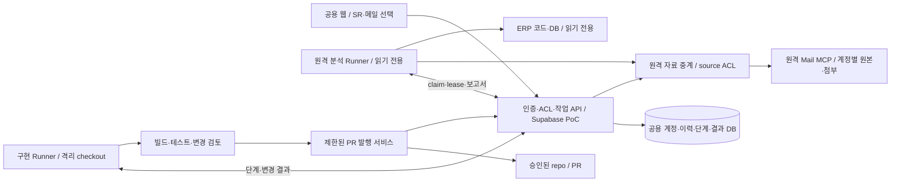
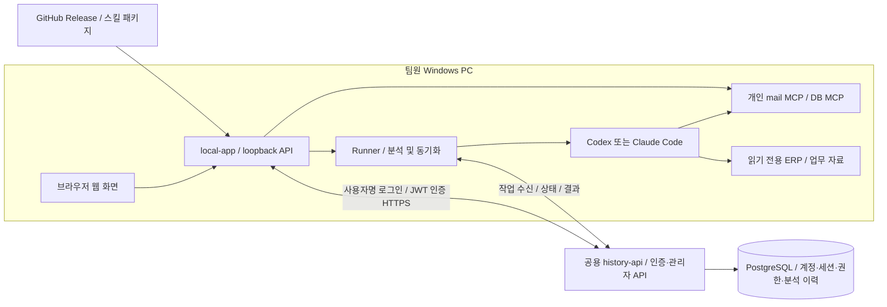

# v2.1 계획 보존본 — 현재 실행 기준 아님

2026-09-21 원본 `6ceecf2`의 본문을 그대로 보존했다. 아래 과거 Supabase 우선안·단계 ID·현재/미착수 표현은 당시 기록이다. 최신 사용자 결정, 팀 배포 우선 순서와 AWS/DB 검토는 [통합 구현 계획](../implementation-plan.md)을 따른다. 새 백로그나 상태를 이 파일에 갱신하지 않는다.

---

# mail-triage-web 통합 구현 계획

문서 버전: 2.1 · 갱신일: 2026-09-21 · 상태: **최종 목표는 사용자 PC가 꺼져 있어도 웹에서 SR/메일 분석 → 보고서 → AI 구현 → 검증 → PR 생성까지 진행하는 원격 파이프라인이다.** 이번 원본 작업은 계획 정합화 완료이며 원격 구현·배포 완료가 아니다. 원본 `23863ab`에는 A1~A7 새 인증 구현이 없고, 별도 Supabase PoC `8303d52`는 로컬 완료 결과가 확인됐으나 미병합이다(18.6절). A8 및 원격 종단 검증은 대기한다. 기존 P1~P6 로컬 검증은 새 목표의 완료 근거가 아니다. P8 공용 실행은 필수 범위로 전환하고 18절 S1~S7로 구체화한다. [이전 로컬 검증](local-completion-2026-09-18.md), [검증 기록](../validation.md), [현재 코드의 실행 경계](v1-development-2026-09-22.md).

이 문서는 앞으로의 범위·기술 선택·실행 순서의 단일 기준이다. **공용 웹·DB·Mail MCP·원격 Runner**가 최종 구성이며 개인 PC의 웹·MCP·개인 AI 실행은 초기/과도기 구성이다. 추가 인프라 비용을 최소화하기 위해 Supabase Free의 계정·이력·작업 제어 적합성을 먼저 검증한다. 장시간 AI·빌드와 Mail MCP의 원격 호스트·저장소·네트워크·AI 비용은 별도 결정한다. 사용자명·앱 비밀번호, 관리자 생성 계정, JWT와 서버의 현재 세션/역할/자료 ACL 원칙을 유지한다. Auth0·인증 이메일·SES 연결은 제외하고 기존 SES의 다른 용도는 보존한다. 실제 저장소 수정·push·PR 발행은 대상과 권한을 후속 확정해야 하며 자동 merge·운영 배포·운영 DB 쓰기는 범위 밖이다. 인증 세부 계획은 17절, 전체 실행 순서와 완료 기준은 18절을 따른다.

문서 안내는 [문서 목록](../README.md), 현재 실행법은 [프로젝트 README](README-v0-2026-09-22.md), 검증 근거는 [검증 기록](../validation.md), 기존 운영 명령은 [운영 안내](../operations/legacy-maintenance.md)를 따른다. 과거 계획과 완료 체크리스트는 [구현 이력](implementation-history-2026-09-17.md), 이전 배포 비교는 [이전 배포 제안](team-deployment-proposal-2026-09-17.md)에 보존한다.

## 1. 결정과 범위

### 1.1 사용자 결정과 이번 설계의 기본값

| 구분 | 내용 |
|---|---|
| 사용자 결정 | 로그인 ID는 사용자명이며 앱 전용 비밀번호를 사용한다. 이메일 주소·메일 소유 인증을 요구하지 않는다. |
| 사용자 결정 | 관리자 계정으로 접속하면 관리자 메뉴를 표시하고 관리자가 사용자 계정을 추가한다. 공개 회원가입은 제공하지 않는다. |
| 사용자 결정 | Auth0와 인증용 SES/SMTP 연결을 제외하고 계정·로그인·권한을 공용 서버에 통합한다. 개인 PC에는 DB 접속 자격이나 서버 서명키를 배포하지 않는다. |
| 사용자 결정 | 개인 PC의 앱·MCP·개인 AI는 과도기 구성이다. 최종 서비스는 사용자 PC 종료 상태에서도 실행한다. |
| 사용자 결정 | 공용 웹에서 작업을 등록하고 원격 Mail MCP·분석 Runner·구현 Runner·검증·PR 결과를 연결한다. |
| 사용자 결정 | 앱·스킬·설치 프로그램을 GitHub 등으로 배포한다. 저장소 공개 범위와 게시 시점은 아직 정하지 않았다. |
| 설계 기본값 | 한 회사·한 팀으로 시작한다. 최초 관리자는 운영자 전용 초기화 절차로 생성하고, 이후 관리자가 등록한 사용자만 로그인한다. 임시 비밀번호로 첫 로그인 시 본인 비밀번호 설정을 요구한다. |
| 설계 기본값 | 가입과 자료 열람 권한을 분리한다. 개인 출처는 소유자만 접근하고, 팀 공유로 지정한 출처의 이력만 해당 팀에 공개한다. |
| 설계 기본값 | Windows x64 로컬 앱, Node.js 24 + TypeScript + Express, PostgreSQL 17, 자체 JWT 인증·서버 세션 관리. 사용자명 규칙·토큰 수명 등 수치 기본안은 A1에서 확정한다. |
| 설계 기본값 | Supabase Free PostgreSQL + Edge Functions/DB 함수로 공용 제어를 검증한다. 기존 Linux VM/Compose안은 대안이며 유료 VM 구매를 전제하지 않는다. |
| 미확정 | 최초 관리자·팀·자격 전달/복구, hosted PoC, 웹/Runner/MCP 호스트·DNS/TLS·저장소·백업, AI 실행 자격/비용, 대상 repo/branch와 쓰기·PR 권한. 13절에서 필요한 시점을 정한다. |

이전 Auth0 회사 이메일 자동 가입 및 이메일 초대안은 관리자 생성 계정으로 대체한다. 개발자 PC를 상시 팀 서버로 사용하지 않는다. 공용 제어와 원격 실행은 분리하며 같은 VM에 모두 배치할 필요는 없다. 회사 SSO, Redis, Kubernetes, Next.js 전환은 초기 필수 요소가 아니다.

### 1.2 유지할 동작과 경계

- 현재 AGENTS.md에 따라 ERP 소스와 ERP DB는 읽기 전용이다. 향후 구현 Runner의 지정 repo/경로/브랜치 쓰기는 명시적 범위 결정과 해당 지침 조정 후에만 허용한다. 운영 DB 쓰기는 포함하지 않는다. 분석 완료·PR 생성·고객 업무 해결·보고서 공유는 별도 상태로 취급한다.
- 메일 발송·삭제·읽음 변경은 범위 밖이다. 사용자가 누르는 기존 동기화는 유지하되 분석 agent가 자동으로 실행하지 않는다.
- Claude Code를 기본 분석 엔진으로 선택하는 기능을 추가한다. Codex 결과를 자동으로 Claude에 재검토시키는 기능을 추가한다는 뜻은 아니다. 직접 실행의 기존 명시적 리뷰는 유지한다.
- 보고서 버전·리뷰·추가 답변·처리 완료/취소·관련 메일·기존 이력·내보내기를 유지한다. 기존 보고서와 미확정 연결을 임의로 변경하지 않는다.
- 첨부 목록 기본 접힘, 파일당 5 MiB, 기존 이미지·DOCX/PPTX/XLSX 읽기 전용 미리보기, HTML 정제를 유지한다. 첨부 확대·편집은 별도 범위다.
- 비밀과 메일 원문은 Git에 넣지 않는다. 설치 패키지에는 배포 가능한 규칙·템플릿만 넣고 개인 처리 로그·고객 사례·ERP 소스는 넣지 않는다.

### 1.3 P1 전 UI·UX 보완

사용자 요청에 따라 아래 순서로 현재 단일 사용자 화면을 보완했다. 기존 API 계약·DB 구조·Worker는 변경하지 않았다. 검증은 [검증 기록](../validation.md)의 2026-09-17 P1 전 UI·UX 항목을 따른다.

1. 출처·분석별 추가 답변 초안: 탭의 sessionStorage와 메모리로 화면 이동·새로고침·재인증 중 보존. 전송 실패는 유지하고 성공 또는 명시적 삭제 시 제거한다. 저장소 차단 시 제한을 안내한다.
2. 상태별 기본 행동: 분석 시작 / 진행 상황 보기 / 결과 보기 / 실패 내용 보기. 새 분석은 별도 행동으로 두고 등록 직전에 기존 활성 실행을 재확인한다. 최종 동시성 보장은 기존 서버가 담당한다.
3. 메일 선택 강조와 모바일 상세·목록 전환: 검색 조건, 목록 스크롤, 복귀 포커스 유지.
4. 상태 안내: 진행 중 처리 완료 버튼 숨김, 도구 실패와 전체 분석 실패 구분, 분석 결과와 업무 처리 표시 구분, 오래된 등록 알림 제거.
5. 검색·이전 문서: 적용 조건/초기화/빈 결과/조회 실패 재시도, 파일명 우선 표시와 경로·해시 기본 접힘.

이전 Auth0 인증 진입, 초기 설정, 공유 범위·팀원 표시, Runner 연결/큐 복구 UX는 P2~P4의 Native 세션/API에 연결했다. 초안 키에 사용자 식별자를 포함하고 로그아웃 시 메모리/sessionStorage를 정리한다. 자체 사용자명 로그인은 아직 구현되지 않았으며 17절에서 전환한다. 실Auth0 가입·메일 수신 검증은 새 계획에서 제외한다.

### 1.4 메일함 스레드 보기 (2026-09-18 사용자 추가 요청)

- 기본 목록은 답장 헤더로 연결된 대화를 묶고, 펼치면 개별 메일을 선택하는 방식이다. 개별 보기 전환을 제공한다.
- 메일 MCP의 `Message-ID`, `In-Reply-To`, `References`를 사용한다. 제목만 같은 메일은 합치지 않는다. 기존 원본에서 연결 헤더만 보완하며 메일 재수집은 필요 없다.
- 검색·분석 상태 조건에 맞는 메일을 대화로 묶은 뒤 대화 단위로 페이지를 나눈다. 검색 결과 밖의 메일을 자동으로 끼워 넣지 않는다.
- 분석 실행·보고서·처리 완료·관련 메일 연결은 기존 개별 메일 기준을 유지한다. 스레드 전체 분석과 상세 화면의 전체 대화 표시는 이번 범위에 포함하지 않는다.
- MCP와 웹 변경 및 검증 범위는 [스레드 보기 검증](../validation/mail-threads-validation.md)에 기록한다.
- 2026-09-18 추가 화면 요청에 따라 본문 최대 너비 1,460px와 헤더의 중앙 정렬 여백을 제거한다. 창 전체 너비를 사용하고 좌우 여백은 데스크톱 30px·모바일 15px를 유지한다.
- 최신 추가 요청에 따라 ‘묶기’ 버튼을 없애고 드래그로 수동 연결한다. 연결된 메일을 펼쳐 목록 아래 해제 영역으로 끌어내면 해당 메일에 직접 연결된 수동 관계를 한 번에 해제한다. 자동 답장 관계는 유지하며 저장 직후 되돌리기와 접힌 ‘수동 연결 관리’도 유지한다.
- 수동 관계는 기존 공용 PostgreSQL의 별도 테이블에 저장소별로 저장한다. 저장 시 양쪽 MCP ID·Message-ID·수집 시각을 다시 확인하며 메일 원본·답장 헤더·개별 분석 이력은 유지한다. 검색에 가려진 연결도 유지하되 결과에는 조건에 맞는 메일만 표시한다.
- 추가 화면 요청에 따라 검색 조건 영역의 높이를 줄이고 메일함·분석 이력·이전 이력 메뉴를 왼쪽 사이드바로 이동한다. 모바일 메뉴는 버튼으로 펼친다. 검색 설명은 접어서 제공하고 동기화 오류·진행 안내는 유지한다.
- 스크롤 개선 요청에 따라 데스크톱은 메뉴·검색·목록 하단 조작부를 고정하고 목록과 상세 패널이 각각 스크롤되게 한다. 본문·첨부의 중첩 세로 스크롤을 제거하며 재조회·수동 연결 변경 후 현재 페이지와 목록 위치, 메일별 읽던 위치를 유지한다. 모바일 및 높이 700px 이하 창은 문서 스크롤 하나를 사용한다.

## 2. 현재 상태와 변경 지점

아래 표는 2026-09-17의 v0 구성에서 출발한 전환 기준이다. v1 현재 구현·검증 범위는 12절을 따른다. 기존 실행 서비스는 v0를 유지하며 v1 로컬 소스·후보 패키지를 실제 팀 배포 상태로 해석하지 않는다.

| 현재 확인한 구성 | 전환 작업 |
|---|---|
| `src/server.ts`가 웹·메일 MCP·이력 API·동기화 처리기를 함께 실행 | 공용 history-api와 로컬 local-app으로 책임 분리 |
| 하나의 `TRIAGE_TOKEN`을 API와 쿠키에서 공유 | 자체 발급 사용자 JWT, 폐기 가능한 서버 세션, 로컬 세션, 자료별 권한으로 교체 |
| `src/worker.ts`·`worker-gate.ts`가 `history.ts`와 DB를 직접 호출. health 확인 뒤에도 claim은 DB 호출 | Runner가 HTTPS API로 claim/heartbeat/result를 호출하도록 전환 |
| `history.ts`가 실행 예약·불변 결과·lease·중복 요청을 관리 | 서버 내부 서비스로 유지하고 사용자·팀·Runner 범위를 추가 |
| `config.store`와 기본 `local-mail-v1`, 단일 MCP URL | 등록된 source UUID와 PC별 연결 프로필로 교체 |
| API가 분석 등록·관련 메일·기존 이력 연결 때 직접 MCP 재조회 | 로컬 원본 확인과 서버의 출처 권한·입력 검증을 분리하고 확인 주체 기록 |
| `sync.ts`의 공용 DB 상태 + API 내부 스케줄러 | source별 동기화 작업을 등록하고 해당 로컬 프로그램이 묶음별 실행 |
| Worker 전체에 하나의 DB advisory lock, `worker_state.name='codex'` | 메일·작업 단위 잠금 + Runner별 동시 실행 한도로 교체 |
| Docker Worker가 전용 Codex home과 인증 seed를 사용 | 설치형 Runner의 개인 CLI 인증 사용. 기존 사용자 설정을 덮어쓰지 않음 |

기록상 구현된 기능은 메일/첨부/Office·Markdown 보기, 분석·재분석·진행 이벤트, 처리 완료, 관련 메일 연결, 동기화 복구, 이전 이력과 직접 CLI 연동이다. 기록상 실메일 1건의 분석·저장·웹/직접 조회 및 실제 동기화 3건을 확인했다. 이는 모든 메일 유형·새 팀 구조의 검증을 뜻하지 않는다.

기존 문서 33건 중 30건의 최초 대상 연결과 미연결 3건 보존은 [이력 연결 검증](../validation/legacy-link-validation.md)을 따른다. 중복 후보 1건의 판단과 누적 보고서 6건에 포함된 후속 메일 8건의 복수 연결은 별도 잔여 작업이다. 메일 검색 상태 필터의 구현·검증은 [상태 필터 검증](../validation/status-filter-validation.md)에 별도로 기록되어 있다. 진행 이벤트의 실제 agent 종단 검증 등 추가 변경의 완료 여부는 각 검증 기록으로 판단하며 이 문서 작성으로 완료 처리하지 않는다.

기존 잔여 작업은 팀 전환에 묻히지 않도록 별도로 추적한다. L1 중복 후보 연결은 대상 확인 뒤 수행, L2 legacy 복수 연결은 별도 모델·중복 조회 설계 후 구현, L3 기존 로그와 공용 이력의 최종 전환 대조는 P5/P7에서 수행한다. L1/L2 미완료 자료는 제한된 collection에 미연결/기존 연결 상태로 보존해 이관할 수 있으며 완료로 표시하지 않는다. 실제 지식 반영·Outlook 고객 분석은 지정 대상이 있을 때만 수행한다.

## 3. 목표 구성과 데이터 흐름

최종 목표 구성은 아래와 같다. 인증/제어는 짧은 요청만 처리하고 Agent·빌드는 원격 Runner에서 수행한다. 배치 위치는 아직 확정되지 않았다.



메일/첨부는 원격 MCP 저장소, 보고서·단계 메타데이터는 공용 DB, 빌드 로그·diff는 접근 통제된 artifact 저장소에 둔다. 메일 ACL이 보고서·로그·PR 링크 조회에도 적용된다. 비밀은 서버의 용도별 보호 저장소에 두고 분석/구현 Agent에 DB 자격·서명키·PR 토큰을 전달하지 않는다. PR에 넣을 요약·변경 파일은 비밀/메일 원문 유출 검사를 거친다.

### 3.1 과도기 로컬 구성과 보존할 경계

아래 구성·데이터 표는 기존 local-app/개인 Runner 전환안이다. 5~11절의 로컬 연결·설치·VM 상세도 이 과도기 구성에 해당한다. 최종 원격 경계는 14·18절로 확장하며 개인 PC의 DPAPI를 원격 서비스 자격 보관 방식으로 재사용하지 않는다.



| 데이터 | 기본 저장·처리 위치 | 팀 공유 규칙 |
|---|---|---|
| 사용자명·표시 이름·비밀번호 해시·계정 상태·팀/역할 | 공용 PostgreSQL | 관리자만 계정 관리. 비밀번호·해시는 조회 API로 반환하지 않음 |
| 세션·refresh token 해시·폐기 상태 | 공용 PostgreSQL | 인증 서비스 내부 전용. 개인 PC에는 자기 세션 자격만 제공 |
| JWT 서명 개인키 | 공용 서버의 비밀 저장 경로 | DB 일반 데이터·Git·앱 패키지·개인 PC에 배포하지 않음 |
| 메일 원문·첨부·동기화 원본 저장소 | 개인 MCP/PC | v1에서 공용 이력 서버로 전체 업로드하지 않음 |
| 출처 식별·제목 등 최소 메타데이터 | 공용 PostgreSQL | source 권한 적용. 제목도 업무 데이터로 취급 |
| 보고서·질문·답변·리뷰·연결·처리 상태 | 공용 PostgreSQL | 해당 source 또는 legacy collection 권한 적용 |
| AI 토큰·MCP 비밀·로컬 경로 | 해당 PC | 서버·Git·설치 패키지에 전송하지 않음 |
| 실행 임시 결과·진단 로그 | 해당 PC의 보호된 앱 데이터 | 로그에 토큰·원문을 기록하지 않고 실패 결과는 복구 후 정리 |
| 스킬·보고서 스키마 | 버전이 정해진 배포 패키지 | 업무 데이터와 분리, 분석별 버전 기록 |
| ERP 원본·업무 참조 자료 | 권한 있는 로컬 경로 | agent가 읽기 전용으로 사용. 배포 패키지에 복제하지 않음 |

보고서에 원문의 일부가 포함될 수 있으므로 보고서 공유도 데이터 공유다. 다른 PC에 원본 메일이 없으면 보고서는 보되 원문·첨부 열기는 ‘이 PC에 연결된 원본 없음’으로 표시한다. 서버가 사용자가 보낸 임의 MCP URL이나 파일 경로를 대신 열지 않는다.

로컬 앱에는 이력용 PostgreSQL 설치를 요구하지 않는다. 공용 서버와 연결되지 않으면 기존 로컬 메일 조회는 가능하지만 새 분석·새 동기화 등록은 막는다. 별도 오프라인 분석과 나중의 이력 병합은 v1 범위에 넣지 않는다.

## 4. 기술 스택과 패키지 구조

### 4.1 채택 기술

| 계층 | 기술·버전 기준 | 선택 이유·제약 |
|---|---|---|
| 공통 런타임 | Node.js 24 계열, ESM, TypeScript 7.0.2 기준 | 현 Dockerfile·package.json 유지. 패치·이미지 digest는 릴리스 시 고정 |
| API/로컬 서버 | Express 5.2.1, Zod 4 계열 | 기존 라우트와 검증 재사용. DB 모듈은 공용 API에만 포함 |
| DB | PostgreSQL 17, `pg` 8.23.0 | 기존 SQL·트랜잭션·불변 이력 재사용. 연결 풀 기본 max 8 |
| UI | React 19.3.0 + TypeScript + Vite SPA | 4.3절 R0~R6 전환 완료. 기존 Express에서 정적 빌드 제공. 인증·source/agent 선택·공유 상태는 후속 P1~P8 |
| Office/Markdown | 현재 Vite 8.3.0·React 19.3.0 viewer, marked·DOMPurify, extend viewer 버전 유지 | 현재 lockfile 재현. 이번 설계에서 버전 업그레이드하지 않음 |
| MCP | `@modelcontextprotocol/sdk` 1.30.0 기준, Streamable HTTP 우선 | 기존 MCP와 호환 검증. stdio는 실제 필요가 확인되면 후속 지원 |
| 로그인 | 공용 API 자체 인증 + 관리자 생성 계정 | 사용자명·비밀번호, 임시 비밀번호 변경, 관리자 초기화. Auth0/SES 불필요 |
| 비밀번호 저장 | Argon2id 우선, 검증된 라이브러리 사용 | 서버에서만 해시·검증. 지원 플랫폼/패키징/비용을 A1에서 확인하고 버전 고정 |
| JWT/세션 | 기존 `jose` 6 계열 + PostgreSQL 세션/refresh 관리 | 서버만 서명, 고정 알고리즘 검증, 권한·폐기는 매 요청 DB 확인. Auth0/PKCE 경로 교체 |
| 작업 큐 | PostgreSQL 작업 테이블 + `FOR UPDATE SKIP LOCKED` | Redis/BullMQ 없이 현재 큐 확장. API만 DB를 사용 |
| 진행 전달 | Runner 폴링 + UI 상태 폴링 | 작은 팀에서 운영 단순화. SSE/WebSocket은 초기 필수 아님 |
| 로컬 비밀 저장 | Windows DPAPI CurrentUser 보호 + 사용자 전용 파일 ACL | Node에서 제한된 PowerShell helper를 표준입력으로 호출하는 안을 P2에서 검증. 평문 fallback 금지 |
| 로컬 임시 저장 | 원자적 임시 파일→rename, 결과 hash, 단일 앱 인스턴스 | DB 대체 이력 저장소가 아닌 outbox/receipt. 재시작 복구용 |
| 서버 운영 | Linux x64 VM + Docker Compose v2 + Caddy 2 | HTTPS·API·DB의 단순 구성. 공용 API 이미지에 AI CLI/ERP 자료 제외 |
| 배포 | GitHub 비공개 저장소 기본 제안, Releases, Actions | 소스/빌드·패키지 배포. GitHub가 이력 API/DB를 실행하는 것은 아님 |
| 테스트 | `node:test`/tsx, 격리 PostgreSQL, Playwright | 현 검사·브라우저 스크립트 확장. 고객 데이터 없는 CI |

표의 기존 버전은 현 소스 스냅샷이며 최신 버전 권고가 아니다. 새 의존성은 A1에서 지원 조건과 정확한 버전·lockfile·라이선스를 확인한다. [OWASP 비밀번호 저장](https://cheatsheetseries.owasp.org/cheatsheets/Password_Storage_Cheat_Sheet.html), [JWT 검증](https://cheatsheetseries.owasp.org/cheatsheets/REST_Security_Cheat_Sheet.html#jwt), [jose](https://github.com/panva/jose), [Windows DPAPI](https://learn.microsoft.com/en-us/dotnet/standard/security/how-to-use-data-protection)를 참고한다. DPAPI는 저장 시 보호이며 같은 Windows 사용자 권한으로 실행되는 악성 프로세스를 격리하는 장치는 아니다.

### 4.2 목표 디렉터리

기존 파일을 단계적으로 옮기는 npm workspaces 구성이다. 먼저 서비스 경계 테스트를 만든 뒤 이동하며, 전면 재작성하지 않는다.

```text
apps/history-api/       공용 인증·권한·이력·큐, 유일한 DB 접근 앱
apps/local-app/         loopback 서버, 로그인, 메일/첨부, UI, Runner 관리
packages/contracts/    Zod DTO, 결과 스키마, 오류 코드, API 버전
packages/history-client/ 사용자 인증 API 클라이언트, 멱등 재전송
packages/runner/       작업 수명·취소·heartbeat·outbox
packages/agent-adapters/ codex.ts, claude.ts, 공통 이벤트 변환
packages/skills/        배포 가능한 공통 규칙·템플릿·manifest
packages/ui/            React 메인 화면과 기존 Office/Markdown 자산·빌드
deploy/                 compose.server.yaml, Caddyfile, backup/restore
installer/windows/      설치·시작·중지·진단·업데이트·제거
docs/                   이 문서, 운영법, 검증 근거
```

`src/history.ts`, `archive.ts`, `related.ts` 등은 history-api 서비스로 옮긴다. `mcp.ts`, `attachments.ts`, 로컬 검색·미리보기는 local-app에 둔다. `worker.ts`는 runner/adapter로 나누고 `sync.ts`는 서버 상태 관리와 로컬 묶음 처리로 나눈다. ERP 쪽 기존 CLI는 우선 앱 저장소 안의 호환 클라이언트로 검증하고, 외부 저장소 변경이 필요한 배포 작업은 별도 변경 목록으로 관리한다.

### 4.3 React 화면 전환 계획 (2026-09-18)

사용자의 단계별 계획 요청에 따라 먼저 작성한 전환 기준안이다. 기존의 ‘HTML/CSS/JavaScript 유지’ 선택을 이 계획으로 갱신했다. **2026-09-18 R0~R6 구현·검증·로컬 Docker 적용 완료.** 지정 터미널의 선행 작업 완료와 기준 커밋 `97525f6`을 확인한 뒤 구현했다. 단계별 산출물·기능 대응표·합성 및 실제 읽기 검증·복귀 정보는 [React 전환 검증](../validation/react-transition-validation.md)을 따른다. 아래 단계는 수행 기준으로 보존하며 팀 배포 P1~P8의 완료를 뜻하지 않는다.

#### 목적과 범위

- 검색·선택 메일·스레드·보고서·분석 진행·답변 초안의 상태를 React 컴포넌트와 훅으로 관리하고, 메인 화면을 TypeScript로 전환한다.
- 현재 사이드바, 창 전체 너비, 목록/상세 구성, 모바일 전환, 버튼 의미와 CSS를 기준으로 기능을 이관한다. 디자인 개편은 이 전환의 완료 조건에 포함하지 않는다.
- 현재 `/api/*` 계약, 토큰 로그인, PostgreSQL, Codex Worker, MCP 호출 및 ERP 읽기 전용 경계를 유지한다. 서버 변경은 정적 파일 제공·빌드 연결에 필요한 범위로 한정한다.
- 사용자별 인증·권한, Claude Code 선택, 공용 API 분리, Runner와 설치 프로그램은 P1~P8 범위다. 당시 Auth0 구현은 17절의 자체 인증으로 교체한다. React 전환에서 미래 API를 실제 제공 기능처럼 사용하지 않는다.
- 전환 순서는 **R0 → R1 → R2 → R3 → R4 → R5 → R6 → P1 → P2~P8**을 기본으로 한다. 서비스 분리 문서·계약 검토는 선행 가능하지만 동일 화면의 팀 기능 개발과 전환 구현을 겹치지 않는다.

#### 구현 구조와 상태 관리 기준

R1에서는 저장소 루트의 `ui/`에 메인 화면을 만들고 기존 `viewer/`를 유지한다. `packages/ui/`로의 위치 이동은 P1 서비스 분리 때 수행하며 React 전환만을 위해 전체 저장소를 workspaces로 재편하지 않는다.

```text
ui/
  index.html
  vite.config.ts
  tsconfig.json
  src/
    main.tsx
    app/                App, 로그인, 사이드바, 화면 전환, 공유 UI 상태
    api/                fetch 클라이언트, 현재 API의 DTO, 오류 처리
    features/
      mailbox/          검색, 목록, 스레드, 수동 연결, 상세, 동기화
      analysis/         실행 상태, 보고서, 추가 답변, 처리 상태, 관련 메일
      history/          전체 분석 이력, 이전 문서
    components/         Dialog, 상태 안내, Markdown, 첨부·뷰어 연결
    hooks/              폴링, 초안, 포커스·스크롤 복원
public/style.css        현재 화면 스타일 재사용
viewer/                 기존 Office iframe 앱과 WASM, Markdown 변환
public/                 정제·뷰어 공통 모듈 및 빌드 산출물 제공 위치
```

| 항목 | 전환 기준 |
|---|---|
| 의존성 | 기존 React 19.3.0·Vite 8.3.0·TypeScript 7.0.2와 lockfile을 출발점으로 사용. JSX 빌드에 추가 패키지가 필요하면 R1에서 호환성·정확한 버전·라이선스를 확인하고 고정 |
| 화면 이동 | 현재 `#mailbox`·`#history`·`#legacy`를 유지. 별도 라우터 없이 hash와 화면 상태를 동기화하고 뒤로/앞으로 이동 검증 |
| 상태 소유 | 선택 메일·적용 검색 조건·페이지·읽던 위치는 App 아래 공통 상태에 둔다. 입력 중 검색어와 적용된 조건을 구분하고 개별 모달 상태는 해당 기능에서 관리 |
| 상태 구현 | 로컬 상태는 `useState`, 함께 바뀌는 상태는 `useReducer`, 공유가 필요한 범위만 Context 사용. 서버 응답을 여러 전역 저장소에 복제하지 않음 |
| 조회 | 출처·검색 조건·페이지·메일 ID·run ID를 요청 식별에 포함. `AbortController`와 요청 식별 확인으로 이전 응답이 새 선택을 덮어쓰지 않게 함 |
| 폴링 | 기존 실행 상태 3초·목록 상태 10초 등의 동작을 먼저 보존. 요청 중첩 방지, 화면 해제·401·실행 종료 시 타이머/요청 정리. StrictMode 재마운트에서도 중복 루프가 남지 않게 검증 |
| 변경 요청 | 분석·동기화·연결·추가 답변 POST는 사용자 이벤트에서 호출. 마운트 Effect에서 실행하지 않으며 응답 불확실 시 자동 재전송하지 않고 상태 재조회. 서버의 기존 중복 방지 규칙 유지 |
| 초안 | 기존 출처·run별 sessionStorage 키와 메모리 fallback 보존. 성공 또는 명시적 삭제 때 제거하고 401 후 재인증·전송 실패 때 유지. 개인 계정 도입 시의 분리는 P2에서 적용 |
| API 경계 | `/api` 상대 경로와 기존 HttpOnly 쿠키 사용. 토큰을 프런트 빌드·localStorage에 넣지 않으며 DB·MCP용 서버 모듈을 UI 번들에서 import하지 않음 |
| 개발·빌드 | R1의 기본 확인 경로는 Vite 빌드/watch + Express 동일 origin. HMR을 추가할 경우 현재 Origin 검사·쿠키 경로와의 호환을 검증하고 인증 검사를 완화하지 않음 |
| Office | `/preview/` iframe과 별도 CSP·WASM 빌드 유지. 메인 React 번들에는 Office 패키지를 직접 포함하지 않고 기존 메시지의 origin/source 검사와 자원 정리를 보존 |
| HTML·Markdown | 메일 본문 재구성·외부 리소스 차단, marked·DOMPurify 정책을 재사용. 정제되지 않은 HTML을 React에 직접 삽입하지 않음. 메인 화면은 CSS class 기반으로 기존 CSP 준수 |

추가 상태 관리·UI 라이브러리는 초기 필수 의존성으로 넣지 않는다. 실제 중복이나 사용성 문제가 확인되면 해당 단계에서 도입 근거와 검증 비용을 기록한다.

#### R0. 현재 동작과 검증 기준 확정

- 현재 작업 트리의 미커밋 스레드·수동 연결·사이드바 변경까지 포함해 이관 기준을 기록한다. 기존 변경을 덮어쓰거나 이전 커밋으로 되돌려 기준을 만들지 않는다.
- `public/app.js`와 기능별 JS의 화면 상태·이벤트·API 호출·타이머·DOM 의존성을 목록화한다. 로그인, 메일함, 보고서, 이력, 미리보기별 동작과 실패 경로를 대응시킨다.
- 기존 Playwright 합성 검증을 실행해 현재 통과/실패를 분리하고 데스크톱·모바일 화면을 합성 데이터로 기록한다. 기존 실패는 원인과 처리 범위를 정한 뒤 비교 기준으로 사용한다.
- **산출물:** 기능/기존 파일/대상 컴포넌트/API/검증 스크립트 대응표, 현재 검증 결과, 화면 기준 자료.
- **완료 기준:** 아래 회귀 검증 표의 각 기능에 재현 가능한 시나리오가 있고, 기존 결함과 전환 결함을 구분할 수 있다.

#### R1. React 앱과 빌드 연결

- `ui/`에 React + TypeScript + Vite 앱, AppShell, 오류 경계, 최소 로그인/연결 확인, API 클라이언트와 DTO를 만든다.
- 과도기에는 기존 `/` 화면과 후보 `/react/`를 분리한다. 후보 빌드 출력은 `public/react/`로 제한하고 생성물을 Git에서 제외한다. Vite의 출력 정리가 `public/preview/`, `public/markdown/`, 기존 화면을 삭제하지 않게 한다.
- 기존 루트 package.json의 타입 검사·전체 빌드에 UI를 연결하고 Dockerfile에 UI 소스 복사·빌드 단계를 추가한다. `viewer/`의 독립 빌드는 유지한다.
- 후보와 기존 화면은 서로 다른 문서에서 실행한다. 같은 DOM 하위 영역을 기존 JS와 React가 함께 수정하지 않으며 두 화면에서 변경 작업을 동시에 실행하는 것을 비교 검증 방식으로 사용하지 않는다.
- **산출물:** 후보 진입점, UI 디렉터리·빌드 구성, 타입이 있는 API 호출 계층, 기존/후보 화면 선택 방법.
- **완료 기준:** 타입 검사·전체 빌드와 합성 로그인/401/상태 조회 통과, 기존 화면과 Office/Markdown 자산 경로 정상, 프로덕션 빌드에서 CSP 오류 없음.

#### R2. 메일함·검색·스레드·동기화 이관

- 사이드바, 검색 폼, 분석 상태 필터, 페이지 이동, 스레드/개별 보기, 선택 강조, 모바일 메뉴와 빈 목록/재시도 상태를 컴포넌트로 옮긴다.
- 자동 답장 관계는 현재 서버 결과를 사용한다. 수동 드래그 연결·해제·되돌리기·수동 연결 관리와 검색에 가려진 관계 보존을 유지하며, 프런트에서 제목으로 재그룹화하지 않는다.
- 검색/페이지 전환 시 요청 취소와 늦은 응답 무시, 화면을 왕복할 때 검색 조건·스레드 펼침·스크롤 복원을 구현한다.
- 동기화 시작·중지·이어가기와 부분 실패 표시를 옮긴다. 실제 메일 수집 없이 모의 API로 상태 전이를 검증한다.
- **산출물:** MailboxPage, SearchForm, MailList, ThreadList, 수동 연결 UI, SyncStatus와 상태 훅.
- **완료 기준:** 필터·페이지 건수·스레드 동작이 현재 API와 일치하고 빠른 검색/선택에서도 이전 결과가 섞이지 않는다. 드래그 요청 중복과 화면 이동 후 폴링 누수가 없다.

#### R3. 메일 상세·첨부·문서 표시 이관

- 메일 상세의 텍스트/HTML fallback, CID 이미지, 첨부 기본 접힘, 원본 다운로드를 이관한다. 선택 메일 변경 중 늦은 본문·첨부 응답이 새 상세에 표시되지 않게 한다.
- 이미지·Office 미리보기의 열기/닫기/Escape·재시도·다운로드를 React dialog와 연결한다. 기존 Office iframe을 재사용하고 요청·이벤트·파일 자원을 닫을 때 정리한다.
- 공통 Markdown 표시를 React 컴포넌트에서 사용하도록 감싼다. 외부 이미지·문서 HTML·링크 처리 정책을 유지하고 표/코드의 좁은 화면 표시를 확인한다.
- **산출물:** MailDetail, MailBody, AttachmentList, PreviewDialog, MarkdownView.
- **완료 기준:** 합성 본문·이미지·DOCX/PPTX/XLSX·Markdown 검증 통과. 5 MiB 초과·손상 파일·조회 실패 안내, CSP·외부 리소스 차단, 닫기 후 포커스 복귀와 모바일 목록 복귀 확인.

#### R4. 분석·보고서·이력 이관

- 분석 시작/진행 상황/결과/실패 버튼, 기존 활성 실행 재확인, 보고서와 메일별·전체 이력 레이어를 옮긴다. 재분석은 기존 보고서를 보존하는 새 실행으로 유지한다.
- 진행 이벤트 폴링, 추가 답변과 초안, 처리 완료/취소, 관련 메일 연결·해제, 리뷰·지식 제안 표시, Markdown 내보내기 및 이전 문서를 이관한다.
- 도구 실패와 전체 분석 실패, 분석 완료와 업무 처리 완료를 구분한다. 401 재인증과 전송 실패 시 초안을 보존하고 통신 실패를 저장 성공으로 표시하지 않는다.
- **산출물:** AnalysisActions, RunProgress, ReportDialog, AnswerForm, HandlingActions, RelatedMails, HistoryPage, LegacyPage.
- **완료 기준:** 기존 보고서·질문·리뷰·연결의 표시/요청 계약 유지, 빠른 보고서 전환 시 내용 혼합 없음, 초안 보존·성공 후 제거 확인. 버튼 연속 클릭과 StrictMode에서도 분석/답변 POST가 의도치 않게 중복되지 않음.

#### R5. 전체 회귀 검증과 기본 화면 전환 준비

- 기존 브라우저 스크립트의 API 모의 응답·행동 검증을 재사용한다. DOM 구조 변경에 필요한 선택자만 수정하고 실패를 피하기 위해 검증 항목을 제거하지 않는다.
- 아래 표의 정상/실패/경합 시나리오를 React 후보에서 실행한다. 키보드 이동, dialog 포커스, Escape, 모바일, 401 복귀, 콘솔 오류·미처리 Promise를 확인한다.
- R0와 같은 합성 목록 크기·브라우저에서 초기 로딩, 목록/상세 전환, 네트워크 요청 수를 비교한다. 중복 폴링·뷰어의 초기 번들 유입·응답 역전은 해결하고 성능 차이는 측정 조건과 함께 기록한다.
- 기본 `/`를 React로 바꿀 빌드와 명시적으로 선택 가능한 기존 UI 빌드를 준비한다. 두 빌드 모두 최근 서버/API 변경을 포함하며, `/api`, `/preview/`, `/markdown/`, 다운로드 경로를 유지한다.
- **산출물:** `validation.md`의 React 전환 검증 결과, 기본 전환용 빌드, 기존 UI 복귀용 빌드와 절차.
- **완료 기준:** 관련 타입 검사·전체 빌드·합성 회귀 통과. 미해결 기능 손실이 없고 자산 404·인증 실패·콘솔 오류가 없다. 기본 전환과 복귀를 격리된 환경에서 확인한다.

#### R6. 기본 화면 적용·확인·기존 구현 정리

- 배포 실행이 요청된 시점에 R5의 검증된 React 빌드를 API 서비스에 반영한다. API 이미지와 기존 UI 복귀 이미지의 식별자를 보존하고 기존 DB·Worker·볼륨을 재생성하지 않는다.
- 기존 운영 방식에 따라 API만 `--no-deps`로 교체한다. UI 복귀 시에도 최신 API 기능을 포함하는 기존 UI 빌드를 사용하며 DB 복원으로 화면을 되돌리지 않는다.
- 반영된 기본 URL, 인증, 정적 자산, 목록/상세/기존 보고서의 읽기 동작을 확인한다. 실제 분석·동기화는 별도 지정된 대상과 실행 범위가 있을 때 확인하고 합성 결과와 구분해 기록한다.
- 기본 화면 안정성과 복귀 절차가 확인된 후 참조되지 않는 기존 DOM 조작 파일·임시 후보 경로를 정리한다. 재사용 중인 정제·뷰어 자산을 함께 삭제하지 않는다. 운영 README와 빌드/검증 명령을 갱신한다.
- **산출물:** 반영 버전·확인 범위·복귀 정보, 정리된 프런트 소스, 최신 운영 안내.
- **완료 기준:** 실제 적용 확인까지 기록되어야 ‘React 전환 완료’로 표시한다. R5까지 끝나고 적용하지 않았다면 ‘구현·합성 검증 완료, 적용 대기’로 기록한다. 팀 인증·Runner 전환 완료와는 별도다.

#### 회귀 검증 대응표

아래는 기존 스크립트의 재사용 후보다. R0에서 실행 의존성·현재 커버리지·실제 외부 접근 여부를 확인한다. 스크립트가 존재한다는 사실만으로 통과나 전체 커버리지를 인정하지 않는다.

| 기능 | 우선 확인할 기존 스크립트 | 추가로 확인할 전환 위험 |
|---|---|---|
| 인증·검색·상태·초안·모바일 | `verify-pre-p1-ux.mjs`, `verify-status-filter.mjs` | 401 후 복귀, 초안 키 호환, 저장소 차단, 뒤로/앞으로 이동 |
| 스레드·수동 연결·읽던 위치 | `verify-mail-threads.mjs`, `verify-manual-threads.mjs`, `verify-mail-scroll.mjs` | 늦은 검색 응답, 숨겨진 연결, 드래그 중복, 펼침·포커스·스크롤 유지 |
| 본문·첨부·미리보기 | `verify-inline-images.mjs`, `verify-downloads.mjs`, `verify-image-preview.mjs`, `verify-preview.mjs` | 메일 변경 중 응답, 닫은 뷰어의 이벤트, 5 MiB, 외부 요청 차단, CSP |
| 분석·진행·업무 처리 | `verify-mail-analysis.mjs`, `verify-analysis-progress.mjs`, `verify-handling-ui.mjs`, `verify-related-mails.mjs` | 연속 클릭, 폴링 정리, 잘못된 완료 표시, 전송 실패 후 입력 보존 |
| 이력·문서·동기화 | `verify-history-ui.mjs`, `verify-markdown.mjs`, `verify-maintenance-ui.mjs`, `verify-sync-refresh.mjs` | 보고서 응답 역전, 미연결 문서 보존, 동기화 중 화면 이동·재로그인 |
| 빌드·서비스 제공 | 기존 `npm run check`, `npm run build` 확장 | Docker에 UI 소스 포함, 출력 디렉터리 충돌, 기본/후보 URL과 iframe 자산 경로 |

검증에는 합성 메일·문서를 사용한다. 기존 live Worker/sync 검증은 UI 전환의 자동 실행 항목으로 넣지 않는다. 고객 원문·인증값·실제 화면 캡처를 Git에 추가하지 않는다. 단계별로 관련 검사를 수행하고 R5에서 전체 UI 회귀를 한 번 묶어 실행하며, 변경이 없는 ERP/DB 전체 검사를 반복하지 않는다.

기술 참고: 기존 서버에 React를 점진적으로 도입하는 방식은 [React 공식 안내](https://react.dev/learn/add-react-to-an-existing-project)를 참고한다. 요청·구독 정리와 개발 중 재마운트 대응은 [Effect 동기화 안내](https://react.dev/learn/synchronizing-with-effects)를 따른다. 이 문서의 디렉터리·단계·기존 동작 보존 기준은 현재 프로젝트를 위한 설계이며 React가 정한 필수 구조는 아니다.

### 4.4 React Query 및 스레드 조회 개선 (2026-09-18)

React 전환 후 사용자 요청으로 추가한 성능 개선 범위다. 2026-09-18 구현·검증·로컬 Docker 적용을 완료했다. R0~R6의 기존 API 계약 보존 원칙을 유지하면서 메일 목록 캐시와 스레드 조회 내부 구현을 개선한다. P1~P8 팀 전환과는 별도다.

1. `@tanstack/react-query` 5.103.1(React 18/19 지원, MIT)을 정확한 버전으로 고정한다. 메일 목록의 출처·보기·검색·상태·페이지를 query key로 사용하고 기존 화면·스크롤 상태는 유지한다.
2. 목록 결과는 브라우저 메모리에서 15초간 fresh, 비활성 캐시는 60초간 보관한다. 명시적 검색, 동기화 변화, 수동 연결 변경은 캐시를 무효화한다. 401에는 캐시를 제거한다. 자동 재시도·창 포커스 재조회·디스크 영속화는 사용하지 않는다.
3. 서버는 완성된 upstream 검색 결과만 15초간 메모리에 재사용한다. 출처·검색 조건으로 구분하고 최대 8개/직렬화 크기 합계 16 MiB로 제한한다. 동시에 들어온 동일 조회는 Promise를 공유한다. 전체 메일을 읽는 동안 MCP 세션 하나를 사용한다.
4. 페이지와 분석 상태 필터는 같은 원본 스냅샷을 재사용하되 현재 DB의 분석 상태·수동 연결로 다시 계산한 뒤 페이지를 자른다. sync 실행/배치 상태가 바뀌면 서버 캐시를 제거한다. `refresh=1` 조회로 명시적 검색 시 원본을 다시 읽는다. 앱 밖의 MCP 변경은 TTL 뒤 다음 조회에 반영되며 프런트/서버 TTL이 겹치면 약 30초의 지연이 가능하다.
5. 캐시·동시 요청·만료·동기화·인증 및 기존 스레드 정확성 검증, 전체 UI 회귀, 적용 전후 실제 읽기 성능과 데이터 보존을 확인한다. API만 교체하며 실메일 동기화·분석은 실행하지 않는다.

일반적인 이력·보고서 조회와 진행 폴링을 전부 React Query로 재작성하는 작업은 이번 범위가 아니다. 페이지별 불필요한 prefetch는 서버 전체 스캔을 늘릴 수 있어 도입하지 않는다. 근거는 [React Query 기본 동작](https://tanstack.com/query/latest/docs/framework/react/guides/important-defaults), [취소](https://tanstack.com/query/latest/docs/framework/react/guides/query-cancellation), [캐시 무효화](https://tanstack.com/query/latest/docs/framework/react/guides/query-invalidation)이며, 실제 결과는 [검증 기록](../validation.md)에 추가한다.

## 5. 로그인·권한·로컬 연결

### 5.1 관리자 생성 계정과 사용자명 로그인

1. 서버 운영자 전용 CLI에서 팀과 최초 관리자 계정을 한 번 생성한다. 공개 bootstrap API, 공통 기본 비밀번호, 최초 접속자 자동 admin을 두지 않는다. 재실행·동시 실행으로 관리자나 팀이 중복 생성되지 않아야 한다.
2. 관리자가 자기 계정으로 로그인하면 사용자 관리 메뉴를 표시한다. 사용자 목록·추가·표시 이름/역할 변경·비밀번호 초기화·활성/비활성 상태를 관리한다. 모든 관리 API에서 서버가 admin을 재검사한다.
3. 사용자 추가 시 로그인 사용자명·표시 이름·역할을 입력한다. 기본 역할은 analyst이며 viewer/admin 지정은 관리자가 명시한다. 서버가 임시 비밀번호를 생성해 해당 발급 응답에서 한 번만 표시하고 이후 조회할 수 없게 한다. 전달은 관리자가 별도 사내 경로로 수행하며 앱에서 이메일을 발송하지 않는다.
4. 임시 비밀번호로 로그인한 계정은 제한된 비밀번호 변경 세션만 받는다. 비밀번호 변경·로그아웃 외에 보고서/메일/관리자 API·Runner·sync에 접근할 수 없다. 변경 성공 후 임시 자격과 제한 세션을 폐기하고 정상 로그인을 다시 수행한다.
5. 사용자는 사용자명·본인이 설정한 앱 비밀번호로 로그인한다. 로그인은 기존 계정 검증만 수행하며 사용자나 membership을 자동 생성하지 않는다. 이름·이메일로 기존 계정을 자동 병합하지 않는다.
6. 비밀번호 분실 시 관리자가 임시 비밀번호를 재발급한다. 초기화 시 해당 사용자의 모든 세션을 폐기하고 첫 로그인 변경을 다시 요구한다. 관리자는 기존 비밀번호를 조회하지 못한다.
7. 계정 비활성화 시 모든 세션을 폐기하고 다음 보호 API 요청부터 거절한다. 재활성화는 이전 세션을 복구하지 않으며 사용자 재로그인을 요구한다. 계정 삭제로 과거 보고서 작성자·소유 관계를 끊지 않는다.
8. 마지막 활성 admin의 비활성화·강등을 트랜잭션으로 방지한다. 모든 관리자 자격을 잃은 경우 서버 운영자만 실행할 수 있는 복구 CLI로 초기화하고 감사 기록을 남긴다. 복구용 웹 우회 로그인은 만들지 않는다.

아래는 구현 기본안이며 A1에서 확정한다. 사용자명은 3~32자 ASCII 영문·숫자·`.`·`_`·`-`, 앞뒤 공백 제거와 소문자 정규화 후 전역 unique로 검사한다. 표시 이름은 한글을 허용하고 사용자명과 분리한다. 내부 사용자 ID는 변경되지 않는 UUID이며 초기 버전의 사용자명 변경·재사용은 제공하지 않는다. 비밀번호는 15~128자 기본안, 공백/Unicode 허용·임의 trim/절단 금지, 임시 비밀번호는 암호학적 난수 생성·24시간 만료 기본안이다. 기존 비밀번호 해시는 Argon2id로 저장하고 비용 파라미터는 운영 서버에서 측정한다. 비밀번호·임시 자격·해시는 로그와 감사 payload에서 제외한다.

### 5.2 JWT·Refresh Token·로컬 세션

- 로그인 폼은 로컬 앱에서 제공하고 자격은 로컬 백엔드를 거쳐 설정된 공용 API의 HTTPS 로그인 endpoint로 전송한다. 비밀번호는 전송 후 보존하지 않고 URL·로그·localStorage에 넣지 않는다. 운영 공용 API의 인증정보 전송은 HTTPS만 허용한다. 격리 개발 fixture만 명시적 loopback HTTP를 허용하며 외부 호스트로 확대하지 않는다.
- 공용 서버가 짧은 수명의 서명된 access JWT를 발급한다. 기본안은 RS256, 수명 10분, `sub=app_user.id`, `sid=session.id`, `iss`, `aud`, `iat`, `exp`, `jti`이며 `nbf`가 있으면 함께 검증한다. 알고리즘과 issuer/audience는 서버 설정으로 고정한다. 요청 헤더의 임의 키 URL은 읽지 않는다.
- JWT 서명 개인키는 공용 서버에서만 보관한다. 키 식별자와 키 교체 절차를 준비하고 앱 패키지에 개인키를 넣지 않는다. Refresh Token은 JWT가 아닌 충분한 난수로 생성하고 서버 DB에는 해시만 저장한다. 세션 최대 14일·갱신마다 rotation 기본안이며 절대 만료를 갱신으로 무한 연장하지 않는다.
- 매 보호 요청에서 JWT의 서명·만료뿐 아니라 서버 세션 활성/만료, 사용자 활성, membership 및 source/collection 권한을 확인한다. admin 표시 claim은 UI 힌트일 뿐 권한 근거가 아니다. 비활성화·비밀번호 초기화·변경·역할 변경 후 기존 세션을 폐기하고, 변경 트랜잭션 완료 후 시작되는 보호 요청은 거절한다. DB 장애 시 인증을 허용하지 않는다.
- rotation은 단일 트랜잭션으로 한 번만 성공한다. 폐기/사용된 토큰 재사용은 세션 family를 폐기한다. 로컬은 refresh를 직렬화하고 새 자격을 DPAPI에 저장한 뒤 사용한다. 갱신 응답 유실·저장 실패 시 이전 토큰을 반복 전송하지 않고 재로그인을 요구한다.
- access token은 로컬 앱 메모리에, refresh/device 자격은 DPAPI CurrentUser와 현재 사용자 ACL로 보관한다. 브라우저와 agent 환경에는 공용 API 토큰을 노출하지 않는다. 브라우저는 기존 무작위 HttpOnly/SameSite=Strict 쿠키와 CSRF로 로컬 앱에만 접근한다. 일회용 launcher bootstrap 및 Host·Origin 검사, `127.0.0.1` bind를 유지한다. UI 세션 유휴 8시간 기본안의 갱신·만료를 실제 코드로 검증한다.
- 현재 세션 로그아웃은 서버 session을 폐기하고 로컬 토큰·초안·진행 작업을 정리한다. 통신 실패 시 로컬 자격은 지우되 서버 폐기가 미확인임을 표시한다. 다른 PC의 유효 세션은 일반 로그아웃만으로 폐기하지 않는다. 관리자 초기화/비활성화·사용자 비밀번호 변경은 전 장치 세션을 폐기한다.
- 인증 상실 시 Runner 신규 claim/sync를 멈추고, 실행 중 agent는 기존 중지·lease 만료 절차를 따른다. 미전송 결과는 보호 outbox에 보존한다. 재로그인 주체·출처 권한이 동일하고 lease/복구 조건이 유효한 경우만 재전송한다. 다른 사용자로 로그인해 이전 결과를 보내지 않는다.
- 로그인·refresh에 IP와 정규화 사용자명/세션 기준 서버 rate limit을 적용한다. 신뢰 proxy 설정을 고정하고 임의 `X-Forwarded-For`로 우회하지 못하게 한다. 실패 메시지는 계정 유무를 노출하지 않는다. 제한 수치·실패 backoff는 A1에서 정하고 A7에서 부하/잠금 오용을 검증한다.

이 구조는 JWT와 서버 세션을 함께 사용한다. JWT 만료만으로 로그아웃·권한 회수를 처리하지 않는다. 참고: [OWASP JWT](https://cheatsheetseries.owasp.org/cheatsheets/REST_Security_Cheat_Sheet.html#jwt), [인증](https://cheatsheetseries.owasp.org/cheatsheets/Authentication_Cheat_Sheet.html), [비밀번호 저장](https://cheatsheetseries.owasp.org/cheatsheets/Password_Storage_Cheat_Sheet.html). Auth0 PKCE/callback은 전환 완료 후 실행 경로에서 제거한다. 공용 웹은 필수 단계 S2이며 아래 로컬 세션 계약과 별도로 쿠키·CSRF·로그아웃·캐시 격리를 검증한다.

### 5.3 자료 권한과 실행 등록

| 역할 | 허용 범위 |
|---|---|
| viewer | 부여된 source/collection의 이력·보고서·export 조회 |
| analyst | viewer + 자신의 승인된 출처 분석·답변·리뷰·동기화. 공유 출처 편집은 write 권한 필요 |
| admin | 사용자·source 공유·Runner 폐기·팀 설정 관리. 모든 개인 출처 열람 권한을 자동 부여하지 않음 |

로그인된 analyst는 개인 source와 자기 Runner를 등록할 수 있다. 개인 source 기본 ACL은 본인 read/write, 팀 공유는 명시적 설정 후 해당 범위에 적용한다. 보고서·질문·리뷰·관련 메일·legacy·검색·건수·export에 같은 권한 검사를 적용한다. 모델이 분류한 프로젝트명으로 접근 권한을 확장하지 않는다.

Runner 등록에는 사용자 access token과 서버가 발급하는 폐기 가능한 device credential을 함께 사용한다. 서버는 device 소유자·활성 상태와 사용자 subject의 일치를 확인한다. run마다 별도 lease token을 발급해 결과 쓰기 범위를 해당 실행으로 제한한다. machine name이나 body의 `requestedBy`만으로 권한을 부여하지 않는다. 장치 폐기는 다음 API 요청부터 차단한다. 향후 서비스 Worker는 별도의 서비스 주체로 등록한다.

## 6. PostgreSQL 모델과 메일 식별

아래 이름은 구현 시 사용할 논리 스키마 기준이다. 기존 PK·보고서 본문·해시는 보존하며 버전 migration으로 확장한다.

| 테이블/확장 | 핵심 필드·제약 |
|---|---|
| `app_user` | 기존 UUID 보존, username/username_normalized(unique), display_name, active 추가/확장. issuer/subject/email은 기존 데이터 대조용으로 보존 후 후속 정리. 신규 계정에 가짜 이메일을 생성하지 않음 |
| `user_credential` (신규) | user_id(unique), password_hash, must_change_password, temporary_expires_at, password_changed_at. 이전 인증 비밀을 가져오지 않고 명시적 초기화 |
| `auth_session`, `refresh_token` (신규) | session ID·user·purpose·만료/폐기·family, token hash(unique)·부모/교체 토큰·사용/폐기 시각. 원문 토큰 저장 금지 |
| 인증 시도 제한 저장소 (신규) | IP/정규화 ID의 보호된 식별키·시간창·실패/차단 만료. 민감 자격 미저장, 보존·정리 주기 및 동시성 정의 |
| `team`, `membership` | user/team/role/status. 서버가 소속 결정, body의 teamId로 가입 불가 |
| `source` | UUID, team_id, owner_user_id, kind, display_name, instance identity, active. 표시 이름은 식별 키가 아님 |
| `source_access` | source_id, user 또는 team principal, read/write, unique grant. 기본 비공개 |
| `runner`, `runner_source` | owner, device credential hash, executor kind, agent capabilities, version, seen_at, active, 허용 source |
| `mail_identity` 확장 | source_id + local numeric mail ID에 unique. 기존 store_id는 이관 mapping으로 보존. Outlook 별도 external key 유지 |
| `analysis_run` 확장 | requested_by, team_id, executor_kind, target_runner_id, claimed_runner_id, agent, model, skill_version, contract_version, cancel_requested_at |
| `report_version`·`review` | 기존 불변 결과 유지. 새 리뷰 author는 인증 사용자에서 결정. 옛 author는 legacy 표기로 보존 |
| `legacy_collection`, 문서 ACL | 미연결 legacy도 권한 있는 collection에 귀속. 전역 공개 목록 금지 |
| `sync_run` 확장 | source_id, runner_id, requested_by, lease/heartbeat, 묶음별 request ID·응답 여부 |
| `audit_event`, `schema_migration` | actor/action/대상 ID/시각/결과, migration ID/checksum. 원문·비밀 제외 |

`source`는 PC의 이름이 아니라 **MCP 저장소 인스턴스**를 나타낸다. 같은 원격 저장소를 두 PC가 사용하면 권한을 확인한 뒤 동일 source에 연결한다. 서로 독립적으로 수집한 메일 DB는 별도 source를 발급한다. MCP가 안정적 instance ID를 제공하면 대조하고, 없으면 로컬 프로필 UUID와 관리자 확인으로 등록하며 한계를 기록한다.

같은 주소·같은 메일함이라도 저장소를 새로 만들면 숫자 ID가 재사용될 수 있으므로 새 source를 만들거나 명시적 매핑을 거친다. `Message-ID`는 보조 확인이며 단독 병합 키로 쓰지 않는다. 기존 `local-mail-v1`은 기존 저장소 한 개에만 매핑한다. 신규 설치가 이 값을 공용 식별자로 재사용하지 못하게 한다.

SQL 접근은 인증 컨텍스트를 필수로 받는 서버 repository 함수로 모은다. run ID를 아는 것만으로 조회·수정할 수 없으며 연결된 mail/source ACL까지 검사한다. source/team 관계는 FK·unique 제약과 트랜잭션으로 일치시킨다. PostgreSQL superuser는 앱 런타임에 사용하지 않고 migration 계정과 최소 DML 계정을 분리한다.

## 7. API 계약과 작업 수명

### 7.1 통신 계약

- 공용 경로는 `/api/v1`, JSON UTF-8, UUID, UTC ISO 8601 시간이다. Zod와 같은 원본에서 OpenAPI 3.1/JSON Schema를 생성하고 계약 테스트를 한다.
- 실행할 shell 문자열이나 SQL을 서버 작업 본문에 넣지 않는다. 정해진 작업 종류·메일 식별·agent 선택·자료 버전만 전달한다. agent 실행 파일은 로컬 설치 목록에서 선택한다.
- 변경 요청은 `requestId`를 고정한다. 멱등 키는 `(team, actor, operation, requestId)`에 unique, body hash가 다르면 409다. client 재시도마다 새 키를 만들지 않는다.
- 응답 오류는 `{code, message, requestId}`. 인증 401, 권한 403 또는 존재 은닉용 404, 충돌/lease 만료 409, 크기 초과 413, 제한 429, 일시 장애 503을 구분한다.
- 초기 한도 제안: 목록 기본 50/최대 100, 필터는 허용된 source 내부에만 적용, batch 메일 상태 최대 100개. 메타데이터 64 KiB, 결과 JSON 최대 4 MiB 및 기존 보고서 필드 문자 제한을 함께 적용한다. 첨부 5 MiB는 로컬 경로다.
- 초기 rate limit 제안: 사용자별 일반 API 120회/분, 작업 등록 10회/분, Runner heartbeat/claim 60회/분. 지수 대기·jitter·Retry-After 적용. 수치는 부하 검증 후 조정한다.
- v1 minor 변경은 추가 필드 중심으로 한다. `minClientVersion`, `contractVersion`으로 호환성을 확인하며 미지원 클라이언트는 새 작업 시작 전에 갱신 안내한다.

### 7.2 엔드포인트 초안

| 경로 | 동작·권한 |
|---|---|
| `POST /api/v1/auth/login`, `/auth/refresh` | 공개 자격 교환 endpoint. rate limit·자격 검증 필수, 사용자 자동 생성 없음 |
| `POST /api/v1/auth/logout`, `/auth/change-password` | 자기 세션 종료·비밀번호 변경. 변경 필수 세션은 변경/종료와 최소 상태 조회만 허용 |
| `GET/POST /api/v1/admin/users` | admin 사용자 목록/계정 생성. 비밀번호 해시 제외, 임시 비밀번호는 발급 응답에만 표시 |
| `PATCH /api/v1/admin/users/:id`, `POST /api/v1/admin/users/:id/reset-password` | admin 표시 이름/역할/활성 상태 변경·임시 비밀번호 초기화. 마지막 admin 보호·세션 폐기·감사 |
| `GET /api/v1/me` | 검증된 identity, 활성 소속·자료 권한·기능 반환 |
| `POST /api/v1/sources`, `GET /sources` | 개인 source 등록/허용된 출처 목록. 공유·grant 변경은 별도 권한 검사 |
| `POST /api/v1/runners`, `POST /runners/:id/revoke` | 자기 장치 등록/폐기, admin 운영 경로 분리 |
| `POST /api/v1/runs` | source·메일 ID·원본 메타데이터·agent·targetRunner·parentId·답변으로 등록 |
| `POST /api/v1/runners/:id/claim` | 해당 Runner에 지정되고 현재 권한이 유효한 작업 하나 반환. 없음은 204 |
| `POST /api/v1/runs/:id/heartbeat`, `/progress` | 사용자+device+run lease 검증, 제한된 진행 이벤트 저장 |
| `POST /api/v1/runs/:id/result`, `/fail`, `/cancel` | 불변 결과 저장, 실패, 취소 요청. result는 lease 소유 실행만 가능 |
| `GET /api/v1/runs`, `/runs/:id`, `/runs/:id/export` | ACL 적용 목록·상세·내보내기 |
| `POST /api/v1/runs/:id/reviews`, `/handling`, `/related-mails` | 기존 업무 동작 유지, 공유 쓰기 권한과 메일 관계 확인 |
| `POST /api/v1/sync-runs` 및 claim/heartbeat/batch/stop/resume | source별 동기화 예약·로컬 수행·상태 저장 |
| `/api/v1/legacy/*`, `/knowledge/*` | collection/source ACL을 적용한 기존 이관·지식 기능 |
| 로컬 `/local-api/*`, `/auth/*` | 메일/첨부 조회, 연결 점검, UI 세션. 공용 API 토큰은 로컬 백엔드가 사용 |

경로는 목표 계약이다. 기존 이력/Runner API 구현과 새 auth/admin 미구현 endpoint를 구분하며 A1에서 최종 확정한다. 계정 생성·초기화 응답에는 `Cache-Control: no-store`를 적용한다. 응답 유실 시 임시 비밀번호 원문을 DB에 보존해 재조회하지 않는다. 생성/초기화 상태를 먼저 확인하고 필요할 때 명시적으로 새 비밀번호를 발급한다. 일반 변경 API의 멱등 규칙과 이 자격 발급 예외를 계약에 명시한다. 기존 `/api/*`는 localhost 단일 사용자 개발 모드에만 유지한다. 공용 API에서 `TRIAGE_TOKEN`이나 구 Auth0 JWT를 자체 인증의 우회 수단으로 수용하지 않는다. 기존 `/users/:id/disable`도 동일 정책으로 통합하거나 제거한다.

현재 서버의 MCP 재확인 로직은 로컬 프로그램으로 옮긴다. 로컬 프로그램이 원본을 조회해 source/ID/Message-ID·조회 시각·필요한 hash를 제출하고 실행 직전 다시 확인한다. 서버는 등록된 Runner/source 권한과 식별 일관성을 검증하고 **확인 주체를 Runner로 기록**한다. 개인 PC가 보낸 증거를 공용 서버의 독립적인 원본 검증으로 표시하지 않는다. agent가 출력한 `verified: true`만으로 완료하지 않는다.

### 7.3 분석 상태와 장애 처리

이 절은 기존 단일 분석/로컬 Runner 계약이다. SR 전체 상태·서비스 실행 주체·단계 재개·PR 외부 효과는 18.3절 계약을 추가 적용한다. 폴링 수치는 과거 시작안이며 Supabase에서 그대로 채택하지 않고 18.5절의 월 사용량에 맞춰 측정한다.

상태는 `queued → running → completed | needs_input | failed | cancelled`로 정의한다. 취소 요청 플래그와 최종 취소를 구분한다. `handled_at`은 메일의 업무 처리 상태로 유지한다.

| 조건 | 규칙 |
|---|---|
| 작업 배정 | UI에서 선택한 Runner에 고정. 다른 팀원 PC가 임의 claim하지 못함. source 접근·agent capability를 등록·claim·결과 저장 시 재검사 |
| claim 응답 유실 | claim requestId에 연결된 동일 작업을 같은 Runner에 반환. 필요하면 lease generation/token을 회전해 이전 자격을 무효화하며 새 작업을 중복 배정하지 않음 |
| 동시 실행 | Runner당 분석 1개, 메일당 활성 분석 1개. 팀 파일럿 전체 동시 분석 기본 2개. 기존 전역 singleton lock 제거 |
| 폴링 | claim 3초, 빈 큐에서 최대 15초+jitter로 완화. UI 실행 상태 3초, 목록 상태 10초 |
| lease | v1 신규 실행은 heartbeat 30초, lease 120초 제안. 서버가 기한 반환, 만료/인증 거절 시 실행 중지. v0 실행의 기존 15분 lease는 이관 때 임의 축소하지 않음 |
| 일시 통신 오류 | 5·15·30초로 재시도하되 마지막으로 확인한 lease 기한 전에 중지. API 연결 없이 신규 작업을 시작하지 않음 |
| 실행 제한 | 기존 30분 기본 유지. 시간 초과·명시적 취소 시 자식 프로세스 트리 종료와 receipt 보존 |
| 진행 기록 | 최근 20건, 시간·작업 종류·성공 여부만 저장. 모델 사고 내용·SQL·도구 인수·결과 원문 제외 |
| PC 절전/종료 | heartbeat 만료로 실패 처리. 재접속 시 자동 재분석하지 않고 사용자에게 재시도/결과 복구 제시 |
| 완료 응답 유실 | 같은 run·결과 hash·requestId로 재전송. 이미 같은 결과가 저장되어 있으면 성공 반환, 다른 결과면 충돌 |
| 만료 후 늦은 결과 | 완료로 덮어쓰지 않음. 원본·근거 재확인 후 기존 실행을 부모로 새 복구 버전 등록 |
| 권한 회수 | 조회·claim·heartbeat·저장 모두 거부. 로컬 결과는 보호된 경로에 보존하고 다른 계정으로 자동 업로드하지 않음 |
| 대기 작업 | Runner 오프라인 표시. 24시간 지난 queued는 만료시키고 사용자가 새 요청으로 재등록 |

lease token은 충분한 무작위 값으로 생성하고 서버에는 hash와 generation을 보관한다. heartbeat/result는 현재 generation과 token을 모두 검증한다. 재전송에 필요한 token은 PC의 보호된 receipt에 저장하며 AI 자식 프로세스에 전달하지 않는다. result에는 구조 검증과 adapter의 원본 조회 증거 확인이 모두 필요하다. 통신 실패로 저장되지 않은 보고서를 UI에서 ‘저장 완료’로 표시하지 않는다.

### 7.4 동기화·관련 메일·지식

- 동기화는 source별 lease 1개와 로컬 실행 프로세스 1개로 직렬화한다. 분석과 분리하고 기존 100건 묶음·부분 실패·사용자 중지·명시적 이어받기를 유지한다.
- 기존 API 시작 시 전체 sync를 복구하던 방식을 제거한다. 중앙 스케줄러는 자기 lease가 만료된 작업만 일시 중지 처리하며 다른 PC의 활성 작업을 건드리지 않는다.
- 묶음 ID·시작 receipt·MCP 응답을 원자적으로 저장한다. 응답 유실은 ‘결과 불확실’로 보존하고 MCP의 UIDL 중복 방지를 확인한 뒤 명시적으로 재개한다. 불확실한 건수를 완료로 합산하지 않는다.
- 관련 메일 등록은 로컬 원문 미리보기·명시적 선택 후에만 한다. 초기에는 동일 source 안에서 연결하며 원본이 없어도 기존 연결·보고서는 보존한다.
- 메일 검색 상태 필터는 로컬 MCP의 전체 후보와 공용 API의 권한 있는 메일 상태를 batch 대조한 뒤 건수·페이지를 계산한다. 화면의 현재 페이지만 필터링하는 방식으로 축소하지 않는다. 데이터 증가 시 검색 인덱스 도입은 source별 공유 범위를 먼저 정한 뒤 검토한다.
- 지식 제안은 기존 해시·버전·단일 반영 절차를 유지한다. 여러 PC의 다른 원본 파일에 같은 제안을 무조건 적용하지 않고 대상 문서 버전과 반영 담당자를 확인한다. 자동 배포 스킬과 고객 업무 지식은 별도 패키지/권한이다.

## 8. Codex·Claude 연결과 스킬 배포

공통 adapter 계약은 `probe`, `prepare`, `execute`, `cancel`, `normalizeEvent`, `validateResult`이다. 입력은 분석 대상·읽기 전용 자료·스킬 버전·결과 스키마, 출력은 공통 진행 이벤트와 구조화 결과다. 두 agent의 원래 JSON 이벤트 형식을 UI나 DB 코드에 노출하지 않는다.

- Codex는 `codex exec`의 JSON 이벤트·최종 스키마 출력을 사용한다. 현재 Docker의 0.154.0은 기존 환경의 고정값이며 Windows 지원 버전으로 자동 인정하지 않는다. P4에서 최소/검증 버전을 정한다. [Codex 공식 실행 문서](https://developers.openai.com/codex/noninteractive).
- Claude Code는 `claude -p`와 구조화 출력으로 연결한다. 스킬·MCP 로딩과 인증 방식은 실행 옵션에 따라 달라진다. 특히 `--bare`가 구독 로그인·자동 설정 로딩을 생략하는 점을 반영해 개인 계정 모드와 API 모드를 별도로 검증한다. 구독만 있으면 모든 실행 방식이 무료라고 안내하지 않는다. [Claude Code 공식 실행 문서](https://code.claude.com/docs/en/headless).
- API·DB 자격은 agent 환경에서 제외한다. 개인 CLI의 기존 인증은 공식 로그인 경로를 사용하며 인증 파일을 Git·공용 서버에 복사하지 않는다. 에이전트 실행에 필요한 권한/도구만 제공한다.
- ERP DB는 읽기 전용 계정과 MCP 도구 제한을 사용한다. 파일 쓰기 차단은 프롬프트만으로 주장하지 않고 각 agent의 권한·샌드박스와 실제 쓰기 거부 테스트로 확인한다. 해당 플랫폼에서 보장하지 못하는 adapter는 팀 릴리스에서 제외한다.
- 공통 스킬은 개인정보·내부 절대경로를 제거하고 설정 키로 자료 위치를 받는다. 각 agent에 필요한 설치 형식만 adapter에서 생성한다. 기존 전역 설정·개인 스킬을 일괄 덮어쓰지 않는다.
- manifest에는 skill ID, version, 파일 hash, 지원 agent/contract, 필요한 MCP 도구와 참조 자료 목록을 넣는다. 실행 도중 업데이트하지 않고 실행별 스킬·모델·자료 버전을 기록한다.
- 같은 합성 업무 사례로 Codex/Claude의 도구 사용·근거·공통 출력·금지 작업 준수를 비교한다. 설치 파일 존재만으로 스킬 적용 또는 분석 품질 검증을 완료 처리하지 않는다.
- 앱이 읽을 자료와 접근 권한은 같아도 agent/model에 따라 보고서는 달라질 수 있다. 같은 결과 보장이 아니라 같은 업무 절차·검증 기준과 이력 형식을 목표로 한다.

## 9. Windows 설치·업데이트 사양

### 9.1 초기 배포물

Windows 11 x64를 1차 검증 대상으로 한다. 기타 Windows 버전·ARM64·macOS·Linux는 지원 확인 전 배포 대상에 포함하지 않는다. 서버는 Linux x64이며 로컬 OS와 별개다.

초기 배포는 버전이 고정된 ZIP에 portable Node.js 24 런타임, 빌드된 local-app/UI, 앱 관리 스킬, 시작/진단 스크립트를 묶는다. `install.ps1`과 시작 바로가기로 사용자 디렉터리에 설치한다. Electron/Tauri·MSI 제작은 v1의 선행 조건으로 삼지 않는다. 서명·회사 PowerShell 실행 정책을 팀 PC에서 확인하고 전역 실행 정책 변경으로 우회하지 않는다.

| 경로 제안 | 내용 |
|---|---|
| `%LOCALAPPDATA%/MailTriage/releases/<version>/` | 앱·Node·viewer·배포 스킬. 버전별 분리 |
| `%LOCALAPPDATA%/MailTriage/config/` | 공용 API 주소, source/agent 설정, 사용자별 로컬 참조 경로 |
| `%LOCALAPPDATA%/MailTriage/secrets/` | DPAPI 보호 refresh/device 자격. 현재 사용자 ACL |
| `%LOCALAPPDATA%/MailTriage/work/<runId>/` | 보호된 결과·receipt·복구 outbox |
| `%LOCALAPPDATA%/MailTriage/scratch/` | 실행 중 agent 임시 작업. DPAPI receipt와 분리 |
| `%LOCALAPPDATA%/MailTriage/staging/` | 설치 검증 후 releases로 게시하기 전 임시 폴더 |
| `%LOCALAPPDATA%/MailTriage/logs/` | 민감정보 제외 진단 로그, 기본 7일 순환 |

AI CLI와 개인 MCP는 팀원이 관리한다. installer는 설치 유무·버전·로그인·MCP 도구·ERP 경로를 점검하고 부족한 항목을 안내한다. 팀원의 Docker·AI 구독을 대리 생성하거나 기존 설정을 통째로 바꾸지 않는다. 로컬 앱 자체에는 Docker가 필요하지 않지만 개인 MCP가 Docker를 사용하면 해당 환경은 필요하다.

### 9.2 설치 경험과 업데이트

1. 앱 배포 버전 확인 → 사용자 폴더 설치 → launcher로 로컬 로그인 화면 열기 → 관리자가 전달한 사용자명·임시 비밀번호로 로그인 → 본인 비밀번호 설정 → 정상 로그인.
2. Codex/Claude 선택 → 각 CLI의 개인 로그인 상태·지원 버전 확인.
3. MCP 연결 프로필·필요 도구 확인 → source 등록/기존 source 연결 → ERP·업무 문서 읽기 점검.
4. 공통 스킬과 실행 권한 확인 → 합성 샘플 분석 → 이력 저장/재조회 성공 후 사용 가능 표시.
5. 시작 바로가기는 로컬 서버를 숨김으로 실행하고 웹 화면을 연다. 종료는 분석/동기화 진행 여부를 안내하고 중지 절차를 따른다. 기본 자동 시작은 끈다.
6. 업데이트는 사용자가 실행한다. 릴리스 version·checksum·계약 호환성을 확인하고 별도 폴더에 설치한 뒤 진단 성공 시 활성 버전을 바꾼다. 실행 중 작업이 있으면 연기한다.
7. 설정·개인 인증·outbox는 업데이트에서 보존한다. 직전 앱 버전을 유지해 되돌릴 수 있게 한다. 새 DB schema가 구버전 API/client와 호환되는지도 확인한다.
8. 제거는 앱과 앱 소유 스킬만 대상으로 한다. 공유 이력과 개인 CLI/MCP를 삭제하지 않으며 미전송 결과·설정 제거는 별도 선택이다.

비공개 GitHub Release 다운로드는 사용자의 기존 GitHub 인증 또는 운영자가 전달하는 검증된 배포 ZIP을 사용한다. 공유 PAT를 installer에 넣지 않는다. checksum은 손상 확인 수단이며 배포자 신뢰를 대체하지 않으므로 승인된 저장소·릴리스에서만 받는다. 자동 다운로드 인증 UX와 코드 서명은 P6에서 결정한다.

## 10. 공용 서버 배포와 운영 사양

### 10.1 초기 자원과 네트워크

아래는 기존 VM/Compose 대안의 **소수 팀원 2~5명 파일럿 측정 시작값**이며 실제 수용량 보장이 아니다. 현재 우선안인 Supabase Free의 제어 영역과 원격 Runner/MCP의 배치는 18.5절에서 검증한다. 이 표는 구매 결정이나 전체 파이프라인의 자원 산정이 아니다.

| 항목 | 기본안 |
|---|---|
| 호스트 | Linux x64 VM, 2 vCPU / RAM 4 GiB / SSD 40 GiB 시작, CPU·메모리·DB 증가량 측정 |
| 컨테이너 | Caddy 2 + history-api(Node 24) + PostgreSQL 17. 서버에 Codex/Claude/개인 MCP 미설치 |
| 외부 접속 | 공용 API HTTPS 443, 인증서 발급 방식에 필요한 제한된 80 또는 DNS 검증. SSH는 운영자 경로로 제한 |
| DB | Docker 내부 네트워크만, 5432 외부 publish 금지, named volume 사용 |
| API 주소 | 실제 서비스 도메인과 TLS 인증서 필요. source/MCP 주소와 분리 |
| 설정·비밀 | 서버 환경/secret 파일, 이미지·Git·Actions 로그에 넣지 않음. dev/test/prod 분리 |
| 초기 제한 | API replica 1, Runner당 분석 1/팀 합계 2, 동일 source sync 1 |
| 상태 확인 | `/health/live` 프로세스, `/health/ready` DB·schema 호환성. 민감한 구성 정보 미노출 |

GitHub는 코드와 패키지 배포 위치다. 실제 상시 API/DB 호스트는 별도로 확보한다. 이 초기 서버는 ERP망에 접근하지 않으므로 ERP망 연결이 공용 이력 구축의 선행 조건은 아니다. 개발자 PC에서 공용 서버 구성을 재현할 수는 있지만 PC가 꺼져도 사용하는 팀 파일럿의 완료로 인정하지 않는다.

Caddy의 [자동 HTTPS](https://caddyserver.com/docs/automatic-https)는 실제 DNS·인증서 발급 조건을 충족해야 한다. VM·백업 비용은 구매 직전 확인한다. Auth0/인증메일 요금제·회사 이메일 도메인·SES 설정은 이번 배포의 선행 조건이 아니다. 서버 HTTPS 도메인은 여전히 필요하다. Vercel은 후속 웹 호스팅 후보로 남기며 초기 API/DB의 필수 구성에서 제외한다.

### 10.2 백업·장애·관측

- PostgreSQL `pg_dump -Fc` 일 1회와 migration 직전 백업. 매일 14개 + 주간 8개를 초기 보존안으로 하고 암호화된 다른 저장 위치에 보관한다. 같은 VM 디스크 사본만으로 백업 완료 처리하지 않는다. [PostgreSQL 백업 문서](https://www.postgresql.org/docs/17/backup-dump.html).
- 파일럿 목표 RPO 24시간 / RTO 4시간. 매월 및 첫 배포 전에 격리 DB 복원, 건수·관계·보고서 hash·권한 대조를 수행하고 실측을 기록한다. 미검증 목표를 운영 보장으로 표시하지 않는다.
- API 상태·DB 디스크 70/85%·백업 나이 26시간·연속 5xx·대기 작업 지연을 점검한다. 알림 수신처와 담당자는 P5 전에 정한다. Runner 오프라인은 서버 장애와 분리한다.
- 로그는 requestId, actor/runner/run ID, 처리 시간, 오류 코드만 기본 수집한다. 토큰·메일/보고서 본문·SQL 결과·로컬 절대경로는 기록하지 않는다. 감사 로그 초기 보존안 90일, 보고서와 업무 이력 삭제 정책은 팀 운영 정책으로 별도 확정한다.
- 서버 재시작은 claim 중복 없이 복구하고, 만료 실행만 정리한다. 기본 동작으로 기존 큐를 전부 재실행하지 않는다.
- 공용 서버 장애 중에도 로컬 원본 조회를 제공할 수 있지만 공용 이력·신규 작업은 사용 불가로 표시한다. 원래 MCP 저장소와 개인 업무 파일의 백업은 이력 DB 백업과 별도로 담당자를 정한다.
- 사용자 AI 계정과 MCP에 접근하는 것은 로컬 agent다. 로컬 실행이어도 분석 입력 일부는 선택한 AI 제공자에게 전달될 수 있으므로 해당 계정의 업무 이용·데이터 설정을 파일럿 조건에 포함한다.

## 11. 기존 이력·API 이관과 롤백

1. **기준 확보:** 진행 중 분석·sync를 확인하고 전환 창을 정한다. 기존 DB 백업과 보고서·legacy·관계·처리 상태의 건수/hash를 보존한다. 현재 작업 트리의 미커밋 변경은 별도이며 이관 명목으로 reset하지 않는다.
2. **schema 확장:** numbered SQL migration과 checksum ledger를 도입한다. 기존 `migration.sql` 상태를 baseline으로 인식하고 복제 DB에서 검증한다. 시작 시 매번 DDL을 실행하는 방식에서 배포 전 migration 명령으로 전환한다. 실행 API와 migration DB 계정을 분리한다.
3. **식별 매핑:** 기존 store를 하나의 등록 source에 연결하고 원래 메일/run ID를 유지한다. 과거 요청자·실행 agent가 불확실하면 `legacy/unknown`으로 둔다. 현재 사용자가 과거 모든 실행을 했다고 추정하지 않는다.
4. **권한 부여:** 기존 개인 보고서·legacy는 제한된 소유자/보관 collection으로 가져온다. 팀 공유 범위를 검토한 뒤 공개한다. 미연결 3건이나 후속 메일 연결 미완료를 삭제·강제 병합으로 해결하지 않는다.
5. **복제본 검증:** 두 사용자·두 Runner·합성 source로 계약과 권한을 먼저 검증한다. 실제 고객 분석은 사용자가 지정한 메일 ID가 있을 때만 한다.
6. **단일 쓰기 전환:** 기존 작업을 마친 뒤 쓰기를 잠시 중지하고 최종 백업/복원·hash 대조·API URL 전환을 수행한다. 구 서버는 읽기 전용으로 보관한다. 양쪽 DB에 동시 쓰기하며 임의 병합하는 전환은 하지 않는다.
7. **안정화:** 웹·직접 CLI·Runner가 같은 공용 결과를 읽는지 확인한다. 기존 v0 ownerToken은 팀 공용 인증으로 인정하지 않고 남은 복구 건을 전환 전에 정리하거나 제한된 운영 절차로 처리한다.
8. **롤백:** 공용 쓰기 전 문제면 원래 서버로 복귀한다. 공용 쓰기 후에는 새 결과부터 백업하고 writer를 멈춘 뒤 역이관을 검토한다. 오래된 DB 백업을 덮어 최신 보고서를 버리는 롤백은 금지한다. 앱 롤백과 DB 롤백은 별도로 기록한다.

schema는 추가→채움→검증→사용 전환→후속 정리 순서로 바꾸며 기존 컬럼 제거는 파일럿 안정화 이후로 미룬다. 어떤 단계에서도 `docker compose down -v`로 이력을 초기화하지 않는다.

## 12. 단계별 작업·산출물·완료 기준

아래 검증 범위는 이전 인증 구조에서 완료한 기록이며 React R0~R6 완료와 P1~P8 팀 배포 완료를 구분한다. 2026-09-21 자체 인증 결정으로 P2와 관련 P3/P5/P6 재검증이 필요해졌다. **인증은 17절 A0~A8, 최종 원격 SR→PR 실행 순서는 18절 S1~S7이 기준**이다. 아래 과거 예상 공수는 새 목표의 납기 산정에 사용하지 않는다.

| 단계 | 2026-09-18 현재 검증된 범위 | 남은 구현·검증 |
|---|---|---|
| P1 | workspace/모듈·UI 이동·호환 export, DB 없는 클라이언트, legacy/리뷰/처리/관련 메일/검색/수동 링크/지식 제안 ACL·React facade, UI 15개 및 Native 브라우저 회귀 | 외부 통합 환경에서 기존 기능 수용 검증 |
| P2 | 이전 JWT/PKCE·Auth0 Action, 사용자/source/collection/Runner, DPAPI, browser bootstrap·cookie/CSRF·refresh/logout, 공유 UI·초안·원본 재연결 | A1~A7 자체 인증·관리자 UI 전환 및 재검증. D1/D3 최초 관리자/전달/복구, D5 다른 Windows 사용자·upstream instance 식별 |
| P3 | 지정 Runner 큐/lease/progress/outbox, 지속 loop·중지·복구 UI/CLI, 부모 보고서·답변 연결, HTTP sync 3,200건, 실제 agent 저장 종단 및 Windows 부모/자식 취소 | 실제 PC 절전/종료·다중 장치·실제 권한 회수 현장 검증 |
| P4 | 두 개인 CLI 실제 MCP 합성 읽기→Runner→HTTP API→DB, 스킬/결과 근거 대조, 파일·환경 제한·scratch 분리 | D5 ERP DB 읽기 전용 계정/고정 query provider 연결, 실제 금지 쓰기 거부·Windows sandbox 설정/깨끗한 PC 검증 |
| P5 | 공용 API 이미지/Compose·Caddy 및 이전 SMTP 템플릿, 매핑 preview/hash/apply·DML 권한 검사, 기존 DB 복제 migration·재복원 11테이블 hash 보존 | A6~A8 새 인증 schema/서명키·runtime 권한, D1~D4 실제 귀속/계정·외부 접근/TLS·암호화 백업·실전환. SMTP 제외 |
| P6 | 고정 Node 후보 ZIP, 파일 hash/import 진단, staging 설치·롤백·복구, 실행/브라우저/바로가기/중지·보존 제거, DPAPI 한글 경로 검사 | D5/D6 깨끗한 팀 PC·회사 실행 정책/서명·비공개 배포 접근 및 릴리스 승인/게시 |
| P7 | 합성 두 사용자/Runner 회귀, 파일럿 사례·기록 양식·누락 검사 | D5/D7 시험자·두 PC·지정 메일·실제 업무 관찰. 현장 미착수 |
| P8 | v1 local 경계 유지, service 입력 거부 검사 | 최종 목표의 필수 범위로 전환. S2~S7 구현/검증 및 D8~D11 결정 필요 |

이전 승인 범위의 로컬 구현·합성 검증·후보 산출물은 완료 기록을 보존한다. 원본에는 자체 인증 전환이 아직 반영되지 않았으며 별도 PoC의 로컬 완료/미병합 경계는 18.6절을 따른다. 후보의 releaseApproved=false를 유지한다. 이번 계획 변경으로 실행 중 v0 서비스를 교체하지 않는다. 기존 잔여 L1~L3 자료 판정/후속 설계도 자동 완료하거나 임의 매핑하지 않는다.

| 단계 | 선행 조건 | 작업·산출물 | 완료 기준 | 예상 공수 |
|---|---|---|---|---|
| P0 문서 통합 | 현재 문서·소스 대조 | 이 통합 계획, 문서 목록, 기존 계획 보존, 상태/근거 구분 | 문서 링크·보존 대조 및 상충 계획 정리 | 이번 문서 작업 |
| P1 서비스 분리 | P0, React R0~R6 | contracts/history-client, history-api/local-app 골격, v1 계약, 기존 기능 경계 이동 및 UI 패키지 이동 | 합성 Runner가 DB 자격 없이 API로 등록·저장·조회. 기존 기능 회귀 통과 | 3~5일 |
| P2 인증·권한·다중 출처 | P1, A1 계약 | 자체 JWT/세션·관리자 생성 계정·사용자명 로그인, 사용자/source/Runner/ACL, migration | A1~A7 기준. 자동 가입 없음·관리자 경계·즉시 폐기·두 저장소 ID 충돌 검증 | A1 이후 재산정 |
| P3 로컬 Runner·sync | P1/P2 | claim/lease/progress/cancel/outbox, source별 sync, 직접 CLI v1 | 두 Runner 배정·중복 방지, API 중단·PC 종료·만료·재전송·sync 복구 통과 | 3~5일 |
| P4 agent·스킬 | P3, 각 agent의 시험 계정·자료 | Codex/Claude adapter, 공통 스킬 manifest, 권한·결과 검증 | 두 agent로 같은 합성 업무 종단 검증, 금지된 ERP 쓰기 차단, 로그인/스킬 적용 확인 | 3~5일 |
| P5 공용 서버·이관 리허설 | P2/P3, 서버·DNS·운영 계정 | Compose/Caddy, 자체 인증 서명키·관리자 bootstrap, 배포·백업·복원·전환 runbook | 외부 두 환경에서 인증 API 접근, DB 비공개, 복제 DB 이관/hash 및 복원 시간 확인 | 기존 2~4일, A1 이후 재산정 |
| P6 설치·배포 패키지 | P4/P5의 계약 안정화 | Windows ZIP/설치기/진단/업데이트/제거, Actions·Release 초안 | 깨끗한 팀 PC에서 설치·분석·갱신·복구, 개인 설정/비밀 보존 | 3~5일 |
| P7 두 PC 팀 파일럿 | P6, 시험 사용자·공유 출처 확정 | 실제 설치 안내, 결함 목록, 사용량·속도·복구 기록 | 아래 파일럿 기준 통과 후 팀 확대 판단 | 실제 업무 5일 이상 관찰 제안 |
| P8 필수 공용 실행 | S1 및 단계별 자료/AI 계정·예산 결정 | S2~S7 공용 웹·원격 MCP·분석·구현·검증·PR | 사용자 PC 종료 상태의 웹→PR 종단 및 복구 검증. 로컬 P7만으로 대체 불가 | 호스트/대상 확정 후 산정 |

자체 인증의 A1~A7은 합성 계정·격리 DB로 먼저 진행할 수 있다. 실제 관리자·상시 호스트·패키지 배포 대상은 A8/P5~P7에 필요하다. 외부 준비가 없으면 해당 실검증을 미완료로 남기며 합성 성공으로 대체하지 않는다. Auth0 계정/테넌트·회사 이메일 도메인·발송 서비스는 더 이상 입력 대기가 아니다.

### 12.1 테스트 매트릭스

| 검증 축 | 필수 사례 | 증거 |
|---|---|---|
| 인증 | 사용자명 정규화/중복, 임시 비밀번호 만료·변경 필수, 비밀번호 초기화, JWT 서명/issuer/audience/만료, 폐기·refresh 재사용·동시성 | 자체 인증 합성 사용자 + 격리 DB/API/브라우저 테스트 |
| 관리자 | 일반 사용자의 직접 API 호출 차단, 역할 변경·마지막 admin 경합, 생성/초기화 응답 유실, 관리자 복구, 비밀 로그 제외 | 서버 권한/트랜잭션 검사 및 두 역할 UI 검증 |
| 권한 | A가 B의 run/source/legacy/export/관련 메일 ID 직접 요청, 건수·검색 유출, 비활성 사용자, 폐기 Runner | 두 사용자·별도 source·collection의 격리 DB 테스트 |
| 식별 | 동일 숫자 ID/Message-ID의 다른 저장소, MCP 재설치, 기존 source 재연결 | mapping과 보고서 hash 보존 |
| 큐 | 동시 claim, 다중 API 트랜잭션, 다른 Runner 탈취, agent 미지원, source ACL 회수 | 합성 Runner 이벤트·DB 상태 |
| 장애 | claim/완료 응답 유실, heartbeat 실패, lease 만료 뒤 저장, 앱/PC 종료, 취소·30분 제한 | 프로세스 장애 주입, outbox/복구 결과 |
| 동기화 | partial 지속, 100개 묶음, 멈춤·재개, 응답 불확실, source 동시 실행 차단 | 기존 합성 3,200건 시나리오의 새 구조 회귀 |
| UI·첨부 | 기존 메일/보고서/추가 답변/처리 상태, 원본 없는 PC, 5 MiB·WASM·CSP·외부 요청 차단 | Playwright 합성 화면·모바일 검증 |
| agent | 실제 스킬 로딩, MCP 도구 조회, 읽기 전용 준수, 공통 결과/실패 이벤트 | Codex/Claude 각각의 합성 업무 실행 결과 |
| 패키지 | 새 Windows 사용자, 비ASCII 경로, 포트 충돌, CLI 없음/만료, 기존 설정 보존·업데이트·롤백 | 깨끗한 PC 체크 결과와 파일 hash |
| 운영 | schema baseline, dump/restore, source ACL 이관, 백업 암호화·다른 위치, DB 외부 접속 차단 | 리허설 결과·건수/hash·복원 시간 |

API/DB 테스트는 전용 schema 또는 별도 Compose 프로젝트로 격리한다. CI는 합성 자료만 사용하고 운영 DB·MCP·개인 AI 인증을 넣지 않는다. 단계 변경에 관련된 검사만 실행하고 결과·제한을 `validation.md`에 남긴다.

### 12.2 파일럿 합격 기준

- 서로 다른 두 PC에서 개인 AI/MCP로 분석하고 동일 공용 API·DB에 기록된다. 최소 Codex 1개 환경과 Claude Code 1개 환경을 포함한다.
- 같은 공유 source의 보고서는 두 사용자가 볼 수 있고 개인 source/collection은 타인이 볼 수 없다. 원본이 없는 PC는 원본 열기 제한을 정확히 표시한다.
- 개발자 PC가 꺼져도 공용 이력 조회와 다른 팀원의 분석이 가능하다. 해당 팀원 PC가 꺼지면 그 PC 대상 분석만 중단된다.
- 중복 클릭·네트워크 끊김·결과 재전송으로 보고서가 중복 저장되거나 이전 결과가 덮어써지지 않는다.
- 설치/업데이트가 개인 agent·MCP 설정을 훼손하지 않고 실패 시 되돌릴 수 있다.
- 백업을 실제 복원해 결과·권한을 확인하며, 운영 담당자와 AI/서버 사용량 확인 방법이 정해져 있다.
- 실메일 분석 검증은 사용자가 지정한 대상에 한정한다. 합성 테스트 통과, 실제 실행 성공, 업무 판단 확인을 별도 항목으로 기록한다.

## 13. 결정 대기 항목과 변경 관리

| ID | 필요한 결정 | 필요한 시점 | 미확정 상태에서 가능한 일 |
|---|---|---|---|
| D1 | 최초 관리자 사용자명·표시 이름·팀 이름, 실제 계정 발급 담당 | A8 초기화 전 | 합성 관리자·사용자·팀으로 A1~A7 구현/검증 |
| D2 | 공유할 source/legacy·지식, read/write 사용자 | P2 권한 fixture 확정, P5 이관 전 | 기본 비공개 및 명시적 ACL로 개발 |
| D3 | 임시 비밀번호의 사내 전달 경로·본인 확인 절차, 관리자 자격 분실 시 서버 복구 담당 | A8 실제 계정 발급 전 | 메일 없는 발급/만료/초기화·운영자 복구 절차 구현. 종전 Auth0/SMTP 결정은 폐기 |
| D4 | Supabase 조직/Free 프로젝트·리전·웹 호스트·DNS/TLS·백업 위치·운영/알림 담당, VM 대안 | S1/S2 hosted 검증 전 | 로컬 PoC 검토·용량/비용 모델·복원 계획 |
| D5 | 팀 PC OS·agent 종류/버전·계정 방식·MCP 형태·자료 경로 | P4/P6 | Windows x64·HTTP MCP 기준 adapter와 진단 구현 |
| D6 | GitHub 조직/비공개 여부·Release 접근·코드 서명 정책 | P6 게시 전 | 로컬 빌드·배포 ZIP·manifest·CI 초안 |
| D7 | 두 PC 시험자·합성 사례·실메일 지정·팀 확대 기준 | P7 | 합성 종단/장애/격리 테스트 |
| D8 | 원격 Runner 호스트·AI 실행 자격/요금·동시성/예산 상한·업무 데이터 이용 조건 | S4 실제 실행 전 | service executor 계약·합성 Agent·자원 측정 설계. 기존 사내 서버는 가용 여부 미확인 후보 |
| D9 | Mail MCP 호스트·사설망/인증·메일 계정별 분리·저장소/첨부 이관·백업 담당 | S3 원격 연결/이관 전 | 현재 localhost 제약 조사·source ACL/매핑·합성 원본 설계 |
| D10 | 대상 repo·base branch/commit·허용 경로·쓰기 자격·PR 대상/가시성·검증 명령·리뷰 정책, ERP 지침 조정 | S5 실제 수정 및 S6 push/PR 전 | 합성 저장소의 격리/검증/PR 모의 계약. 현재 ERP 읽기 전용 유지 |
| D11 | 팀 사용량·보고서/로그/첨부 보존·월 비용 한도·장애 담당·종단 대상/수용 기준 | S7 운영 수용 전 | 비용 계산·실패/복구 시나리오·백업 대조 설계 |

새 결정은 이 표와 해당 사양을 함께 고친다. 이전 안은 역사 문서에만 남기고 여러 계획서에서 서로 다른 다음 단계를 유지하지 않는다. 외부 계정 생성·서비스 구매·실제 이관·배포·게시가 필요한 단계는 구체적인 산출물과 대상이 준비된 시점에 사용자 지시 범위를 확인한다.

## 14. 필수 공용 실행으로의 전환

공용 웹은 SR/메일 선택·실행 등록·단계 상태·보고서·검증 결과·PR 조회를 제공한다. 과도기에는 인증된 로컬 Runner가 outbound로 서버 큐를 처리할 수 있지만 이 상태는 사용자 PC 종료 시 실행되는 최종 목표의 완료가 아니다. 브라우저가 팀원 PC의 localhost에 임의 접근하게 만들지 않는다. 원격 원문/첨부 조회는 등록된 source와 서버 ACL을 적용한 중계 경로를 사용한다.

원격 source에 service Runner와 Mail MCP를 등록한다. 개인 AI 인증을 서버로 복사하지 않고 공용 실행 자격·비용 한도·source grant를 별도로 준다. 자료 버전·읽기 권한·네트워크를 확보한 작업만 `executor_kind=service`로 배정한다. Runner는 API·lease·결과 계약을 확장해 사용하며 DB에 직접 접근하지 않는다. 분석 Runner와 구현 Runner의 자격·파일시스템·허용 도구를 분리하고 PR 토큰은 검증 이후 발행 서비스에서만 사용한다(18.2절).

웹을 중앙에 올리는 것, AI 실행을 중앙으로 옮기는 것, 원본 MCP/자료를 공유하는 것은 각각의 전환이다. 이 중 하나만 끝난 상태를 전체 상시 분석 운영 완료로 표시하지 않는다. 로컬 source와 공용 source의 메일 ID는 자동 통합하지 않고 별도 매핑 검증을 거친다.

## 15. 문서 관리와 확인 근거

- 앞으로의 결정·백로그·단계 상태: 이 문서만 갱신한다. 완료 표시는 해당 검증 기록 링크와 함께 한다.
- 기존 구현 세부 체크리스트: [implementation-history-2026-09-17.md](implementation-history-2026-09-17.md). 이전 배포 비교: [team-deployment-proposal-2026-09-17.md](team-deployment-proposal-2026-09-17.md). 두 문서는 통합 직전 내용을 보존한 역사 자료다.
- 기능 사용법: [프로젝트 README](README-v0-2026-09-22.md). 현재 운영 명령: [maintenance.md](../operations/legacy-maintenance.md). P5/P6 완료 시 실제 배포·설치 명령으로 갱신한다.
- 검증 일지: [validation.md](../validation.md), 이력 연결 상세: [legacy-link-validation.md](../validation/legacy-link-validation.md). 기록 당시의 미완료를 최신 미완료로 오독하지 않도록 날짜·후속 기록을 함께 본다.
- 작업/인계 당시 맥락: [work-summary.md](work-summary.md)와 handoff 문서. 새 구현 범위나 배포 승인 근거로 사용하지 않는다.

기존 구현 근거와 검증 일지는 당시 상태로 보존한다. 자체 인증 사양은 2026-09-21 사용자 결정 및 5절의 OWASP 자료를 기준으로 추가했다. 비용·상품 지원·CLI 옵션·패키지 패치 버전은 해당 단계에서 다시 확인한다. 이전 Auth0 연결 문서는 역사 자료이며 현재 실행 계획으로 사용하지 않는다.

## 16. 2026-09-21 후속 보완

사용자가 승인한 1→2→3 순서로 구현·검증하고 작업별로 커밋한다. DB 공통 잠금 부하 측정/변경은 이번 범위에 포함하지 않는다.

| 순서 | 작업 | 상태와 검증 |
|---|---|---|
| 1 | v1 스레드 검색 캐시·동시 요청 합치기·MCP 연결 재사용 | 완료. 15초/8개/16MiB 캐시를 사용자·source·MCP instance/endpoint로 구분하고 매 요청 권한·sync revision·수동 연결·분석 상태를 재확인한다. 205개 합성 메일의 다음 페이지는 추가 원본 조회 0회, 최초 3개 검색 페이지는 MCP initialize 1회. 관련 검사 15/15 및 check 통과 |
| 2 | Runner 일시 통신 오류 재시도와 중단 사유 구분 | 완료. heartbeat의 통신/timeout/일시 HTTP 오류는 5·15·30초 재시도, 마지막 확인 lease 기한 전에 중지. 권한 거절/lease 충돌/명시 취소는 즉시 중지. 네트워크·권한·lease·앱 종료·사용자 취소·실행 실패를 별도 코드로 저장. 관련 최종 검사 17/17 및 check, PostgreSQL 포함 전체 검사 110/110 통과 |
| 3 | requestId 기반의 안전한 오류 로그 | 완료. 오류 응답 ID와 stderr JSON 로그를 연결하고 로컬→공용 API의 upstreamRequestId도 검증 후 기록. 경로 템플릿·고정 오류 분류·처리 시간만 기록하며 원문·토큰·SQL·동적 URL·stack 제외. 로그 sink 장애와 부분 응답 오류도 검증 |

상세 근거는 [검증 기록](../validation.md)의 같은 날짜 항목을 따른다. 기존 candidate.6 ZIP은 9월 18일 산출물이며 후속 수정이 들어간 패키지로 간주하지 않는다.

3건 최종 상태에서 check/build/compat, PostgreSQL 격리 백엔드 116/116, Chrome query-cache·native-ui 2/2 통과. 로그/검증 자료는 `.runtime/20260921-*.log`에 로컬 보존하며 Git에는 합성 테스트와 검증 요약만 반영한다.

같은 날 추가 UI 요청: 처리 완료 보고서의 관련 메일 연결 전 미리보기/연결 후 ‘메일 보기’를 메일함과 같은 `MailContent`로 통일했다. 확인된 메일 ID의 HTML 본문을 조회해 문단·줄바꿈·표·CID 이미지를 보존하고, 서식 조회 실패 시 전체 텍스트의 줄바꿈을 보존한다. 원문 식별 검사와 HTML 안전 처리, 닫힌 미리보기의 늦은 응답 차단은 유지한다. check·UI build, Chrome related-mails/image-preview/mail-scroll/history-ui 4/4 통과. 기존 로컬 v0 화면 반영과 데이터 보존 근거는 검증 기록을 따른다.

같은 날 잔여 작업 1: 검색어·발신자 입력에서 Enter로 검색하고 한글 조합 중 Enter는 제출하지 않도록 정리했다. 데스크톱 검색어/발신자 폭은 최대 280/220px이며 모바일 배치를 유지한다. check·UI build, Chrome pre-p1-ux/query-cache/native-ui 3/3과 별도 Enter·IME 이벤트·폭 검증을 통과했다. 이 후속 변경의 실행 중 Docker 서비스 반영과 Windows ZIP 갱신은 수행하지 않았다.

같은 날 잔여 작업 2의 이전 기록: [이전 이메일 인증 연결 절차](auth0-setup.md)와 별도 43180 포트의 Native 설정 예시를 준비했다. Auth0 Action의 도메인/인증 차단과 API claim 호환 검사를 추가하고 인증·세션 9/9 및 check를 통과했다. 이후 사용자 결정으로 Auth0·이메일 가입을 제외했으므로 실테넌트/실메일 연결 작업은 진행하지 않는다. 17절의 자체 인증 작업으로 대체하며 이전 테스트 통과는 새 인증 검증을 대신하지 않는다.

## 17. 자체 인증·관리자 계정 관리 전환 작업 계획

### 17.1 확정 방향과 현재 상태

2026-09-21 인증 결정과 과도기 실행 기준은 다음과 같다. 원격 실행으로 확장하는 최신 목표·순서는 18절을 따른다.

- 공용 API·DB가 계정·로그인·권한·분석 이력을 관리한다. 개인 PC의 MAIL-TRIAGE-WEB·MCP·Codex/Claude 실행은 과도기이며 최종 실행은 원격 서비스로 전환한다.
- 로그인 ID는 사용자명이다. 이메일 인증·공개 회원가입·메일 초대·SES 발송·Auth0 연결은 제공하지 않는다. 기존 SES나 개인 AI 계정을 변경하지 않는다.
- 관리자가 계정을 생성하고 사용자는 전달받은 계정으로 로그인한다. 최초 관리자·임시 비밀번호·변경 필수·초기화·비활성화의 상세 절차는 5절을 따른다.
- JWT는 공용 API 인증 수단이며, 실제 인가는 DB의 최신 역할·계정·세션·자료 권한으로 검사한다. DB나 JWT 서명 자격은 개인 PC와 agent에 제공하지 않는다.
- A5의 관리자 메뉴는 과도기 로컬 웹 앱에 연결한다. S2에서 같은 권한을 공용 웹에 연결하며 일반 사용자에게 관리자 자료 접근권을 암묵적으로 부여하지 않는다.

원본 `23863ab`의 `apps/history-api/src/auth.ts`, `apps/local-app/src/pkce.ts`는 이전 Auth0 인증 경로이며 `Directory.login()`의 자동 회원 생성도 교체 대상이다. 역할/출처 ACL·DPAPI·Runner lease/outbox는 재사용 대상으로 검토한다. 별도 PoC `8303d52`의 자체 인증·관리자 UI 로컬 완료 결과는 18.6절에 기록했다. 원본 미병합이므로 아래 A1~A7은 원본 반영 상태를 뜻하며 PoC 작업을 다시 시작하라는 지시가 아니다. 검색 수정은 `d6d9f56`, 이전 Auth0 준비는 `c0c3ceb`에 보존한다.

### 17.2 실행 순서와 완료 기준

**A0 → A1 → A2 → A3 → A4 → A5 → A6 → A7 → A8**은 인증 작업의 의존 순서다. 각 단계는 명시한 검증 결과를 기록한다. 다음 작업은 기존 PoC의 검토·통합과 S1 적합성 검증이며 중복 구현하지 않는다. 이번 요청은 원본 계획 정합화이며 제품 통합/배포는 수행하지 않는다.

| 단계 | 작업 | 산출물·주요 대상 | 완료 기준 | 원본 반영 상태(별도 PoC는 18.6절) |
|---|---|---|---|---|
| A0 방향·범위 정리 | 새 결정, 데이터/토큰 경계, 단계별 검증·미확정 입력 정리 | 이 문서 1·3~7·12~13·17절, 이전 문서 안내 | 기존 Auth0 대기와 새 작업의 상태가 충돌하지 않음 | 완료(문서) |
| A1 계약·DB 설계/확장 | 사용자명·자격·세션·rate limit·auth/admin DTO 및 migration | contracts, history-api migrations, 인증 상태/오류 코드 | 정규화 중복·FK·이전 이력 보존, 비밀번호 해시 라이브러리/비용 검증 | 미착수 |
| A2 서버 인증 | 비밀번호 검증, JWT 발급/검증, refresh rotation, 로그아웃/비밀번호 변경, 제한 세션 | history-api 인증 서비스, middleware, session repository | 위조/만료/폐기 거절, 임시 계정 업무 접근 금지, 동시 refresh·재사용 검사 통과 | 미착수 |
| A3 관리자 API·초기화/복구 | 최초 admin CLI, 계정 생성/조회/수정/초기화/비활성화, 감사 | directory/admin service·routes, 운영 CLI | 비관리자 직접 요청 거절, 마지막 admin 보호, 기존 세션 차단·복구 검증 | 미착수 |
| A4 로컬 앱·Runner 연결 | 자체 로그인/토큰을 LocalSession·HistoryClient·CLI에 연결, DPAPI 보존·세션 상실 복구 | local-app session/browser-app, history-client, runtime | 토큰이 브라우저/agent에 노출되지 않음, 재시작/갱신/재로그인과 outbox 소유자 검증 | 미착수 |
| A5 로그인·관리자 UI | 사용자명 로그인, 첫 비밀번호 변경, 사용자 관리 메뉴·폼·오류·권한 변경 반영 | React App/Settings·새 관리자 화면 | 관리자/일반 사용자 실제 브라우저 검증, 강제 변경 우회 차단, 임시 비밀번호 재노출 없음 | 미착수 |
| A6 설정·이관·패키지 준비 | Auth0 실행 설정 제거, 자체 서명키/issuer 설정, 기존 사용자 매핑·토큰 폐기, 문서/설치 진단 갱신 | deploy, installer, docs, 명시적 계정 매핑 도구 | 복제본 이력/권한 보존, 구 인증 우회 차단, 비밀 없는 패키지/설정과 복구 절차 | 미착수 |
| A7 통합 검증·후보 생성 | 새 인증 아래 백엔드/UI/Runner/설치·이관 회귀, 후보 ZIP 재생성 | 검증 로그·validation.md, 최신 후보 ZIP·manifest | 17.3 전체 통과, 알려진 제한 기록, 후보와 검증 소스 일치 | 미착수 |
| A8 공용 서버·실계정·두 PC | D1~D7 확정값으로 서버 구축/전환, 실제 관리자·사용자 등록, 파일럿 | P5/P6/P7 배포/복원/사용 기록 | 두 PC에서 본인 계정·권한·공유 이력·각자 분석 검증, 팀 배포 기준 통과 | 외부 입력 대기 |

#### A1: 계약·DB

- 5절의 사용자명/비밀번호/토큰 수명 기본안 및 로그인 실패·rate limit·잠금 해제 정책을 확정한다. 임시 비밀번호와 변경 필수 세션의 만료, 일반 세션의 장치 범위를 계약에 포함한다.
- 기존 UUID·보고서/리뷰·source/Runner FK를 보존하는 추가 migration을 작성한다. 기존 issuer/subject/email의 NOT NULL·unique와 신규 사용자명 계정의 공존/전환을 정의한다. 과거 migration 파일을 수정하지 않는다.
- credential·session·refresh 테이블의 runtime 권한을 명시한다. 비밀번호 해시 값과 서명키는 일반 회원 조회 DTO에 포함하지 않는다.
- Argon2id 구현의 서버 Linux/로컬 검증 Windows 호환성·빌드·hash/verify 비용을 확인한다. 미지원이면 별도 근거를 남기고 대안을 결정하며, 비밀번호를 일반 SHA-256으로 저장하지 않는다.

#### A2: 서버 인증

- 사용자명 로그인, 제한 세션, 정상 세션, refresh, logout, 본인 비밀번호 변경을 분리한다. 임시 계정의 변경 전 권한은 서버에서 제한한다.
- JWT 검증과 DB 세션 조회를 기존 ACL 앞에 연결한다. 일반 보호 API에서 자동 회원 생성과 구 issuer 허용을 제거한다. HTTP 오류 로그에 자격정보가 포함되지 않게 기존 안전한 로그 경계를 유지한다.
- refresh 재사용/동시성, 키 교체, DB 장애, 만료·로그아웃·세션 폐기 시나리오를 검증한다. 민감 변경은 요청 진입 시 검사뿐 아니라 변경 트랜잭션에서도 현재 권한을 확인한다.

#### A3: 관리자 기능

- 첫 admin 생성과 관리자 분실 복구를 운영자 전용 CLI로 제공한다. 비밀번호를 인자·환경변수·shell 기록으로 받지 않고 보호된 대화형 입력/발급 경로를 사용한다. CLI 사용·초기화도 안전한 감사 이벤트를 남긴다.
- 사용자명 중복·대소문자 충돌·비활성 계정 이름 재사용을 막는다. 임시 비밀번호는 한 번 표시하고 전달 실패 시 재발급한다. 응답 유실 후 자동 재요청으로 비밀번호를 반복 초기화하지 않는다.
- 계정 변경·역할 변경·초기화·비활성화를 원자적으로 처리한다. 마지막 admin을 동시에 강등/비활성화하는 경합을 검사한다. 관리자가 개인 자료 ACL을 자동 획득하지 않게 한다.

#### A4: 로컬·Runner

- Auth0 redirect 대신 사용자명 인증 교환을 사용한다. 기존 localhost Host/Origin·CSRF·DPAPI launcher 경계를 유지한다. 공용 API 주소 변경 시 기존 서버 토큰을 새 주소로 전달하지 않도록 자격을 서버 주소/issuer에 묶는다.
- 갱신 성공 시 새 refresh를 보호 저장한 뒤 사용하고 응답 유실은 재로그인으로 수습한다. 계정 전환 시 캐시·초안·source 선택·이전 토큰을 분리한다.
- 서버의 계정/권한 폐기는 다음 heartbeat/claim/result에서 확인된다. 이미 실행 중인 로컬 프로세스가 즉시 종료됐다고 보장하지 않고, 다음 응답 또는 lease 기한의 중지와 결과 제출 차단을 검증한다. 미전송 결과는 삭제하지 않는다.

#### A5: 화면

- 사용자명·비밀번호 입력, 변경 필수 화면, 본인 비밀번호 변경, 로그아웃, 비밀번호 분실 시 관리자 문의 안내를 제공한다. 회원가입·이메일 인증·초대 메일 메뉴를 제공하지 않는다.
- 관리자 메뉴에서 목록/추가/표시 이름·역할·활성 상태 변경/초기화를 제공한다. 임시 비밀번호는 발급 직후 화면에서만 확인하며, 닫은 뒤 재조회/브라우저 저장소/분석 로그에 남기지 않는다. 복사 기능은 명시적 사용자 클릭으로만 제공한다.
- 권한이 회수되면 관리자 메뉴와 열린 관리 화면을 정리하고 재로그인을 안내한다. 화면 숨김과 별개로 직접 API 호출 거절을 검증한다. 일반 사용자는 자기에게 허용된 업무 메뉴만 사용한다.

#### A6: 설정·이관

- `deploy/server.env.example`, `deploy/auth0/*`, `deploy/smtp-settings.example.json`, 로컬 settings schema·installer·진단·실행 문서의 Auth0/SMTP 요구사항을 갱신한다. 폐기 코드는 필요 범위를 확인한 뒤 제거하며, 기존 SES 자원이나 개인 CLI/MCP 설정은 변경하지 않는다.
- 현재 Auth0 실계정이 없다는 전제만으로 데이터를 덮어쓰지 않는다. 대상 DB의 app_user/소유 관계를 먼저 읽고 기존 사용자 UUID별 명시적 사용자명 매핑과 초기 자격 발급을 설계한다. 미확정 사용자/legacy를 새 관리자에게 임의 귀속하지 않는다.
- 구 Auth0 토큰·DPAPI 세션은 새 인증으로 변환하지 않고 재로그인시킨다. outbox·보고서·source 매핑은 보존한다. 구 candidate.6은 새 인증 지원 패키지로 재사용하지 않는다.
- DB와 별도로 서명키 백업/교체·권한·복구를 기록한다. 복원으로 과거 폐기 세션이 되살아나지 않도록 복원 후 전체 세션 무효화와 재로그인 절차를 포함한다. 전환 이후 인증을 구 토큰 방식으로 자동 fallback하지 않는다.

#### A7~A8: 검증·배포

- A7은 합성 사용자/메일·격리 DB로 수행하고 필요한 검사만 단계별로 추가한다. 완료 소스에서 check/build/compat, 인증·권한·업무 회귀, Windows 설치/업데이트·DPAPI·브라우저·복제 DB 복원을 검증한 뒤 후보를 고정한다.
- A8은 실제 호스트/TLS/백업과 최초 관리자 설정, 실제 사용자 발급·전달·첫 비밀번호 변경, 두 PC의 독립 실행/공유 이력을 확인한다. 실메일 분석은 지정 대상에 한정한다. 운영 데이터 전환은 기존 writer/진행 작업·백업·복원·롤백 기준을 따른다.
- 실패한 인증 전환을 이유로 기존 DB를 초기화하거나 Worker/개인 설정을 삭제하지 않는다. 앱 롤백과 DB 롤백은 분리하고 새 결과를 보존한다. 실제 파일럿과 배포 검증 전까지 `releaseApproved=false`를 유지한다.

### 17.3 필수 검증 목록

| 검증 | 필수 결과 |
|---|---|
| 계정 생성 | 정규화 중복 차단·ID 불변·일반 사용자의 직접 생성 거절·암묵적 가입 없음 |
| 임시 비밀번호 | 만료/이전 값 거절·첫 변경 강제·변경 전 자료/관리/Runner 접근 거절 |
| 정상 로그인 | 잘못된 사용자명/비밀번호 통합 오류·rate limit·서명/issuer/audience/만료 검사 |
| 갱신/폐기 | 동시 refresh 1회 처리·재사용 차단·응답 유실 처리·로그아웃 세션 거절 |
| 운영 변경 | 초기화/비활성화/역할 변경 완료 후 기존 JWT 요청 거절, 마지막 admin 보호·복구 |
| 자료 권한 | admin도 부여되지 않은 개인 자료 접근 거절·다른 사용자 보고서/건수/export 격리 |
| 로컬 보관 | 공용 토큰의 브라우저/agent 노출 없음·DPAPI 재시작·계정 전환 시 캐시/초안 격리 |
| Runner | 세션 폐기 후 신규 작업/결과 차단·기존 agent 중지·lease 만료·outbox 보존/재인증 복구 |
| 이관·복원 | 기존 ID/보고서 hash/관계/ACL 보존·복원 후 폐기 세션 부활 없음·구 인증 거절 |
| 화면·패키지 | 관리자 메뉴/직접 URL 우회 거절·모바일·임시 비밀 재노출 없음·깨끗한 Windows 설치 |
| 로그 | 사용자/대상/시각/결과 감사 기록, 비밀번호·임시 비밀번호·JWT·refresh·원문 제외 |

검증 결과는 [validation.md](../validation.md)에 단계·커밋·명령·결과·미검증 범위를 기록한다. 합성 성공, 실제 두 PC 성공, 실업무 확인을 구분한다. 이번 문서 작성은 이 검증들을 실행한 기록이 아니다.

### 17.4 착수 조건과 범위 밖

- 다음 작업은 **별도 PoC의 A1~A7 대응 검토·통합 계획 및 S1 검증**이다. PoC checkout을 동시에 수정하거나 동일 인증 구현을 다시 시작하지 않는다. 합성 검증에 실제 비밀번호나 SES 키는 필요 없다.
- A8 전에 D1 최초 관리자·팀, D3 자격 전달/복구 담당, D4 공용 호스트·DNS/TLS·백업, D2/D5~D7 자료·PC·배포 범위를 확정한다. 실제 비밀번호·개인키는 채팅/Git에 넣지 않는다.
- 자체 인증은 공용 API/DB 범위에 포함한다. ERP 계정 통합·ERP DB 쓰기, 메일 발송, 공개 회원가입, 소셜/기업 SSO, 별도 인증 서비스 도입은 포함하지 않는다.
- MFA/패스키·자동 사용자명 변경·사용자 계정 영구 삭제는 초기 인증 범위 밖이다. 공용 웹·원격 실행은 S2~S7의 필수 단계이며 실제 실행 자격/대상 확정 전까지 설계·합성 준비와 외부 실행을 구분한다.

## 18. 원격 SR 분석·구현·검증·PR 파이프라인

### 18.1 단계와 의존성·완료 기준

이 절은 2026-09-21 최신 사용자 목표를 구체화한 설계 계약이다. 아래 API/필드/상태는 구현 완료 주장이 아니다. 이번 인계의 완료는 문서 정합화·검증·로컬 커밋이며, 실제 서비스의 완료는 S7 증거로 판단한다.

| 단계 | 선행 조건 | 작업·산출물 | 완료 기준 | 현재 경계 |
|---|---|---|---|---|
| S1 공용 데이터·계정·작업 제어 | 기존 PoC 검토, A1~A7 대응 확인; hosted는 D1~D4 | Supabase 적합성, JWT/세션/ACL, 단계·lease·불변 결과 계약, 통합 계획 | 관리자/개인 자료 분리, 원자적 claim·재전송·권한 폐기·복원 및 hosted 비용/제약 검증 | 별도 PoC 로컬 완료 보고 확인; 원본 통합·hosted 미실행 |
| S2 공용 웹 진입점 | S1; 운영 호스트는 D4 | 로그인·SR/메일 선택·실행·단계/오류/보고서/검증/PR 조회 | 두 브라우저 사용자 격리·세션 폐기·CSRF/캐시 검사, 새로고침 후 상태 복원, localhost 의존 없음 | 설계만. 원격 메일 표시는 S3 연동 후 수용 |
| S3 Mail MCP 원격화·자료 ACL | S1, D2/D9 | 사설 연결·인증 중계, 계정별 MCP/저장소, source 매핑·백업/복원 | 원격 원문/첨부 ACL·계정 간 차단, UIDL/ID/바이트 대조, 재시작/복원·네트워크 차단 검사 | 별도 mail-mcp 구현 범위 미확정; 이번 작업은 읽기만 |
| S4 원격 분석·보고서 | S1~S3, D8 및 ERP 읽기 권한 | service Runner, 제한된 자료 조회, 근거/버전 포함 보고서 저장 | PC 종료 상태의 웹 요청→원격 분석→저장/조회, 원문 근거 대조, 읽기 전용 강제·취소/lease 복구 | 실제 원격 Agent 미실행 |
| S5 격리 구현 Runner | S4 보고서, D10 명시적 쓰기 범위 | 승인 repo의 base commit 고정 checkout·작업 브랜치·diff/commit 산출 | 보고서/정책 버전에 묶인 수정, 허용 경로만 변경, 작업 간 파일·자격 격리, 운영 DB 접근 차단 | 실제 repo/branch 미정; ERP 읽기 전용 유지 |
| S6 빌드·테스트·리뷰·PR | S5, D10 검증/발행 정책 | 고정 명령·검증 결과·변경 검토·비밀 검사, 제한된 push/PR 발행, 웹 링크 | 검증 대상 head와 발행 head 동일, 필수 검사 통과, PR 실제 조회 및 중복 없음 | 실제 push/PR 미승인·미실행 |
| S7 종단·운영 수용 | S1~S6, D11 및 지정 시범 대상 | PC 종료 종단·실패/재개·권한 회수·백업/복원·사용량/비용 보고 | 단계별 증거와 PR 일치, 타 사용자 거절, 중복 PR 없음, 복원 후 상태/자격 재검사, 실제 비용·운영 담당 확인 | 미실행; 로컬 합성/과거 후보로 대체 불가 |

S2와 S3의 준비는 S1 계약 후 분리 가능하다. S4 이후는 입력 보고서→수정 commit→검증→PR 순서를 지킨다. 기존 P7 로컬 두 PC 파일럿은 과도기 검증이며 S2~S7 준비의 무조건적인 선행 조건은 아니다. 새 유료 자원·실메일 이관·외부 게시·ERP 지침 변경은 구체적 대상과 권한을 확정한 후 수행한다.

### 18.2 실행 권한과 신뢰 경계

| 주체 | 허용 범위 | 자격과 차단 조건 |
|---|---|---|
| 웹 사용자 | 허용된 SR/source의 등록·조회·취소 및 정책이 허용한 재개 | 사용자명/JWT·현재 세션/역할/자료 ACL 검사. admin도 개인 메일/보고서 자동 열람 불가 |
| 제어 API | 인증·등록·배정·상태 전이·결과 연결 | Supabase secret/service_role·DB 자격·서명키는 서버 전용. 브라우저/일반 사용자/Agent에 배포하지 않음 |
| 자료 중계/분석 Runner | 할당 source의 메일/첨부·허용 ERP 코드/DB 읽기 | 서비스 identity와 source grant, 허용 도구/경로/네트워크만. 저장소 쓰기·PR 토큰 없음 |
| 구현 Runner | 지정 repo/base의 격리 checkout 및 허용 경로 수정 | 작업별 파일시스템과 제한된 환경. ERP 쓰기는 D10 및 AGENTS.md 조정 전 거절. 운영 DB 자격 없음 |
| 검증 Runner | 정해진 빌드/테스트/리뷰, 산출물 제출 | 코드/테스트를 비신뢰 실행으로 격리. PR 토큰·운영 비밀 없이 CPU/시간/네트워크 제한 |
| PR 발행 서비스 | 승인 repo/branch의 검증된 commit push와 PR 생성/조회 | 짧은 수명의 최소 저장소 자격. 발행 직전 권한·검증 head·취소/lease 재확인. merge/배포 권한 없음 |

메일 본문·첨부·사용자 자유 입력·분석 보고서는 외부 입력이다. 그 텍스트가 repo allowlist, shell 명령, tool 권한, 비밀 범위, 검증 생략 여부를 변경하지 못한다. 서버가 저장한 `policy_version`과 검증 명령 집합만 실행 권한을 결정한다. Agent가 제안한 정책/CI/AGENTS 변경은 자동 권한 확대로 해석하지 않는다. PR 본문·diff·로그의 공개 범위를 검사하고 메일 원문/비밀을 Git에 넣지 않는다.

현재 Mail MCP README를 확인한 결과 단일 POP3 계정의 SQLite 저장소, Java 21/Docker Compose, 즉시 TLS·UIDL 조건을 사용한다. Outlook 상시 실행이 전제는 아니지만 현재 원격 접속 미지원·자체 MCP 인증 없음·localhost 신뢰 경계다. 포트 공개만으로 원격화하지 않는다. S3에서 사설망과 인증된 중계의 호출자/source 검사, 계정별 자격/저장소 분리, Host 검증 호환, UIDL·원본 ID·첨부 바이트 이관/복원을 검증한다. 허용되지 않은 임의 MCP URL·리다이렉트·파일 경로를 서버가 열지 않는다. 분석과 수집 sync는 분리하고 기존 명시적 수집 동작을 유지한다.

### 18.3 작업·단계·결과 계약

기존 `analysis_run`/불변 `report_version`을 유지하며 SR 상위 작업과 단계 참조를 추가하는 논리 모델이다. 실제 테이블/API 명칭과 migration은 S1 통합 검토에서 확정한다.

| 계약 | 필수 식별·내용 | 제약 |
|---|---|---|
| SR 작업 | `job_id`, `request_id`, `requested_by`, `team_id`, `source_id`, 메일 identity, `contract_version`, `policy_version` | 기존 `(team, actor, operation, requestId)` 멱등키 및 입력 hash. 같은 키·다른 내용은 409 |
| 고정 입력 | `analysis_run_id`, `report_version_id`, `report_sha256`, 자료/스킬 버전, `repo_id`, `base_branch`, `base_commit` | 구현 전에 report와 base를 고정. 보고서/base 변경은 새 revision으로 만들고 하위 검증/발행 재수행 |
| 실행 단계 | `stage_id`, `job_revision`, `stage_kind`, `depends_on`, `status`, `executor_kind`, `executor_id`, `attempt_id`, `attempt_no` | analysis/implementation/validation/pr 단계 구분. local/service capability·source·repo grant 모두 검사 |
| lease/진행 | `lease_generation`, token hash, `lease_expires_at`, heartbeat, `cancel_requested_at`, 이벤트 순번 | claim 원자 처리, stage별 활성 attempt 1개. 이전 generation의 상태/결과 변경 거절 |
| 결과 | `result_id`, `attempt_id`, 입력 digest, artifact URI/hash/크기, 완료 시각, 안전한 오류 코드 | 결과는 불변. 같은 result 키/hash 재전송은 기존 receipt 반환, 다른 hash는 충돌. URI 조회도 ACL 적용 |
| 변경·검증 | `branch`, `head_commit`, diff hash, `validation_id`, 명령/환경 버전, 종료 코드·검토 결과·로그 참조 | 필수 빌드/테스트/리뷰 각각 pass/fail/skipped 기록. 필수 skipped/불확실은 통과 아님 |
| PR 연결 | `publication_id`, `repo_id`, provider PR ID/번호/URL, base/head, `validation_id`, 외부 처리 상태 | `(job_id, job_revision, repo_id)`의 논리 발행은 하나. 실제 provider 조회로 일치 확인 후 완료 |

계획 API는 작업 등록/조회/취소/재개, 단계 claim/heartbeat/progress/result/fail, 권한 있는 artifact·PR 조회로 나눈다. 기존 `/api/v1/runs` 분석 API를 PR 완료 API로 재해석하지 않는다. 등록 actor와 실행 service identity는 분리하되 서버가 양쪽의 현재 권한을 claim·heartbeat·결과 저장·발행 시 검사한다. 서비스 identity에 사람의 refresh token을 복사하지 않는다.

단계 상태는 `queued → running → succeeded | failed | needs_input | cancelled`와 외부 효과 확인용 `reconciling`을 사용한다. 상위 작업은 필수 단계가 전부 성공하고 PR 연결을 실제 확인한 경우만 `completed`다. 분석의 기존 `completed`는 보고서 저장만 의미한다. UI는 ‘분석 완료 / 검증 실패 / PR 미생성’처럼 각 상태를 보여주고 `handled_at`과 연결해 업무 해결로 자동 표시하지 않는다.

- 네트워크 재전송은 같은 attempt/request/result ID와 hash를 사용한다. 실제 재실행은 새 attempt를 만들고 이전 실패와 입력/결과를 보존한다. lease 만료는 성공이 아니다. 만료된 실행의 늦은 결과는 현재 단계를 덮어쓰지 않는다.
- 재개는 마지막으로 검증된 불변 산출물부터 시작한다. 입력 hash·보고서/base/head·현재 권한을 재검사하며 입력이 바뀌면 후속 단계를 새 revision으로 실행한다. 오래된 검증을 새 commit에 재사용하지 않는다.
- 취소 요청 후 새 단계/발행을 막고 프로세스 중지 또는 lease 만료를 확인한다. 이미 발행된 PR을 자동 삭제/닫기하지 않고 링크와 취소 시점을 보존한다. 오류/재개/취소 가능 여부와 안전한 원인을 웹에 표시한다.
- PR/push는 DB 트랜잭션과 원자적으로 묶을 수 없다. 발행 전 의도를 DB에 저장하고 stable publication ID를 브랜치/PR 표식에 연결한다. 응답 유실·발행 중 lease 만료 시 `reconciling`으로 두고 provider에서 동일 repo/base/head/표식을 조회한다. 존재하면 기존 PR을 연결하고, 부재가 확정된 경우에만 동일 발행을 재시도한다. 확인 불가면 `needs_input`으로 유지하며 새 ID로 재발행하지 않는다.
- 발행은 전용 서비스가 논리 발행별 직렬화한다. lease가 만료된 Agent가 직접 push하지 못하게 하고, 복구 중인 외부 요청의 부재 확인 전에는 다음 발행자를 허용하지 않는다. 검증 후 head 변경·취소·권한 회수는 발행을 차단한다. PR의 필수 원격 CI가 있다면 해당 head의 CI 통과 전에는 전체 완료로 표시하지 않는다.

### 18.4 종단·장애 수용 검증

| 시나리오 | 필요한 증거 |
|---|---|
| 정상 종단 | 사용자 PC 종료 후 웹 등록부터 원격 MCP 조회·보고서 hash·수정 head·검증·PR 조회까지 job/stage/attempt ID 연결 |
| 권한 격리 | 타 사용자/admin의 개인 source/report/artifact/PR 링크 거절, 잘못된 repo·쓰기 경로·운영 DB 쓰기 거절 |
| 입력 신뢰 | 메일/첨부의 지시로 비밀 조회·임의 명령·검증 생략·repo 변경을 요청해도 정책 확대 없음 |
| 검증 실패 | 빌드/테스트/리뷰 실패 및 필수 검사 누락에서 PR 발행 차단, 분석 완료와 작업 실패 구분 |
| 응답 유실/중복 | 등록·claim·result 재전송과 PR 발행 직후 응답 유실에서 결과/PR 각 1개, provider 조회 근거 |
| 만료·취소·회수 | Runner 종료/네트워크 단절·lease 교체·권한 폐기 시 늦은 결과 거절, 새 단계/발행 차단, 산출물 보존 |
| 복원·재개 | 격리 복원에서 계정/ACL/보고서 hash와 단계/PR 참조 대조, 세션 폐기, 미확정 외부 효과 재조회 후 재개 |
| 비용·운영 | 실제 호출/egress/DB·artifact 증가, AI 비용·실행시간·CPU/RAM/디스크, 보존/한도 알림·복구 시간과 담당자 |

합성 저장소/모의 PR API 검증, 실제 원격 실행, 지정 실메일/실repo 수용 검증은 별도 기록한다. 운영 백업에는 공용 DB뿐 아니라 Mail MCP SQLite·원본/첨부·artifact·필요한 서버 키의 보호된 복구 절차를 포함한다. 실제 삭제·보존 기간 단축으로 무료 한도를 맞추지 않는다. 검증 근거는 [검증 기록](../validation.md)에 남긴다.

### 18.5 무료 PoC와 원격 운영 비용

2026-09-21 공식 문서를 재확인한 값이다. Free DB 500 MB/project, egress 5 GB, Edge Functions 월 500,000회가 기준이다. 할당량의 조직/프로젝트 적용 범위와 실제 사용량은 운영 전 다시 확인한다. [Supabase 요금·한도](https://supabase.com/docs/guides/platform/billing-on-supabase).

Edge Functions는 메모리 256 MB, CPU 요청당 2초, Free worker wall-clock 150초 제한이 있다. 따라서 인증·작업 등록·짧은 claim/result 처리를 검증 대상으로 삼고 장시간 Agent/빌드·상시 Mail MCP 호스트로 가정하지 않는다. 공용 웹 정적 호스팅 위치도 별도 결정한다. [Edge Functions 제한](https://supabase.com/docs/guides/functions/limits).

Free는 낮은 활동으로 일시정지될 수 있어 상시 가용성을 보장하는 전제가 아니다. Free DB는 정기적인 별도 dump/외부 보관·복원 검증이 필요하고 DB 백업은 Storage 객체를 포함하지 않는다. [일시정지](https://supabase.com/docs/guides/platform/free-project-pausing), [백업](https://supabase.com/docs/guides/platform/backups).

무료 적합성은 팀 수·근무시간·폴링/heartbeat·단계 수·재시도·보고서 열람량·보고서/로그 크기·보존 기간을 입력으로 산정한다. `월 호출 = 인증 + UI 조회 + claim/heartbeat + 단계 진행/결과 + sync/복구`, egress는 응답 바이트와 다운로드, DB/artifact는 누적 증가량으로 측정한다. 기존 7.3절의 짧은 폴링을 무료 한도에 그대로 적용하지 않는다. PoC 비용 모델도 로컬 분석 중심이므로 원격 SR의 구현/검증 단계 호출·빌드 로그·메일/첨부 규모를 추가해야 한다.

별도 비용은 Runner/MCP 호스트의 CPU/RAM·디스크·네트워크·암호화 백업, AI 실행 자격/요금, 저장소/CI 사용량과 웹 호스팅이다. 기존 사내 서버는 후보일 뿐 가용 자원이 확인되지 않았다. 무료 가능 구간과 이 비용을 분리하고 자동 유료 업그레이드·무의미한 keepalive·고객 이력 삭제를 기본 해결책으로 삼지 않는다. 예산 상한·대기열·시간/동시 실행 한도와 한도 도달 시 신규 실행 중단 정책을 D8/D11에서 정한다.

### 18.6 기존 Supabase PoC의 상태와 호환 요구

별도 checkout `C:/Users/david/IdeaProjects/mail-triage-web-supabase`, branch `feat/supabase-free-poc`, 기준 `23863ab`이며 이번 작업에서 수정/병합하지 않는다. 인계 요청 `b8a5c5dd-8809-4031-8a4f-40ae6a16496d`의 completion은 `succeeded`, 완료 시각 `2026-09-21T04:14:19.651Z`다. 결과 10,263 bytes와 SHA-256 `70fb2381fe6fc1a4d5f0a07994173d36b44d47894dc95f3e50905477fc206225`를 대조했고 checkout HEAD `8303d52`와 clean 상태를 확인했다.

완료 보고에 따르면 `af7ee97`·`056f8fa`·`1f8d11d`·`8303d52`에 자체 사용자명/JWT·관리자·ACL·Edge API·로컬 Runner·DPAPI·복원·후보 검증을 구현했다. Supabase Auth의 가상 이메일 매핑 대신 자체 사용자명 인증을 선택했다. 보고된 backend 127/127·Edge/DB/Runner/Chrome/복원 12군 성공은 **이번 문서 작업에서 재실행하지 않은 PoC 결과**다. hosted Supabase·실AI/ERP/실메일·깨끗한 두 PC는 미검증이고 원본에 통합되지 않았다. PoC의 보존된 설명/근거는 해당 checkout의 `docs/validation.md` 및 위 커밋에서 확인한다. A1~A7을 처음부터 다시 구현하지 않고 기존 변경을 검토한다.

후속 통합에서 아래 호환성을 확인하고 부족한 부분을 추가 범위로 정한다. 이 목록은 PoC가 이미 원격 SR→PR을 구현했다는 의미가 아니다.

- local/service executor 구분, 서비스 identity·capability·source/repo grant. 사용자 세션과 서비스 실행 수명의 분리 및 권한 회수.
- SR 상위 작업·단계/attempt·lease fencing·고정 보고서/repo/base/head·불변 산출물과 PR 연결, schema/contract 버전 호환.
- 짧고 원자적인 DB 함수/트랜잭션과 Edge claim/result. 장시간 실행은 외부 Runner로 위임하고 함수 재호출이 Agent 중복 실행을 만들지 않음.
- 공용 웹의 세션/ACL·상태/오류/보고서/검증/PR 조회. local-app 전용 token/DPAPI 흐름을 브라우저에 그대로 노출하지 않음.
- stage별 호출·로그/첨부 저장량을 추가한 무료 사용량 모델, 외부 효과 복구 및 서버 secret/백업 운영 검증.

원본에서 가능한 다음 준비는 PoC 변경과 계약의 대응 검토, 합성 SR/저장소·모의 PR 장애 시나리오, API/화면 명세 구체화다. 실제 원격 실행 전에는 D4/D8/D9 호스트·자격/비용·네트워크, S5/S6 전에는 D10 repo/쓰기/PR 범위와 ERP 지침, S7 전에는 D11 운영 수용 입력이 필요하다. 이 계획 커밋은 이 외부 실행의 승인이나 완료로 해석하지 않는다.
