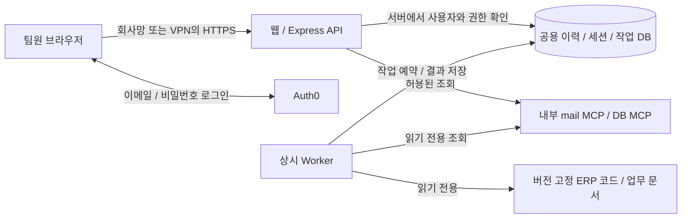

> 역사 자료 — 2026-09-17 문서 통합 직전의 본문을 보존했다. 아래의 현재/미완료/권장 방향은 당시 기록이며 앞으로의 작업 기준은 [통합 구현 계획](../implementation-plan.md)이다.

# 팀 인증과 배포 계획

작성일: 2026-09-17. 상태: 제안 및 구현 대기. 사용자 요청으로 Auth0 기반 ID/비밀번호 로그인과 향후 팀 내부 사용, Vercel 및 대안을 검토했다. 이번 변경은 계획서이며 인증 설정·계정 생성·유료 가입·외부 배포를 수행하지 않았다.

## 권장 방향

1. 사용자 확인에 따라 **회사 계정/SSO 연동은 제외**하고 **Auth0 Universal Login의 이메일·비밀번호**를 기본 후보로 둔다. 이메일을 로그인 ID로 사용하고 초대된 팀원만 허용한다. 회사 SSO는 내부 앱을 만드는 데 필수 조건이 아니다.
2. **현재 상시 서버가 없고 개인 PC만 있다.** 먼저 개인 PC에서 인증·권한을 구현하고, 필요한 HTTPS·회사망/VPN 접속 경로를 갖춘 뒤 소수 팀원이 시험한다. PC 절전/종료/인터넷 중단 시 서비스가 멈추는 파일럿이며 상시 운영으로 표현하지 않는다.
3. 상시 운영 시에는 **클라우드 VM + Docker**를 우선 비교한다. 웹/API·Worker·이력 DB와 필요한 MCP·버전 고정 참조 자료를 옮겨 개인 PC 의존을 없앤다. ERP DB까지 승인된 연결을 확보할 수 없다면 회사 내부 상시 호스트 확보가 먼저다. 클라우드 웹만 올리고 Worker/MCP를 PC에 남겨 둔 구성은 상시 운영 완료가 아니다.
4. Vercel은 추후 웹 배포·프리뷰가 필요할 때 웹 계층의 선택지로 둔다. 현재 Worker와 동기화를 HTTP Function 한 번의 실행으로 옮기지 않는다.

위 순서는 현재 코드·공식 플랫폼 문서와 사용자의 **SSO 불필요/개인 PC만 보유** 답변에 근거한 설계 판단이다. 예상 인원·예산·외부 접속 범위와 클라우드의 ERP DB 접근 가능 여부는 아직 미확정이다.

## 현재 구조에서 달라져야 하는 점

| 현재 확인한 구성 | 팀 운영 전 필요한 변경 |
|---|---|
| `src/server.ts`: 하나의 `TRIAGE_TOKEN`, 동일 값의 8시간 쿠키, 사용자 식별/권한 없음 | OIDC 로그인, 사용자별 세션, 승인된 팀원·권한·감사 기록 |
| `src/history.ts`: 직접/웹 실행 구분은 있으나 실제 요청자 없음 | 요청자 ID를 서버에서 확정하고 실행·리뷰·이력에 보존 |
| `src/worker.ts`: 상시 루프, Codex 자식 프로세스, 최대 30분, `/work`·`/codex` 영구 데이터, 읽기 전용 ERP 파일 | 상시 실행 호스트, 팀 관리 자격증명·비용 한도, 버전이 정해진 참조 파일, 영구 저장소 |
| `src/sync.ts`: DB 영속 작업과 API 내부 스케줄러의 묶음별 수집, 중지/재시작 일시 중지/명시적 이어받기 | API 다중 인스턴스·서버리스 전환 전 처리기를 분리하고 복구 책임/팀 권한 검증 확정 |
| `compose.yaml`: `host.docker.internal` MCP 연결과 Windows 개인 경로 bind | 배포 호스트에서 접근 가능한 내부 서비스 주소·코드 경로·읽기 전용 계정 |
| 실제 분석 한 건 310.958초, Worker의 최대 허용 시간은 30분 | 짧은 HTTP 요청으로 job 등록 후 상태 조회. 브라우저 요청 수명과 분석 수명 분리 |
| 인증된 첨부 다운로드 최대 5 MiB, Office WASM/Worker 번들 | 새 프록시의 응답 크기·CSP·WASM 경로·권한 검증 |

## 로그인 선택

| 선택지 | 적합한 경우 | 결정 |
|---|---|---|
| Auth0 Universal Login + Database Connection | 회사 SSO 없이 ID/비밀번호·비밀번호 재설정부터 도입 | 기본 후보. 비밀번호는 Auth0가 관리하고 앱 DB에는 저장하지 않음 |
| Microsoft Entra ID 직접 OIDC | 향후 회사 계정 연동 요구가 생기는 경우 | 이번 요구에서는 제외 |
| Auth0 + 회사 IdP 연결 | 향후 여러 회사 로그인 방식을 통합하는 경우 | 이번 요구에서는 제외. 현재 Enterprise Connection을 전제로 설계하지 않음 |
| 앱 자체 ID/비밀번호 DB | 별도 인증 서비스 사용이 어려운 특별한 제약 | 우선순위 낮음. 비밀번호 재설정·복구·인증 방어까지 직접 운영해야 함 |

Auth0는 이메일/사용자명과 비밀번호를 지원하고, Universal Login과 기존 Express용 SDK 안내를 제공한다. 현재 정적 웹을 Next.js로 전환해야 로그인할 수 있는 것은 아니다. [Database Connections](https://auth0.com/docs/authenticate/database-connections), [Universal Login](https://auth0.com/docs/authenticate/login/auth0-universal-login), [Express 연결 안내](https://auth0.com/docs/quickstart/webapp/express).

Entra ID 직접 OIDC도 비교했으나 사용자 요구에 따라 회사 SSO 연동은 이번 계획에서 제외했다. 향후 요구가 바뀔 때의 참고 자료로만 남긴다. [Microsoft OIDC 문서](https://learn.microsoft.com/en-us/entra/identity-platform/v2-protocols-oidc).

### 인증·권한 설계

- 브라우저는 `/login`에서 IdP 로그인 페이지로 이동하고 callback을 거쳐 원래 화면으로 돌아온다. 검증된 OIDC SDK의 Authorization Code 흐름을 사용하고 state/nonce, PKCE, issuer/audience/signature, callback 허용 목록을 확인한다.
- 로그인 성공은 팀 접근 허용과 별개다. 앱의 활성 membership을 확인하고 초대 또는 관리자가 등록한 사용자만 허용한다. 가입 버튼 숨김이나 이메일 도메인 검사만으로 접근을 허용하지 않는다.
- 앱 사용자 키는 `(issuer, subject)`로 식별한다. 이메일 변경 때문에 사용자 이력이 바뀌지 않게 한다. 계정 연결이 필요하면 명시적으로 처리한다.
- 현재 PostgreSQL을 활용한 서버 세션을 기본안으로 한다. 브라우저에는 별도 무작위 세션 식별자만 `HttpOnly`·`Secure` 쿠키로 전달하고, OIDC callback 방식에 맞는 SameSite 설정과 CSRF 검사를 적용한다. 비밀번호·공용 마스터 토큰을 브라우저 저장소에 넣지 않는다.
- 로그인 유지 기간은 팀 정책으로 확정한다. 초안은 유휴 8시간/절대 7일이며, IdP 재로그인 빈도와 함께 사용자 불편을 검증한다. 로그아웃·회원 비활성화·권한 회수는 서버 세션에도 반영한다. Auth0의 세션과 앱 세션은 별도이므로 쿠키 기간만 늘려 해결했다고 판단하지 않는다.
- 역할 초안: viewer는 허용 데이터 조회, analyst는 해당 범위 분석/답변/리뷰, admin은 팀원 관리·수집·이관·지식 반영을 담당한다. 역할 변경·차단은 기존 세션에도 적용한다.
- 모든 목록/상세/첨부/다운로드/분석 결과/export/legacy/지식 제안 API에서 mailbox/store/project 범위를 검증한다. 화면 버튼 숨김으로 대신하지 않는다. 분석 전 project가 미확정인 메일은 승인된 mailbox/source 범위로 먼저 제한하고, 모델의 project 분류로 권한을 넓히지 않는다.
- 공유할 팀 메일함과 업무 자료 범위를 먼저 확정한다. 기존 개인 메일 저장소나 이관 문서 전체를 팀원에게 자동 공개하지 않는다. 미분류 legacy도 관리자 검토 대상으로 둔다.
- 요청자·답변자·리뷰 작성자·수집 실행자·지식 반영자와 시각을 기록한다. 본문/비밀을 감사 로그에 복제하지 않는다. 이전 레코드는 실제 사용자 ID를 추측하지 않고 `legacy/unknown`으로 유지한다.

### 직접 CLI와 Worker

- 직접 mail-triage CLI는 브라우저 로그인 또는 Device Authorization Flow로 사용자별 자격을 얻는 방향을 검토한다. 장기 비밀번호/관리자 토큰을 CLI 인자로 전달하지 않는다. 개인 토큰을 중간 단계로 쓸 경우 해시 저장·만료·scope·폐기·사용자 귀속을 갖춰야 한다. [Auth0 Device Flow](https://auth0.com/docs/get-started/authentication-and-authorization-flow/device-authorization-flow).
- 사용자의 로그인 세션, API 접근 자격, 개별 run의 ownerToken, Worker 서비스 자격을 분리한다. 팀 서버에서 기존 공용 토큰이 모든 권한 검사를 우회하지 않게 한다. localhost 개발 호환이 필요하면 명시적 개발 모드에만 남긴다.
- 초기에는 기존 분석 큐·단일 Worker·lease/heartbeat를 유지한다. 요청자의 권한과 고정된 대상 범위를 job에 서버가 기록하고, Worker는 실행 전 유효성을 확인한다. 모델이 DB role/프로젝트 접근 범위를 임의로 선택해 넓히지 않게 한다.
- 현재 개인 인증 seed를 그대로 팀 공용 운영 자격으로 간주하지 않는다. 팀에서 관리할 모델 실행 자격·예산·회전/복구 담당자를 확정하고 실제 동시 사용·비용을 확인한다.
- 기존 처리 문서와 코드 참조는 읽기 전용으로 유지하고 배포 시점의 버전을 기록한다. 실행 중 임의 git pull이나 ERP 소스/DB 쓰기를 도입하지 않는다.
- 전환은 활성 작업을 먼저 완료/정리하고 수행한다. 기존 run ownerToken과 불변 보고서를 보존하며, 사용자 인증 변경 때문에 완료 결과를 덮어쓰거나 이미 실행된 작업을 중복 수행하지 않는다.

## 배포 선택

| 후보 | 구성과 장점 | 제약·판단 |
|---|---|---|
| 개인 PC + Docker | 인증·권한 구현과 제한된 팀 파일럿에 현재 환경 재사용 | PC를 켜 둔 동안만 가능. 팀 접속용 HTTPS/회사망 또는 VPN 구성 필요. **개발·파일럿용** |
| 클라우드 VM + Docker | 기존 Compose 구조 재사용, 상시 Worker/영구 볼륨 제어 | **상시 운영의 우선 후보**. 팀이 관리할 계정/비용과 ERP망 접근 경로 필요. Worker/MCP까지 옮겨야 개인 PC 의존이 해소됨 |
| 회사 내부에 새 상시 호스트 확보 | ERP망 가까이에서 API/Worker/DB 운영 | 현재 보유 서버는 없음. 클라우드에서 ERP DB 접근이 불가할 때 검토할 대안 |
| Render 등 Web Service + Background Worker + DB | 상시 Worker와 웹 서비스를 각각 관리형으로 운영 | 내부망 연결·영구 저장소·샌드박스/파일 접근 호환성 및 비용 POC 필요. 컨테이너가 실행된다고 현재 Worker가 그대로 작동한다고 단정하지 않음 |
| Vercel 웹 + 별도 Docker API/Worker/DB | 웹 프리뷰/배포는 Vercel, 내부 작업과 데이터 접근은 전용 서버 | 운영 지점과 인증/네트워크 구성이 늘어남. UI 배포의 이점이 필요해질 때 선택 |

Render의 Background Worker는 지속 실행하는 별도 서비스 형태를 제공한다. 이를 현재 Worker의 후보로 보는 것은 구조적 판단이며 실제 배포 검증은 아직 없다. [공식 Worker 문서](https://render.com/docs/background-workers).

### Vercel을 선택할 때 확인할 사항

- 2026-09-17 공식 문서의 Fluid Compute 제한은 Hobby 최대 300초, Pro/Enterprise 기본 300초·통상 최대 800초·조건부 확장 1800초 Beta다. 현재 분석 311초는 Hobby 한도를 넘고, 장기 Worker 프로세스·DB 잠금·자식 프로세스·로컬 볼륨 의존도 있다. 시간 한도 조정만으로 현재 구조의 이전이 끝나지는 않는다.
- Vercel Function의 요청/응답 payload 한도 4.5 MB는 현재 최대 5 MiB 첨부와 충돌할 수 있다. 첨부 경로는 일반 Function으로 무조건 중계하지 말고 권한 검증된 전용 API 직접 전달 또는 짧은 수명의 파일 전달 방식을 POC한다. [Functions 제한](https://vercel.com/docs/functions/limitations).
- sync는 DB에 작업/진행/재시도 예약을 저장하지만 처리기는 아직 API 프로세스 안에서 실행된다. 다중 인스턴스/서버리스 전환 전에 별도 처리기로 분리한다. API 시작 시 migration/recovery 실행과 장기 DB 연결도 배포 수명에 맞게 분리한다.
- 클라우드의 `localhost`/`host.docker.internal`은 사용자 PC나 회사 ERP망을 가리키지 않는다. 기존 MCP를 인증 없이 인터넷에 공개하지 않고, 사설망 경로 또는 제한된 게이트웨이를 설계한다.
- 웹만 Vercel에 올리면 기존 상대 `/api` 경로, HttpOnly 쿠키, strict Origin 검사, Office iframe/CSP를 함께 바꿔야 한다. 같은 origin의 인증 BFF/프록시 또는 명확한 API origin을 선택하고, 필요한 origin만 허용한다. 기능 크기 제한을 우회하려다 인증이 빠지는 경로를 만들지 않는다.
- 운영과 프리뷰의 IdP callback·세션·DB·MCP를 분리한다. 프리뷰에는 합성 데이터만 사용하고 운영 비밀/실메일을 연결하지 않는다. Vercel 프리뷰 보호는 앱의 회원 권한을 대신하지 않는다.
- Vercel Hobby는 공식 문서상 개인·비상업적 용도이므로 회사 내부 운영 예산을 Hobby 무료 전제로 계산하지 않는다. [Hobby 적용 범위](https://vercel.com/docs/plans/hobby).
- 위 평가는 **현재 코드를 기존 Functions에 그대로 옮기는 방안**에 대한 것이다. 별도 Workflow/컨테이너 실행 제품을 도입하는 안은 다른 구조 변경과 지원 조건 검증이 필요하다. Vercel 전체가 기술적으로 불가능하다는 뜻은 아니다.

### 상시 운영의 목표 구성

웹/API·Worker는 같은 관리 서버에서 시작하되 서로 다른 서비스/자격으로 운영한다. DB/MCP 포트는 내부에 두고 브라우저는 앱 API를 이용한다. 사내망/VPN에서 IdP의 로그인·메타데이터·토큰 교환에 필요한 통신과 callback을 실제 검증한다. 외부 팀원 접속이 필요하면 앱 입구의 HTTPS와 접근 경로만 별도로 결정한다.

현재 PC 파일럿은 위 앱/Worker/MCP가 개인 PC에서 돌아가는 임시 단계다. Vercel 웹과 개인 PC를 연결하는 임시 터널을 사용하더라도 PC 가용성에 종속된다. 클라우드 VM 전환 전에는 메일 MCP 저장소 보존/이전, ERP DB의 접속 허용·사설 경로, 코드/문서 동기화 주체, 모델 인증 이동을 각각 점검한다. DB나 MCP 포트를 단순히 인터넷에 여는 방식으로 해결하지 않는다.

## 단계별 작업과 완료 기준

| 단계 | 산출물 | 완료 기준 |
|---|---|---|
| 0. 운영 조건 확정 | Auth0 후보/PC 파일럿 전제, 공유 자료/역할/예산/담당자 결정표 | SSO 제외와 서버 미보유는 확인 완료. 네트워크 접근 경로와 팀 데이터 범위는 추가 확정 |
| 1. 인증 POC | 개인 PC의 Auth0 로그인/로그아웃/재설정, 서버 세션 | 승인 팀원 성공·미승인 차단, 만료/로그아웃/비활성화 반영, 기존 CLI 전환 경로 확인 |
| 2. 팀 권한·감사 | 사용자/membership/session/audit 및 요청자 필드, API 권한 검사 | 다른 사용자·프로젝트·메일 ID를 직접 지정해도 차단, 첨부/export/legacy 포함 회귀 검증 |
| 3. 개인 PC 팀 파일럿 | 소수 승인 사용자, HTTPS 접속 경로, 운영 매뉴얼 | 웹·직접 이력 일치, 역할별 권한 회수, 실메일 선정 검증, PC 종료 시 중단 안내 |
| 4. 상시 서버 이전 | 클라우드 VM/접속 불가 시 내부 호스트, durable sync, 팀 자격, 백업/모니터링 | 개인 PC 종료 시에도 조회·분석 가능. 네트워크/재시작/중복/예산/영구 저장/복원/기존 보고서 보존 확인 |
| 5. 팀 확대 또는 Vercel 분리 | 확정 배포 구성과 롤백 절차 | 5 MiB 첨부와 세 형식 viewer, Auth callback/CSP, 운영·프리뷰 격리, 서비스 복구 확인 |

초기 팀 시험에서 로그인만 통과했다고 공개 준비 완료로 처리하지 않는다. 기존 ERP 코드/DB 읽기 전용, 메일 발송·읽음 처리 제외, 원문/비밀 Git 제외 원칙은 유지한다. 기능 구현·테스트를 먼저 준비하고 실제 외부 배포는 대상·비용·데이터 범위를 정한 상태에서 실행한다.

## 비용과 미확정 사항

- Auth0는 사용자 수뿐 아니라 로그인 연결 종류, MFA, 관리자/조직 기능과 M2M 사용량 등 필요한 기능 기준으로 요금제를 확인한다. 무료 범위를 운영 가능 조건으로 단정하지 않는다. [공식 요금표](https://auth0.com/pricing).
- 배포 비용에는 웹/API, 상시 Worker, DB, 백업/파일 저장, 트래픽, 네트워크 연결, 모델 실행료를 각각 포함한다. Vercel을 추가하면 기존 Worker/내부 연결 운영비가 사라지는 것은 아니다.
- 사용자 확인 완료: 회사 SSO는 불필요, 기존 상시 서버는 없고 개인 PC만 있음. 확인 대기: 팀 인원, 공유할 메일함·프로젝트, 외부 접속, 예산·운영 담당자, 클라우드 VM에서 ERP DB에 접근할 수 있는 경로.
- 단일 팀만 운영하는 초기 단계에서 Auth0 Organizations나 별도 Redis/복잡한 다중 클러스터를 필수로 도입하지 않는다. 앱의 권한 모델과 기존 PostgreSQL 작업 큐를 먼저 사용하고 실제 규모에 맞춰 확장한다.

검토 근거: 현재 `src/server.ts`, `src/history.ts`, `src/sync.ts`, `src/worker.ts`, `compose.yaml` 및 위 공식 자료. 가격·한도·Beta 조건은 서비스 선택 시 다시 확인한다.
