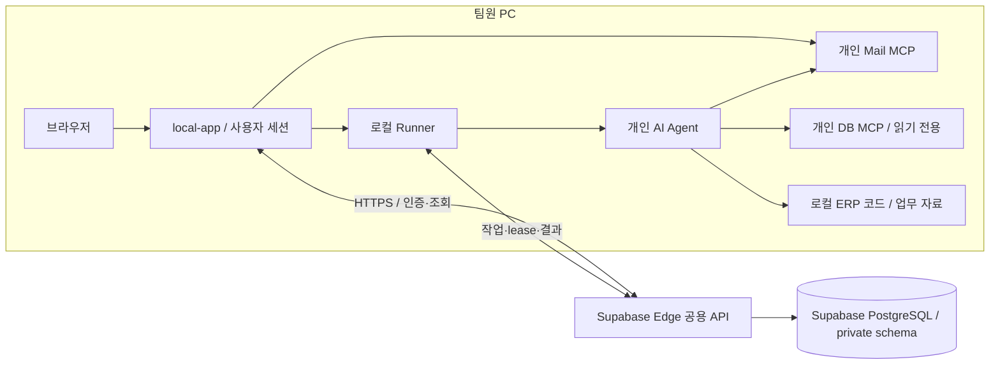
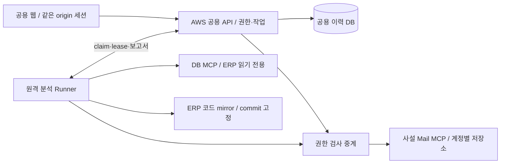

# mail-triage-web 통합 구현 계획

문서 버전: 3.3 · 갱신일: 2026-09-23 · 상태: **Release 배포 기반 → 간편 설치·업데이트 → GitHub push·Release 게시 → 설치본 실분석 → 팀 파일럿 → 피드백·안정화 → AWS 이전 검토 → 원격 분석 → SR 구현·검증·PR 자동화**. 첫 Supabase API·DB 배포와 합성 종단 검증을 완료했다. 최신 candidate.10에서 stale lock 복구·설치/설정 보존·한글 경로 lifecycle과 실제 Claude Code 2.1.280 probe를 로컬 검증하고 GitHub prerelease를 게시했다. hosted update route 코드는 candidate.9 배포본을 유지하며 catalog를 candidate.10으로 갱신했다. 실계정 업데이트 제공·설치와 실 MCP/Agent 분석은 아직 검증하지 않았다. 사용자 요청으로 백업 설정은 보류하며, 실제 두 PC 업무 파일럿과 M1 운영 준비 완료는 별도로 판정한다.

## 1. 목표와 현재 우선순위

**당장 제공할 제품은 공용 API·DB에 계정과 분석 이력을 저장하고, 팀원 PC의 웹 앱·Mail/DB MCP·개인 AI Agent로 분석하는 팀용 앱이다.** 먼저 제한된 팀원에게 배포해 피드백을 받고 안정화한다. 공용 웹·원격 MCP·원격 Agent·자동 코드 수정·PR은 다음 제품 단계다.

최종 목표는 사용자 PC가 꺼져 있어도 웹의 SR/메일 선택에서 분석 보고서, 격리된 코드 구현, 빌드·테스트·리뷰, PR 생성·조회까지 수행하는 것이다. 최종 기능을 최초 배포의 완료 조건으로 묶지 않는다. 최신 사용자 결정과 이 문서가 계획의 단일 기준이며, 이전 P/A/S 단계표는 [v2.1 보존본](archive/implementation-plan-history-2026-09-21-v2.1.md)의 역사 기록이다.

| 구분 | 결정/제안 |
|---|---|
| 확정한 진행 순서 | 공용 API·DB + 로컬 실행기 → Release 계약·패키징 → 간편 설치·업데이트 → 검증된 소스 push·Release 게시 → 설치본 실분석 → 팀 배포 파일럿·안정화 → 원격 실행 → SR→PR |
| 인증 유지 | 사용자명 + 앱 비밀번호, 관리자 생성 계정, 공개 가입 없음, JWT + 현재 계정/세션/자료 권한 검사 |
| 화면 구성 | 전체 React UI는 MUI 공통 테마로 통일. 기존 업무 동작·분할 화면·본문/Office 렌더러 유지. UI 전환으로 M4~M5 범위를 앞당기지 않음 |
| 보고서 협업 | 대화·결정 저장, 명시적 보고서 반영·새 revision, 낙관적 락을 추가한다. 로컬 Agent를 사용하는 M3 기능 확장 배치안이며 첫 파일럿의 선행 조건으로 만들지 않음 |
| 앱 배포 방향 | [srp-david/mail-triage-automation](https://github.com/srp-david/mail-triage-automation)의 기존 41개 이력을 제외한 공개용 첫 커밋 `3803669f801ec8b52bc3614d367b830e5e38b2a9`에 후속 커밋 `cb64f473123807a981de83e1b8332b1e3772a063`·candidate.10 prerelease 게시. GitHub Release에 앱 파일·변경 내역 보관, 필요 시 private 전환. 실사용 업데이트는 별도 |
| 앱 업데이트 기본안 | 인증된 공용 API가 사용자별 버전·채널·호환성·배포 중단을 결정. public 파일은 직접 다운로드, 알림 후 사용자가 설치 선택. 완전 자동 설치는 후속 안정화 대상으로 분리 |
| 첫 호스팅 | Supabase Edge 공용 API + Supabase PostgreSQL. Free로 소규모 파일럿을 준비하고 실제 사용량·한도를 측정. 유료 전환은 별도 결정 |
| 첫 DB | PostgreSQL 유지, 비공개 앱 schema와 최소 권한 runtime 계정. M1에서 MariaDB 이식하지 않음 |
| 이후 AWS | M3 안정화 후 이전 범위·시점 결정. PostgreSQL 유지가 기본 이전 후보이며 `srp-rds-maria/cvslog` MariaDB 재사용은 별도 엔진 이식 결정 |
| Supabase PoC | 보존된 `8303d52`의 제품 변경을 원본에 통합하고 회귀 검증. 자체 인증·계정 관리·Runner/복원을 재사용하며 일반 Node 진입점도 유지 |
| 현재 허용 경계 | ERP 코드·ERP DB 읽기 전용. 비밀·메일 원문 Git 제외. 기존 DB/Worker/reports/legacy/개인 AI·MCP·SES 설정 보존 |
| 최종 목표에서도 제외 | 운영 DB 쓰기, 자동 merge, 자동 운영 배포, 메일 발송·삭제·읽음 변경 |

M1은 Supabase PostgreSQL과 로컬 실행을 유지해 합성/복제본에서 통합하고, M2에서 실제 팀 PC와 지정 업무로 검증한다. AWS 이전·DB 엔진 변경·원격 Agent를 첫 배포에 묶지 않는다. ERP 쓰기는 M5의 지정 repo/경로 범위와 AGENTS.md 조정을 명시적으로 정한 후에만 허용한다.

## 2. 실제 구현 상태와 재사용 범위

| 대상 | 현재 확인된 상태 | 다음 작업 |
|---|---|---|
| 원본 | v0 서비스 보존. 사용자명 인증 PoC 제품 커밋 `602e5aa`·`f3e32fe`·`1c45518` 통합 | backend 130/130 및 hosted 7군 통과. 제한된 팀 파일럿 준비 |
| 기존 P1~P6/candidate.6 | 당시 로컬 구현·합성/후보 검증 기록 존재 | 새 인증/배포 환경의 완료로 재사용하지 않음 |
| 이전 PoC `8303d52` | 기존 작업 폴더/브랜치는 현재 없음. Git 객체·인계 보고서 보존, 제품 커밋 3개 복구·통합 | 사라진 로컬 패키지/시험 산출물을 배포본으로 쓰지 않고 현재 코드에서 재생성 |
| hosted/팀 파일럿 | 서울 프로젝트에 API·비공개 DB 배포, TLS/pooler·인증·권한·Runner 합성 검증 통과 | 백업 보류. 개인 MCP/Agent·실제 두 PC 업무 파일럿 진행 필요 |
| Windows 배포·업데이트 | candidate.10 setup.exe에 기존 lifecycle의 stale lock 복구 연계. 합성 9→10 설치·historyUrl/port 보존, 살아 있는 PID 잠금 거절, 한글 경로 start/pause/stop, Claude Code 2.1.280 probe, unit 8/8 통과. GitHub prerelease 게시·hosted catalog .10 갱신 | 실계정 `offered`·게시 asset 실사용 업데이트, 팀 PC 수용·실분석 대기. UI E2E 1 passed는 candidate.9 증거 |
| 보고서 협업·작업 시작 | 추가 답변→새 분석, 분석 요청 멱등성과 메일당 활성 분석 제한 구현 | 지속 대화·보고서 편집 낙관적 락·업무별 작업 등록부·구현 시작 미구현 |
| 원격 SR 자동화 | 원격 자료·Agent·구현·PR 종단 미구현/미검증 | M3 안정화 판정 뒤 M4~M5 착수 |

PoC 인계 `b8a5c5dd-8809-4031-8a4f-40ae6a16496d`의 완료 ID·10,263 bytes·SHA-256 `70fb2381fe6fc1a4d5f0a07994173d36b44d47894dc95f3e50905477fc206225`는 대조됐다. v3.0 문서 작업 당시에는 재실행하지 않았고, v3.1 통합 후 원본에서 backend 127/127·Edge/DB/Runner/Chrome/복원 12군을 다시 통과했다. 과거 PoC 검증 문서는 Git 객체 `8303d52:docs/validation.md`에 남아 있다. 현재 증거와 hosted/팀 파일럿의 미완료 경계는 [원본 검증 기록](validation.md)을 본다.

기존 메일/첨부/Office·Markdown, 헤더 기반 스레드/수동 연결, 검색/상태 필터, 보고서 버전/추가 답변/리뷰, 처리 완료/취소, legacy 연결/내보내기, 스크롤/초안 보존은 회귀 대상이다. 제목 일치로 메일을 합치지 않는다. L1 중복 후보 연결, L2 legacy 복수 연결, L3 이력 전환 대조는 미확정 자료를 보존하며 별도 추적한다. 과거 검증 이력은 [문서 안내](README.md)에서 찾는다.

## 3. 단계와 진입·완료 기준

| 단계 | 제공하는 결과 | 주요 작업 | 완료/다음 단계 조건 |
|---|---|---|---|
| M1 공용 기반·로컬 앱 통합 | 팀 배포 가능한 후보 | PoC 통합, Supabase Edge/PostgreSQL·권한·백업/복원, 로컬 설치/연결, 업데이트 계약과 간편 배포 준비 | 합성/복제본 통과, hosted API·DB 격리·운영 담당 확인, 배포 후보 고정 |
| M2 제한된 팀 배포 | 팀원이 자기 PC에서 실제 사용 | 최소 2명/2PC, 개인 MCP/Agent 연결, 지정 사례 분석·공유 이력, 사용자 선택 업데이트 구현·수용 | 로그인·권한·실분석/저장·복구·업데이트·백업 복원 성공, 피드백 수집 시작 |
| M3 피드백·안정화 | 안정된 팀 분석 서비스 | 실패/품질/설치/권한 개선, 사용량/비용 측정, 회귀·릴리스 정리. 보고서 대화·편집/락 확장은 6.1절 배치안으로 추적 | 6절 기준을 팀과 확인. 기능 확장 출시 범위는 D14에서 정하며 M4~M5를 배포 선행 과제로 넣지 않음 |
| M4 원격 분석 전환 | PC 종료와 무관한 웹 분석·보고서 | 공용 웹 세션, 원격 MCP/중계·ERP 읽기 자료, service Runner | PC 종료 종단, 사용자/출처 격리, 원격 취소·회수·비용·복구 검증 |
| M5 SR 구현·검증·PR | 필요한 SR의 코드 변경과 검증된 PR | 구현 brief/정책, 격리 checkout·불변 commit 전달, 검증/CI·PR/복원 | 9절 실패/중복/권한 검증 포함 종단 수용, 지정 repo/범위/예산에서 운영 가능 |

M1~M3가 첫 번째 제품 범위다. M4~M5는 호환 계약을 문서로 남기되 stage 테이블·service identity·PR 발행 코드를 미리 완성할 필요는 없다. 최초 공용 배포는 미래 기능이 없어도 독립적으로 수용 가능해야 한다. 문서 준비와 실제 원격 작업 착수는 구분한다.

## 4. Supabase 첫 배포와 이후 AWS 이전

### 4.1 M1~M3 구성

- 공용 API는 계정·세션·source/collection ACL·작업/보고서/리뷰/처리 상태를 관리한다. 팀 PC에 이력 DB 자격·서명키를 배포하지 않는다.
- Mail/DB MCP와 AI 실행은 각 PC에 남기는 설계다. 공용 API가 각 PC의 localhost MCP에 접근하지 않는다. 이력 DB와 분석 대상 ERP DB는 다른 시스템이며, DB MCP는 ERP 읽기 전용 권한을 유지한다. 현재 local-app에는 실제 ERP DB provider가 연결되어 있지 않고, 기존 v0의 DB MCP 설정을 자동으로 이어받지 않는다.
- 원문·첨부의 원본 저장소는 로컬 MCP이고 공용 DB에는 필요한 메타데이터/보고서를 저장한다. AI 입력에는 원문·코드가 포함될 수 있고 보고서·답변·기존 문서에도 원문 일부가 담길 수 있으므로 로컬 실행을 외부 전송 없음으로 해석하지 않는다. 공유 자료에 ACL을 적용하며 같은 메일함이어도 독립 MCP 저장소의 숫자 ID를 동일시하지 않는다.
- 다른 PC에서 공유 보고서는 볼 수 있지만 대응 원본이 없으면 원문/첨부를 열 수 없다고 표시한다. 팀원의 PC가 꺼지면 그 PC의 분석만 멈춘다. 공용 API와 다른 PC의 분석은 계속 이용 가능해야 한다.
- 로컬 origin/Host/CSRF, DPAPI, 개인 설정 보존을 유지한다. 공용 웹 세션 문제는 M4에서 해결하며 첫 배포를 공용 브라우저 제품으로 바꾸지 않는다.

### 4.2 안정화 이후 AWS와 기존 RDS 재사용 판단

이 절은 M3 이후 선택을 위한 조사 기록이다. 첫 Supabase 배포를 지연시키는 선행 과제가 아니다.

AWS에 API와 미래 MCP를 모으면 같은 VPC 안의 사설 연결과 보안 그룹으로 접근 경로를 제한할 수 있다. 이는 운영을 단순화할 수 있다는 설계 판단이며 같은 EC2/같은 DB에 모든 기능을 합치자는 뜻은 아니다. [AWS RDS VPC 연결](https://docs.aws.amazon.com/AmazonRDS/latest/UserGuide/USER_VPC.Scenarios.html).

2026-09-21 AWS CLI의 로그인된 default 프로필·서울 리전에서 읽기 전용 조회했고, 사용자가 `cvslog`는 `srp-rds-maria` 내부 DB라고 확인했다. RDS 설정/CloudWatch 조회이며 DB 내부 목록/테이블·SQL 접속 검증은 아니다. 계정 ID·endpoint·자격은 문서에 남기지 않는다.

| 인스턴스 | 엔진/버전 | 클래스 | 저장소 | 가용성/보호 | 확인된 제한 |
|---|---|---|---|---|---|
| srp-rds-maria | MariaDB 10.11.16 | db.t3.micro | 20 GiB gp2 | Single-AZ, 암호화, 비공개 | 자동 백업 보존 0일, 삭제 보호 꺼짐. 다른 백업 존재는 미확인 |

최근 7일(2026-09-14~21 UTC)의 CloudWatch 시간별 집계 168개씩을 확인했다. CPU 최대 26.48%, FreeableMemory 최소 약 136 MiB, 여유 저장소 최소 약 16.7 GiB, 연결 최대 9개, CPU credit 최소 288이었다. CPU/디스크 수치만으로 추가 앱 수용을 보장하지 않는다. FreeableMemory만으로 메모리 압박을 확정할 수도 없으며 실제 앱 부하·연결 풀·메모리/IO 지표를 함께 검사해야 한다. 원자료는 Git 제외 `.runtime/aws-cvslog-review/metrics.json`에 보존했다.

현재 앱은 `pg`, `jsonb`, PostgreSQL advisory lock, 부분 unique index, `ON CONFLICT`, `RETURNING` 등을 사용한다. 특히 큐/세션의 동시성 보장이 DB 구현에 묶여 있다. 따라서 기존 RDS가 MariaDB이면 `DATABASE_URL`만 바꾸는 재사용은 불가능하고 schema·query·잠금·driver·migration·백업/복원 도구와 회귀 테스트를 이식해야 한다. [현재 DB 연결](../apps/history-api/src/db.ts), [migration](../src/migration.sql), [MariaDB 공식 이식 안내](https://mariadb.com/docs/server/server-management/install-and-upgrade-mariadb/migrating-to-mariadb/migrating-to-mariadb-from-postgresql).

| 후보 | 이점 | 비용/추가 작업 | 현재 판단 |
|---|---|---|---|
| AWS API + PostgreSQL 유지 | 현재 코드·PoC·동시성 계약 재사용 | AWS PostgreSQL 운영 자원/백업 비용. 기존 호스트 자체 운영안은 운영 부담 별도 비교 | M3 이후 이전 기본 후보. 실제 자원 생성은 대상/예산 확정 후 |
| AWS API + 기존 MariaDB RDS | 기존 DB 인프라 활용 가능 | 엔진 이식·권한/성능/백업 검증 및 기존 업무 영향. 총비용이 더 작다는 보장 없음 | 첫 배포 범위 밖. 재사용 선택 시 별도 이식 단계 |
| AWS API + Supabase PostgreSQL | API부터 순차 이전 가능 | 클라우드 간 연결·비밀·장애/egress 운영 | 이후 점진적 이전의 중간 구성 후보 |

기존 RDS 재사용과 기존 `cvslog` 업무 테이블 공유를 구분한다. 같은 인스턴스를 쓰더라도 앱 전용 database와 runtime/migration 계정을 우선 분리하고, PostgreSQL에서 같은 database가 필요하면 schema/search_path/권한을 분리한다. schema 이름만으로 격리가 보장되지 않으므로 타 영역 접근 거부를 검증한다. CPU/메모리/IO·연결·유지보수·장애 영향은 같은 인스턴스에서 공유한다. [PostgreSQL schema와 권한](https://www.postgresql.org/docs/current/ddl-schemas.html).

### 4.3 최초 운영 기본안

- Supabase에는 `history` Edge 함수와 PostgreSQL의 `triage_private` schema만 사용한다. Supabase Auth·Storage·Realtime에 새 의존성을 추가하지 않는다. 관리자 발급 사용자명/자체 JWT를 유지한다.
- 팀 PC는 설정 가능한 HTTPS API 주소만 사용한다. DB 자격·서명키를 배포하지 않는다. 서버에는 TLS 검증·최소 DML runtime 계정·별도 migration 계정을 적용한다. Data API를 비활성화하고 private schema를 노출하지 않는다.
- 로컬 테스트용 `local-gateway`/`local-benchmark`는 hosted 배포 대상이 아니다. 업무 로직은 일반 Node API에서도 실행 가능하게 유지하고 Edge 진입점/설정과 분리한다.
- 프로젝트 식별자·지역·Free 여유·운영 담당은 D4에서 확인한다. Free 적합성은 실제 호출/DB/egress를 측정해 판단하며 자동 유료 전환이나 의미 없는 keepalive를 추가하지 않는다.
- 운영 준비 요건은 매일 및 migration 직전 외부 암호화 백업과 격리 DB 복원이다. 현재 백업 설정은 사용자 요청으로 보류했으며 성공한 hosted 백업·복원은 없다. 보류가 해제된 뒤 준비한다. Free 일시정지 재개·재로그인·미전송 결과 복구도 hosted에서 확인해야 한다. 구체적 운영 절차는 [Supabase 배포 안내](operations/supabase.md)를 따른다.
- 향후 AWS 이전은 호환 PostgreSQL 버전/extension/권한을 대조한 복원 리허설 → writer 중지/최종 복사 → API/DB 전환 → 전체 세션 폐기/재로그인 → 검증 순서다. 새 DB 쓰기 후 롤백은 새 결과 보존/역이관 없이 옛 dump를 덮어쓰지 않는다. MariaDB는 이 절차에 앞서 엔진 이식이 필요하다.

## 5. M1 통합 계약과 검증

### 5.1 PoC에서 가져올 것과 환경 차이

재사용 대상은 자체 사용자명 인증/관리자 UI, 현재 계정·세션·자료 권한 검사, 로컬 로그인/DPAPI/HistoryClient, 사용자 UUID 매핑·복원 후 세션 폐기, outbox 복구다. 일반 Node 실행 진입점도 PoC에 있으므로 Supabase Edge를 사용해야만 인증을 쓸 수 있는 구조로 취급하지 않는다. Edge 전용 gateway·bundle·Supavisor·Free 사용량 튜닝은 AWS Node 배포와 구분한다.

첫 통합에서는 PoC의 인증 사양을 아래처럼 채택했다. 로컬 재검증과 hosted 부하/운영 검증을 구분하며 이전 사양을 동시에 현재 기본값으로 남기지 않는다.

| 항목 | 기존 계획/PoC 차이 | 통합 시 기준 |
|---|---|---|
| JWT/세션 | 구 기본안 RS256/10분/14일 폐기 | 현재 ES256 access 5분·정상 세션 최대 30일·첫 변경 전 제한 세션 10분. 회전/폐기 재검증 |
| 비밀번호 | 구 기본안 15~128자 폐기 | 현재 최소 12자·UTF-8 최대 128 bytes. 임시 비밀번호 24시간·첫 변경 필수 |
| 사용자명 | PoC ASCII 영문 시작 3~32자·소문자 정규화 | 관리자 발급·중복·불변 UUID·이름 재사용 정책 검증 |
| hash/자원 | PoC Argon2id WASM·동시 실행 제한 | hosted Edge의 동시 로그인·CPU/RAM·rate limit 실측. 약한 hash fallback 없음 |
| DB | PostgreSQL 트랜잭션·schema·advisory lock | Supabase PostgreSQL 버전·TLS·실 pooler·최소 권한·migration/restore 재현 |
| 큐/관측 | 기존 전역 lock·30분 분석·Runner 1개/팀 2개 시작값 | 첫 파일럿의 작은 규모에서 측정. API 지연·lock 대기/timeout·pool 사용량으로 개선 여부 결정 |

### 5.2 계정·자료 권한

운영자 전용 bootstrap으로 첫 관리자를 만든다. 첫 접속자 자동 admin, 공개 가입, 가짜 이메일 가입, Auth0/인증 이메일/SES 연결을 사용하지 않는다. 관리자가 사용자명 계정과 임시 비밀번호를 발급하고, 임시 자격은 한 번만 표시한다. 첫 변경 전에는 비밀번호 변경/로그아웃/최소 상태 외의 업무·관리·Runner 접근을 막는다.

비밀번호 초기화/변경·계정 비활성화·역할 변경 시 관련 세션을 폐기한다. 마지막 활성 admin의 동시 강등/비활성화를 막고 운영자 복구 절차를 둔다. JWT 서명/issuer/audience/만료와 서버의 현재 세션·계정·소속·source/collection ACL을 검사한다. 변경은 트랜잭션에서도 재검사한다. DB 장애 시 우회 인증하지 않는다.

일반 사용자는 부여된 개인/공유 자료만 볼 수 있다. admin 역할은 다른 사람의 개인 메일·보고서를 자동 열람하게 하지 않는다. 목록·검색·건수·export·첨부·리뷰에도 동일 권한을 적용한다. 앱 admin 권한과 DB/OS/백업 운영자의 실제 접근 가능성은 다른 신뢰 경계이며 운영자 접근/감사를 문서화한다.

### 5.3 로컬 실행과 복구

- local-app은 loopback에만 bind하고 Host/Origin·HttpOnly/SameSite cookie·CSRF·launcher bootstrap을 유지한다. access/refresh token을 포함한 세션은 앱 메모리와 DPAPI 보호 저장소에서 관리하며 device 자격도 DPAPI와 사용자 ACL로 보호한다. 세션은 서버 주소/issuer에 묶고 브라우저 저장소·Agent 환경·Git에 자격을 넣지 않는다.
- refresh는 직렬 회전하고 사용된 token 재사용을 거절한다. 응답 유실/보호 저장 실패는 재로그인으로 처리한다. 계정 전환 시 캐시·초안·source·outbox 소유자를 분리한다. 다른 사용자로 미전송 결과를 올리지 않는다.
- 작업은 지정 local Runner에만 배정한다. 등록/claim/heartbeat/result에서 현재 사용자·장치·source·capability를 확인한다. `requestId`/입력 hash, claim receipt, lease token+generation, 결과 hash로 재전송과 실제 재실행을 구분한다. 늦은 결과가 새 실행을 덮어쓰지 못한다.
- PC 종료/절전·네트워크 단절·lease 만료를 실패/복구 가능 상태로 표시한다. 명시적 재시도 없이 Agent를 중복 실행하지 않는다. 완료 응답 유실은 같은 결과 ID/hash로 재전송한다. 저장 전 보고서를 ‘저장 완료’로 표시하지 않는다.
- source는 MCP 저장소 인스턴스를 식별한다. Message-ID만으로 저장소를 합치지 않는다. 새 MCP DB/ID 재사용은 새 source 또는 명시적 매핑으로 처리한다. 관련 메일과 동기화는 source별 권한·멱등성을 유지하고 분석 Agent가 임의로 전체 수집을 실행하지 않는다.
- agent/model 선택, 공통 스킬 버전/hash, 허용 도구·자료 경로를 기록한다. ERP 파일/DB 쓰기 차단은 프롬프트만으로 주장하지 않고 실제 거부를 검증한다. 개인 AI 계정·구독·MCP 설정을 설치기가 덮어쓰지 않는다.

### 5.4 배포 후보와 이관

Windows x64의 고정 런타임/앱/스킬/launcher·진단을 패키징하고 지원 OS·서명/실행 정책을 확인한다. 설치→사용자명 로그인/첫 변경→개인 Agent 로그인 확인→MCP/source·ERP 읽기 연결→합성 분석→보고서 재조회가 초기 사용 흐름이다. 로컬 앱은 별도 이력 DB를 요구하지 않는다. MCP가 Docker를 필요로 하면 그 전제만 안내한다.

버전·checksum·계약 호환성을 확인한 후 업데이트하고 실행 중 작업은 먼저 정리한다. 사용자 설정/개인 자격/outbox를 보존한다. 제거는 앱 소유 파일만 대상으로 하며 공유 DB·개인 MCP/CLI를 지우지 않는다. 배포물에 토큰·메일·ERP 원본·개인 처리 로그를 포함하지 않는다.

기존 DB의 복제본에서 UUID·보고서 hash·관계·ACL·legacy를 대조한다. 기존 사용자 매핑은 명시적으로 수행하며 미확정 귀속을 새 admin에게 넘기지 않는다. 실전환은 writer 정지→최종 백업→검증→API 주소 전환으로 하고 두 DB에 동시 쓰지 않는다. 복원 후 폐기된 세션이 되살아나지 않게 재로그인시킨다. 앱 롤백과 DB 롤백은 분리하고 새 보고서를 오래된 dump로 덮어쓰지 않는다. `docker compose down -v` 같은 기존 DB 초기화는 금지한다.

M1 완료 근거는 check/build/compat, 자체 인증/관리자/ACL·동시성/복구 테스트, 로컬 브라우저/DPAPI·설치/업데이트·복제 DB 복원, 실제 API HTTPS/TLS·DB 접근 제한·백업 복원으로 구성한다. 로컬/합성과 외부 운영 검증을 구분한다. 실배포 검증 전 `releaseApproved=false`를 유지한다.

### 5.5 GitHub Release와 사용자 선택 업데이트

GitHub Release를 앱 파일·변경 내역 저장소로 사용하고, 앱은 public 단계에서도 인증된 공용 API를 통해 제공 버전·stable/test 채널·API 호환성·배포 중단 정책을 조회한다. 기본안은 public 파일 직접 다운로드와 사용자 버튼 설치다. 저장소 URL·GitHub 자격을 클라이언트에 고정하지 않고, API가 다운로드 방식을 반환해 private 전환을 지원한다. public 파일 자체는 인증 없이 내려받을 수 있으므로 API 인증을 파일 접근 통제로 설명하지 않는다.

M1에서 계약·신뢰 메타데이터·간편 설치를 준비하고 M2에서 조회/알림→작업 종료 대기→다운로드/검증→별도 updater의 정상 종료/설치/재시작→진단/롤백을 구현·검증한다. 완전 자동 설치는 후속 안정화 대상으로 남긴다. 최초 후보는 기존 수동 절차로 시험할 수 있으나 앱 내 업데이트 수용 완료와 구분한다.

현재 `package-windows.mjs`는 candidate만 생성하고 승인 값은 false다. `release.mjs`의 검증·staging·활성 버전 전환·개인 상태 보존에 서명 메타데이터 검증·로컬 다운로드/updater 조정 소스를 추가했다. candidate.10 setup.exe는 설치 전 기존 설치본의 `lifecycle.mjs recover-lock`으로 종료된 PID의 stale lock만 복구한다. 합성 candidate.9 홈에서 복구→.10 설치·historyUrl/port 보존, 살아 있는 PID 잠금 거절, 한글 경로 lifecycle을 확인했다. Agent Profile의 미사용 고정 버전 문자열을 제거하고 실제 Claude Code 2.1.280 probe가 `supported=true`였으나 실분석은 아직이다. candidate.10 GitHub prerelease asset digest 일치를 확인했다. hosted `history` function은 candidate.9 코드 그대로 두고 `UPDATE_CATALOG_JSON`을 candidate.10으로 갱신했다. hosted health 200·비인증 update check 401을 확인했으며 실계정 `offered`·게시 asset을 통한 설치는 대기 중이다. 정식 버전 생성/승인, 게시 CI, 서명키 신뢰·교체, API 지원 기간과 private 전환은 D13에서 확정한다. 공용 API/DB 배포는 PC 앱 업데이트와 별도이며 GitHub Release 게시가 서버나 ERP 운영 배포를 실행하지 않는다.

세부 계약·구현 위치·장애/전환 수용표는 [Release 업데이트 계획](operations/releases.md)에 둔다. 사용자 생성 저장소에 게시하기 전 소스·Git 이력·ZIP·문서/변경 내역의 비밀·메일 원문·업무 자료 포함 여부를 검토한다. push·Release 게시는 공개 범위와 게시 준비를 갖춘 별도 실행이다.

## 6. M2 팀 배포와 M3 안정화

처음에는 최소 2명/서로 다른 PC의 제한된 파일럿으로 시작한다. 실제 지원할 Agent별 대표 환경을 포함하고 지정된 합성/실메일 사례만 분석한다. 시험자·버전·source·실행 ID·관찰 결과·조치/재검증을 기록하되 피드백 티켓에 원문/비밀을 붙이지 않는다.

| 확인할 것 | 수용 기준 |
|---|---|
| 설치/초기 설정 | 깨끗한 팀 PC에서 관리자의 상시 원격 조작 없이 안내대로 로그인·MCP·Agent 연결 및 샘플 완료 |
| 계정/권한 | 관리자·일반 사용자 구분, 첫 비밀번호 변경, 타인 개인 자료/API·건수·export 거절 |
| 분석/공유 | 두 PC가 자기 Agent로 분석, 같은 공용 이력 저장/조회. 원본이 없는 PC의 열기 제한 표시 |
| 지속 사용 | 개발자 PC 종료 상태에서도 공용 API 조회와 다른 팀원의 분석 성공 |
| 장애/복구 | 통신 단절·중복 클릭·앱 재시작·응답 유실·lease 만료에서 결과 보존/중복 방지 |
| 배포/복원 | 업데이트 실패 시 설정/outbox 보존 복귀, 별도 복원 대상에서 보고서·권한 대조 및 복원 시간 실측 |
| 품질/운영 | 팀원이 보고서의 근거·업무 유용성을 평가. 설치 지원 건수, 실패 원인, 대기/실행 시간, API/DB 부하·비용 기록 |

안정화 관찰은 **최소 실제 업무 5일을 초기 제안**으로 하되 팀 규모/사용량에 따라 D7에서 확정한다. 달력 기간만 지나면 안정화됐다고 하지 않는다. 데이터 유실/권한 누출·반복 실패가 없고, 주요 피드백의 수정과 회귀가 끝나며, 미해결 제한·운영/복원 담당·다음 단계 진행 판단을 팀과 기록해야 M3를 완료한다. 성능/실패율 목표 수치는 첫 사용량 측정으로 정한다.

M3의 산출물은 안정 버전·배포/복구 안내·피드백 조치표·사용량/비용·남은 제한이다. 그 결과를 바탕으로 M4/M5 범위를 조정한다. 원격 자동화 리뷰 항목은 아래에 보존하지만 팀 파일럿에 stage/PR UI를 억지로 추가하지 않는다.

### 6.1 보고서 대화·수정·낙관적 락

현재 `RunReport.tsx`는 추가 답변을 `parentId`와 함께 새 분석으로 제출한다. 아래는 이 기능과 구분되는 미구현 요구다. 로컬 Agent를 이용하는 M3 확장으로 배치하는 안이며, 첫 파일럿을 막지 않고 D14에서 출시 범위/순서를 확정한다. 원격 실행이나 ERP 쓰기를 먼저 요구하지 않는다.

| 작업 | 구현 계약 | 수용 기준 |
|---|---|---|
| C1 지속 대화 | 보고서 옆 질문·추가 조사·요구사항 정리·회신 초안, 메시지/근거/결정/미확정 항목 저장. Agent·허용 자료 선택 | 재접속 후 대화 복원, source ACL·계정 전환 격리, 응답 유실 시 같은 requestId로 대조 |
| C2 보고서 반영 | 대화 저장과 보고서 변경을 분리. 사용자가 반영할 때 기준 revision·작성자·근거·변경 내용/hash를 담은 새 revision 생성 | 기존 분석 결과 불변, 과거 버전 조회, 대화만으로 보고서가 덮어써지지 않음 |
| C3 낙관적 락 | `expectedVersion`과 현재 head를 트랜잭션에서 비교하고 새 revision/head 갱신. 불일치 시 409·최신 버전 안내 | 두 사용자가 v3에서 저장하면 하나만 v4. 다른 초안은 보존하고 비교·재반영, 자동 덮어쓰기 없음 |

현재 `report_version`은 run당 불변 결과 하나다. 편집용 보고서 식별자/head/revision과 대화 저장 모델을 추가 설계하며 기존 결과 테이블의 UPDATE 권한을 넓혀 대체하지 않는다. DB migration·API·클라이언트 호환성과 목록/본문/export의 ACL을 함께 검증한다. `expectedVersion`은 충돌 방지이고 `requestId`/입력 hash는 재전송 방지이므로 둘 다 필요하다.

저장 보고서만 있는 다른 PC에서 대화할 수 있는 경로와 원본/ERP 추가 조회가 필요한 경로를 구분한다. 현재 실행기는 로컬 원본 확인을 요구하므로 별도 report 기반 실행 입력이 필요하다. 원본이 없으면 조사 제한을 표시하고 근거를 확인한 것처럼 답하지 않는다. 대화 응답은 선택한 개인 Agent가 수행하고 공용 DB는 대화·버전·상태를 저장한다.

`작업 시작`은 C1~C3 저장과 별개다. 구현용 Agent·프로젝트/저장소/워크트리·base·범위·MCP·검증 명령·PR 정책을 선택하고 8절의 고정된 brief와 업무 등록을 거쳐 M5 실행으로 넘어간다. Codex/Claude 기반을 재사용하며 Orca adapter는 CLI/세션/결과 계약 확인 후 별도 지원 판단한다.

## 7. M4 원격 웹·MCP·분석 전환

M3 이후 공용 웹과 원격 실행을 도입한다. Mail/DB MCP의 AWS 배치는 후보이며 첫 배포의 요구가 아니다. 기존 source와 local Runner를 유지하면서 검증된 원격 source만 service executor로 보낸다. 명시적 매핑 없는 기존 메일 ID 통합이나 양쪽의 중복 동기화를 하지 않는다.

- 공용 웹의 기본안은 같은 origin의 API/BFF가 HttpOnly cookie 세션을 관리하는 방식이다. local-app의 DPAPI 흐름을 브라우저에 옮기지 않는다. 다른 site 쿠키를 전제로 삼지 않고 실제 도메인에서 CSRF·로그아웃·캐시·브라우저 호환을 검사한다.
- 현재 Mail MCP는 단일 POP3 계정/SQLite·로컬 신뢰 경계·자체 MCP 인증 없음·원격 접속 미지원이다. 인증된 중계와 사설 네트워크·Host 검사 호환을 별도 구현한다. 원문 조회마다 사용자/source/mail 목적 권한을 검사하며 임의 URL/경로를 열지 않는다. 계정별 저장소/자격·UIDL·ID/첨부 바이트 매핑과 백업을 검증한다.
- DB MCP는 ERP 읽기 전용 계정/허용 query로 연결한다. 네트워크 경로·읽기 계정 발급 주체, 코드 mirror의 읽기 자격/갱신 정책과 분석 commit을 D12에서 정한다. MCP를 AWS로 옮긴다는 이유로 ERP DB를 이관하거나 쓰기 가능하게 만들지 않는다.
- 브라우저 원문/첨부는 권한 검사 API/중계를 통해 전달한다. API와 MCP의 AWS 사설 연결을 우선 설계하고 다운로드/스트리밍 용량·시간·비용을 측정한다. Supabase Free에 사설 연결이 불가하다는 미검증 주장이나 특정 도메인 요금 가정은 설계 근거로 채택하지 않는다.
- service identity는 사람 세션과 별도로 등록하고 역할별 짧은 수명 자격, 발급·교체·폐기·호스트 보호 보관을 정의한다. DB master/API 서명키/개인 refresh를 Runner에 주지 않는다. 실제 service 계약은 M4 스키마/API 구현 전에 확정한다.
- **원격 작업은 일반 로그아웃·브라우저 종료로 취소하지 않는다.** 요청자 계정 활성·membership·source/repo grant와 서비스 권한을 매 단계/heartbeat/result/발행에서 검사한다. 비활성화·권한 회수·명시적 취소는 새 단계/발행 차단 및 기존 작업 중지로 이어진다. 이미 끝난 외부 효과는 별도로 대조한다. M1의 사람 세션 기반 local Runner와 구분한다.
- 실행 정책에 단계별 최대 시간·lease/heartbeat·동시성·예산을 둔다. 기존 분석 30분/팀 2개 상수를 모든 원격 단계에 적용하지 않는다. lock 범위를 변경할지는 실제 경합·timeout 측정으로 판단한다.
- 상시 폴링은 월 근무시간만으로 계산하지 않는다. 예: 30일·60초·4개 역할이면 대기 claim만 172,800회다. 단일 dispatcher/배정 API·idle backoff 등 대안을 비교하며 신뢰 경계를 합치지 않는다. AWS에서도 DB 연결·로그·compute 비용을 측정하고 Edge long-poll을 기본값으로 채택하지 않는다.

M4 수용은 PC 종료 상태의 등록→원격 조회→보고서 저장/웹 조회, 타 사용자 거절, ERP 쓰기 거절, 서비스 자격 폐기, 장애/취소/재개, 비용·백업/복원까지다. 코드 수정이나 PR은 아직 필요하지 않다.

## 8. M5 SR 구현·검증·PR 계약

다음은 두 리뷰를 반영한 후속 설계 기준이다. M1에서 전부 구현하지 않으며 M5 구현 전에 상세 schema/명령/provider 계약을 확정한다. 실제 repo·쓰기 자격·허용 경로·예산·리뷰 정책은 D10으로 명시하고 현재 ERP 읽기 전용 지침을 자동 해제하지 않는다.

### 8.1 분석에서 구현으로 넘기는 조건

분석 보고서와 별도로 불변 `implementation_brief`를 만든다. 필수 내용은 `needs_code_change`, 변경 의도/확인된 원인·미확정 항목, 근거 참조, repo·허용 경로 부분집합, 수용/회귀 사례, 비목표, `analysis_code_commit`, report/brief hash, policy 버전, 작성 주체와 진행 결정 근거다. 메일 자유 텍스트가 서버 정책·비밀·repo allowlist를 바꾸지 못한다.

`작업 시작` 화면은 선택한 보고서 revision·brief hash·Agent·대상 repo/프로젝트/워크트리·base branch/commit·허용 범위·MCP·검증 명령·PR 템플릿을 확인할 수 있게 한다. 서버가 현재 권한·보고서 head/예상 버전·정책을 검사하고 작업 등록과 불변 입력 확정을 원자적으로 처리한다. 시작 후 대화/보고서 수정은 새 revision이며 실행 중 입력을 몰래 바꾸지 않는다. 최신 revision으로 전환하려면 기존 작업의 상태를 대조하고 새 시도를 명시한다.

| 판단 | 다음 동작 |
|---|---|
| 코드 수정 불필요 | 이유와 보고서를 저장해 `resolved_without_change`로 정상 종결. PR을 만들지 않음 |
| 근거/요구 불충분·권한 범위 밖 | `needs_input`/`awaiting_authorization`으로 보류. 답변/범위 결정 후 새 brief revision |
| 허용된 수정·수용 기준 충족 | 서버가 검사한 정책 조건에 따라 implementation queued |
| 보호 경로/위험도/리뷰 조건상 사람 확인 필요 | 권한 있는 사용자가 특정 brief hash를 승인한 뒤 진행 |

매 SR에 사람 승인을 강제하지 않는다. 자동 진행 조건은 버전이 고정된 정책에 명시하고, 조건 밖인 경우만 승인을 요구한다. 사람이 승인했더라도 서버의 source/repo 권한을 대신하지 않는다. 보고서 수정은 기존 승인을 재사용하지 않는다. 분석 commit과 구현 base가 다르면 영향 확인/재분석 없이 자동 진행하지 않는다.

### 8.2 SR 식별·revision·상태·멱등성

| 계약 | 필수 내용과 규칙 |
|---|---|
| 업무 식별 | 안정적인 `sr_id` + source/명시적 메일 연결 + 대상 repo. 제목 일치로 묶지 않음. 기본은 같은 SR/repo의 활성 구현 하나 |
| 작업 | `job_id`, actor/team/source, requestId/입력 hash, contract/policy 버전. 같은 키·다른 본문은 충돌 |
| revision | report/brief 버전과 hash, analysis/base/head commit, 자료/스킬 버전. 새 입력이면 revision 증가, 기존 결과/검증을 덮어쓰지 않음 |
| 단계/시도 | stage 종류·의존 관계, executor kind/identity, attempt ID/번호, 활성 attempt 하나, lease token hash/generation/기한, 취소 시각 |
| 불변 결과 | attempt·입력 digest·artifact ID/sha256/크기·검증/오류·저장 receipt. 결과 URI에도 ACL 적용 |
| 발행 | publication ID, SR/repo의 PR identity, revision별 push intent·expected ref·검증 ID·provider PR 번호/URL/base/head |

다른 사용자·새 requestId로 같은 SR을 등록해도 기존 구현/검증/발행이 활성 상태이면 기존 작업을 안내하거나 충돌을 반환한다. 이 검사는 서버 트랜잭션에서 보장하며 메일당 활성 분석 잠금만으로 대체하지 않는다. 재분석 자체는 별도 revision으로 보존하되 진행 중 구현과 경쟁하지 않는다.

공용 등록부는 `업무 ID + 대상 repo/프로젝트 + 작업 종류`의 활성 작업 제약과 소유자/Agent/상태/lease를 관리한다. 같은 requestId·같은 입력 hash는 기존 작업을 반환하고 다른 입력은 충돌한다. 중복 시작 화면에는 권한이 있는 범위의 담당자·상태·진행 링크를 표시한다. 서로 다른 업무는 각각 실행 가능하게 하며 모든 대화·구현을 하나의 전역 순차 큐로 만들지 않는다. 기존 Runner/팀 동시성 한도는 별도 자원 정책으로 유지·조정한다. 보고서 편집의 낙관적 락과 활성 작업 등록의 unique 제약·트랜잭션을 혼동하지 않는다.

**기본 정책은 SR/repo당 열린 자동화 PR 하나**다. 열린 PR이 있고 추가 답변으로 revision이 바뀌면 그 PR을 갱신한다. 기존 automation head를 부모로 이어가는 commit과 새 validation을 만들며 자동 force-push/rebase를 하지 않는다. branch에 예상 밖 commit·사람 수정·비-fast-forward 필요가 있으면 중단하고 명시적 결정을 받는다. 닫힘/merge된 PR에 후속 작업이 필요하면 별도 successor 작업을 명시적으로 만들고 이전 PR과 연결한다. 요청 재전송으로 새 PR을 만들지 않는다.

단계는 `queued/running/succeeded/failed/needs_input/awaiting_authorization/cancelled/reconciling`을 구분한다. 전체 PR 경로 `completed`는 필수 검사와 실제 PR 연결까지 확인한 경우만 사용한다. `resolved_without_change`는 별도 정상 종결이다. 기존 분석의 completed·메일 `handled_at`·고객 업무 해결은 자동 동기화하지 않는다.

### 8.3 commit 전달과 검증

구현 Runner는 작업별 격리 checkout과 읽기 전용 repo 자격 또는 검증된 base bundle을 사용한다. 원격 push·PR 토큰과 운영 DB 자격은 없다. 선택한 base/head/tree 및 prerequisites를 담은 **불변 git bundle**과 sha256을 보호된 artifact 저장소에 제출한다. 객체 검증·용량/경로 제한·쓰기 1회 규칙을 적용한다.

검증 Runner는 bundle을 별도 쓰기 가능한 scratch checkout에 복원해 지정 head/tree를 확인한다. 원본 bundle은 읽기 전용으로 두고, 검증 코드가 바꿀 수 없는 제어 경로에 hash/검증 결과를 저장한다. 발행 서비스는 검증된 동일 객체를 확인해 그대로 push하며 patch를 다시 commit하거나 base 전진을 이유로 rebase하지 않는다. base 변경/충돌 대응은 새 revision과 재검증이다.

검증은 고정 명령/환경 버전, 필수 빌드·테스트·리뷰 각각의 pass/fail/skipped, head/tree/diff hash, 안전한 로그 참조를 기록한다. 명령 exit 0만으로 수용 조건 충족을 판정하지 않는다. 기존 테스트 삭제/skip, 빌드/lint/CI 정책 약화, 보호 경로 변경은 diff로 분류해 발행 차단 또는 정책상 사람 검토로 보낸다. Agent의 자기 보고만으로 보호 검사 통과를 선언하지 않는다.

로컬 검증 격리는 원격 CI까지 포함해야 한다. 대상 repo 등록 시 push/PR workflow·참조 secrets·GITHUB_TOKEN/OIDC 권한·배포 trigger·runner 격리를 확인한다. `.github/workflows`를 막아도 호출되는 빌드/테스트 스크립트가 변경될 수 있다. 비신뢰 head를 실행하는 CI에 운영 비밀/배포 권한을 주지 않고 권한 있는 승격 workflow와 분리한다. [GitHub의 CI 권한 경계](https://docs.github.com/en/actions/concepts/security/compromised-runners).

### 8.4 발행·취소·복원

발행은 전용 서비스가 SR/repo별 직렬화한다. 짧은 수명의 최소 repo 자격으로 허용 branch/PR만 처리하고 merge/배포 권한을 주지 않는다. push 직전 및 PR 생성/갱신 직전에 현재 권한·취소·lease·검증 head를 확인한다. 정책으로 정한 원격 CI가 pending/fail이면 PR 존재와 전체 완료를 구분한다. 원문·비밀과 공개 범위를 검사한 PR 요약만 게시한다.

앱의 source ACL이 Git provider의 repo 열람 권한을 대신하지 않는다. PR을 볼 수 있는 repo 사용자의 범위를 D10에서 확인하고 개인 메일/보고서 내용을 PR 본문·commit 메시지·CI 로그로 옮기지 않는다. 웹의 PR 링크도 원래 source 권한으로 조회한다.

DB와 Git provider의 외부 효과는 원자적이지 않다. `intent_saved → push_confirmed → pr_confirmed`와 `reconciling`을 기록한다. 응답 유실 시 stable publication 표식, branch ref, PR ID/base/head를 조회하고 이미 수행된 단계는 재사용한다. head 불일치를 PR 부재로 해석하지 않는다. 부재/처리 종료를 확정할 수 없으면 발행을 보류하고 새 ID로 우회하지 않는다.

취소/권한 회수 후 새 단계와 새 발행을 차단한다. 이미 제출된 외부 요청은 되돌렸다고 주장하지 않고 결과를 대조한다. 생성된 PR을 자동 삭제/닫지 않고 상태와 취소 시점을 보존한다. 재개는 마지막 검증된 산출물부터 시작하되 입력/현재 권한을 재검사한다. 네트워크 재전송은 기존 ID/hash를 쓰고 실제 재실행만 새 attempt를 만든다.

DB 복원 시 신규 claim/발행을 먼저 중지한다. DB에 남은 intent만 보는 대신 외부 branch/PR 표식과 별도 보존한 발행 원장을 대조해 **백업 이후 생성돼 DB 행이 사라진 PR도 발견**한다. 원장을 자동 복구하지 못하면 고아 외부 효과로 격리해 확인한다. 서비스 자격·lease의 복원 epoch를 갱신해 복원 전 실행을 차단하고 권한/세션을 재검사한 후 재개한다. 오래된 DB의 ‘미발행’ 상태만 보고 같은 SR을 다시 발행하지 않는다.

## 9. 후속 자동화의 수용 검증

| 시나리오 | 필요한 결과 |
|---|---|
| 구현 분기 | 코드 수정 필요/불필요/불확실/보호 경로 사례의 단계 진입·종결 구분, brief 수정 시 결정 무효화 |
| 중복/추가 답변 | 서로 다른 사용자/requestId의 동일 SR에서 활성 구현 하나, 열린 PR 하나, revision 갱신 기록 |
| 객체 전달 | bundle 변조·tree/head 불일치·base 전진 거부/재검증, 검증 head 그대로 발행 |
| 검증 약화/CI | 테스트 삭제·skip·설정 약화 감지, 합성 canary로 원격 CI의 secret/배포 권한 격리 확인 |
| 실패/응답 유실 | claim/result 재전송, push 성공 후 PR 실패/응답 유실, 바뀐 branch head에서 중복 발행 없음 |
| 권한 수명 | 일반 로그아웃은 원격 작업 유지, 비활성화/source·repo 회수/service 폐기에서 신규 실행/발행 차단 |
| 취소/lease | 실행 중 프로세스 중지·늦은 결과 거절, 외부 제출 직후 취소는 실제 결과 대조 |
| 백업 시점 차이 | T0 dump→T1 새 job/PR→T0 restore에서 T1 PR 발견·격리/재연결, 복원 전 service/lease 차단 |
| 자원/운영 | 단계별 시간·동시성·예산, 분석과 빌드의 슬롯 분리, 24시간 대기량·DB pool/lock·비용 실측 |
| 실제 종단 | 사용자 PC 종료 상태의 웹→분석→필요한 구현→검증→PR 확인, 업무 수용 결과와 실행 성공 구분 |

합성 repo/모의 provider, 실제 원격 실행, 지정 실메일/실repo 수용은 각각 기록한다. 원격 자료/이력 DB/산출물/키의 백업은 서로 구분한다. 테스트 성공을 고객 업무 해결이나 전체 운영 완료로 과장하지 않는다.

## 10. 필요한 결정과 시점

| ID | 결정 | 필요한 시점 | 미확정이어도 가능한 일 |
|---|---|---|---|
| D1 | 최초 관리자·팀·계정 발급 담당 | M1 외부 계정 생성 전 | 합성 인증/관리자 검증 |
| D2 | 개인/공유 source·legacy 귀속·ACL | M1 이관/M2 지정 사례 전 | 기본 비공개·미확정 자료 보존 |
| D3 | 임시 자격 전달·본인 확인·admin 복구 담당 | M2 계정 발급 전 | 발급/만료/복구 절차 검증 |
| D4 | Supabase 프로젝트·서울 배포 확인. 요금제/조직 한도·운영 담당 확인과 사용자 요청으로 보류한 외부 백업 설정은 남음 | M1 운영 준비 완료 전 | 설치·개인 연결·제한 팀 파일럿 준비 |
| D5 | 팀 PC/Agent/MCP·읽기 자료·지원 버전 | M1 후보/M2 배포 전 | 로컬 진단·회귀·개인 설정 보존 |
| D6 | 배포 접근·서명/회사 정책·릴리스/롤백 담당 | M2 게시 전 | 후보 패키지·checksum/설치 검증 |
| D7 | 파일럿 팀원·사례·관찰 기간/목표·피드백/안정화 판정 | M2 시작/M3 종료 | 시험표·피드백 양식·합성 검증 |
| D8 | 원격 호스트/서비스 자격 보관·AI 자격/비용·단계 예산 | M4 실행 전 | 역할·권한 수명·자원 정책 명세 |
| D9 | Mail/DB MCP 배치·인증 중계·메일 계정/저장소·운영자 신뢰·백업 | M4 연결/이관 전 | 매핑/권한 계약·합성 연결 |
| D10 | repo/base·checkout 읽기/발행 쓰기·허용/보호 경로·자동/사람 리뷰 정책·CI/PR 가시성·ERP 지침 조정 | M5 실제 수정/push 전 | brief·bundle·중복/발행 모의 검증 |
| D11 | 원격 사용량·로그/첨부 보존·운영 장애/복구 담당·수용 기준 | M4~M5 운영 수용 전 | 비용/복원 시나리오 |
| D12 | 원격 ERP 코드 mirror/commit·DB 읽기 계정·망 경로·갱신 담당 | M4 분석 전 | 자료 버전·쓰기 차단 명세 |
| D13 | `srp-david/mail-triage-automation`에 기존 41개 이력을 제외한 공개용 첫 커밋과 후속 candidate.10 test prerelease 게시. 후속 공개 범위, stable/test 제공 정책·정식 패키징/승인·서명키/교체·게시 담당·최소 API 지원 기간·private 다운로드 방식은 남음 | 후속 Release·정식/실사용 업데이트 제공 전 | update API·UI·updater·서명/전환 검증과 실계정 수용 |
| D14 | 보고서 대화 C1~C3의 M3 확장 출시 시점·지원 Agent·편집 권한·대화 보존/근거 범위 | 협업 schema/API 구현 전 | 대화/보고서 분리·충돌 UI·권한·동시 저장 수용 설계 |

PoC 통합·후보 검증·Supabase 첫 배포와 hosted 합성 검증은 수행했다. M1~M3의 다음 작업은 간편 배포 묶음·개인 MCP/Agent/읽기 자료 연결 → 제한 팀 배포 → 피드백 안정화다. 실제 ERP DB provider와 운영/백업 수용은 별도이며 백업은 사용자 요청으로 보류한다. D8~D12 및 AWS 이전 시점 미확정을 이유로 첫 팀 배포 개발을 멈추지 않는다. 비밀번호·개인키·DB 자격을 채팅/Git으로 요구하지 않는다. 외부 자원 생성·실데이터 이관·실제 repo 쓰기는 구체적 대상과 실행 범위가 마련됐을 때 수행한다.

## 11. 두 리뷰의 반영 결과

리뷰 기준은 원본 `6ceecf2`다. Codex F1~F4와 Claude P1 2건/P2 8건/P3 4건을 아래처럼 정리했다. 리뷰 보고서는 로컬 `.runtime/reviews/`에 보존한다. ‘반영’은 계획 반영이며 제품 수정/테스트 완료를 뜻하지 않는다.

| 리뷰 항목 | 처리 | 반영 위치/시점 |
|---|---|---|
| Codex F1 원격 CI 권한 | 채택 | 8.3 대상 repo의 CI/secret/배포 경계, M5 |
| Codex F2 / Claude P2-1 SR·revision·PR 중복 | 통합 채택 | 8.2 업무키·활성 구현·열린 PR 하나·부분 발행 상태, M5 |
| Codex F3 / Claude P1-1 구현 입력/불필요 수정 | 수정 채택 | 8.1 구조화 brief·no-change 종료·정책 기반 자동 진행. 매번 사람 승인 강제는 채택하지 않음 |
| Codex F4 복원 후 외부 PR | 채택 | 8.4/9절 백업 이후 고아 PR·원장·복원 epoch, M5 |
| Claude P1-2 commit 전달 | 채택 | 8.3 bundle/base/head/tree/hash·재commit 금지, M5 |
| Claude P2-2 서비스 자격/요청자 수명 | 채택 | 7절 로그아웃/회수 구분·역할별 서비스 주체, M4 |
| Claude P2-3 중계/사설망 | 배치 전제 변경 | 7절 AWS 사설 MCP·인증 중계. Supabase Free 연결 불가 단정은 미확인으로 미채택 |
| Claude P2-4 상시 폴링 | 채택 | 7절 24시간 호출/DB/비용 측정. dispatcher/backoff 비교, long-poll 확정 안 함 |
| Claude P2-5 웹 세션/도메인 | 후속 단계 채택 | 7절 same-origin API/BFF 기본안. M1 로컬 세션과 구분, Supabase 유료 도메인 가정 제거 |
| Claude P2-6 ERP 읽기 연결/버전 | 채택 | D12·7절·8.1 분석 commit과 구현 base 대조 |
| Claude P2-7 테스트 약화 | 채택 | 8.3 보호 경로/diff 분류·정책에 따른 리뷰/차단 |
| Claude P2-8 시간/동시성 | 채택 | 5.1 현재 분석값과 7절 원격 단계 정책 분리 |
| Claude P3-1 VM/Supabase 표 충돌 | 구조 정리 | 1·4절 Supabase 첫 배포·안정화 후 AWS 이전. 옛 기술 표는 역사 자료 |
| Claude P3-2 공통 lock | 측정 후 결정 | 5.1 첫 파일럿·7절 원격 부하 검증. 지금 lock 재설계하지 않음 |
| Claude P3-3 운영자 신뢰 | 채택 | 5.2·D9/D11 앱 admin과 호스트/DB 운영자 구분 |
| Claude P3-4 checkout 읽기 자격 | 채택 | 8.3·D10 읽기 전용 자격/base bundle, 발행 토큰 분리 |

## 12. 문서와 변경 관리

현재 계획은 이 문서 하나에서 관리한다. [v2.1 보존본](archive/implementation-plan-history-2026-09-21-v2.1.md)은 기존 본문/검증 연결을 보존한 역사 자료이며 실행 기준이 아니다. 과거 단계 ID로 작성된 기록은 당시 문맥으로 읽고 M1~M5 완료로 환산하지 않는다.

- 최신 설명: [문서 목록](README.md), [현재 상태](current-status.md), [아키텍처](architecture.md), [내부 구조](internals.md), [흐름](workflows.md), [스펙](specification.md).
- 현재 코드 실행 경계: [개발 안내](guides/development.md), [Supabase 운영](operations/supabase.md), [일반 Node 서버](operations/node-server.md), [Windows 후보](operations/windows.md), [팀 파일럿](operations/team-pilot.md). 현재 API·DB 계약과 보안 경계는 [문서 목록](README.md)에서 찾는다.
- 검증/기존 업무: [검증 기록](validation.md), [기존 로컬 완료](archive/local-completion-2026-09-18.md), [운영 안내](operations/legacy-maintenance.md), [legacy 연결](validation/legacy-link-validation.md), [상태 필터](validation/status-filter-validation.md), [스레드 검증](validation/mail-threads-validation.md).

v3.0의 AWS 조회는 읽기 전용이었다. v3.1에서 Supabase PoC 제품 소스를 통합하며 실제 배포/DB 변경 여부와 검증 결과는 [검증 기록](validation.md)에 남긴다. 비용/버전/실제 권한은 해당 구현 단계에서 재확인한다. 완료 표시는 소스·검증 대상·증거와 함께 남긴다.

v3.2는 2026-09-22 사용자 제공 인수인계 `brief-bccc96dc-801e-4b3d-a492-4b68365db056.md`의 Release 업데이트 방향과 앞서 논의한 보고서 협업을 통합한다. public 우선·Release 보관·인증된 조회 방향과 직접 다운로드/버튼 설치 기본안, 미정인 운영 결정을 구분한다. 인수인계의 개인 경로·터미널 식별자는 제품 계약에 넣지 않는다. 이 갱신 자체로 기능 구현·저장소 공개·배포를 완료 처리하지 않는다.

## 13. 남은 작업 등록부

아래는 2026-09-23 소스와 로컬 후보 진행 상태를 반영했으며, 실서비스·GitHub 게시를 검증한 표가 아니다. 상세 계약은 위 절과 연결 문서를 따른다. `미구현`, `기반 구현/실검증 대기`, `보류`, `결정 필요`를 구분해 다음 작업에서 갱신한다.

| ID | 남은 작업·현재 상태 | 단계·의존성 | 완료 근거 |
|---|---|---|---|
| SET1 | setup.exe·shortcut 구현. candidate.10 합성 stale lock 복구·9→10 설치/설정 보존·한글 경로 start/pause/stop 로컬 검증 통과, 팀 PC 수용 대기 | M1~M2, D5/D6 | 설치·포트/한글 경로·실행/작업 중지/앱 종료 구분·설정 보존·롤백 |
| SET2 | 개인 Mail MCP·Agent·ERP 읽기 경로 연결/진단: 새 설치본 실업무 대기. Agent Profile 고정 버전 문자열 제거·실제 Claude Code 2.1.280 probe `supported=true` | M1~M2, 검증된 Release 설치본·지정 자료/개인 환경 | 실제 CLI 실행·MCP·결과 계약을 합성 자료로 검증하고, 실통신·지정 사례 분석/저장·공용 보고서 재조회 |
| SET3 | 실제 ERP DB provider: local-app 미연결 | M1~M3, 허용 조회/읽기 계정·접속 경로 | 실제 읽기 성공·권한 밖 조회/쓰기 거절 |
| U1 | 서명 메타데이터·인증 update API 소스 추가. 사용자 명시 승인 후 hosted `history` function·catalog secret 갱신, health 200·비인증 조회 401 확인 | M1~M2, D13 | 실계정 사용자/채널·버전·호환·중단·서명 검증 |
| U2 | 로컬 다운로드/updater·업데이트 버튼 소스 추가. 게시 asset·실사용 업데이트 검증 대기 | M2, U1/SET1 | 작업 대기·중단 다운로드·재시작·롤백·개인 상태 보존 |
| U3 | candidate.10 설치 파일/ZIP/서명 메타데이터 생성·로컬 검증, 후속 소스 커밋·GitHub prerelease 게시 및 asset digest 일치. 자동 CI·private 전환 수용은 별도 | M1~M3, D6/D13·후속 버전 공개 전 검토 | 재현 빌드·게시 기록·기존 클라이언트 모의 전환 수용. 실제 private 전환은 필요 시 별도 |
| T1 | 팀원 계정·2명/2PC 파일럿·현행 수용 양식/검사기: 대기 | M2, SET1/SET2·D1~D7 | 권한·공유·원본 부재·PC 종료·복구·업데이트 기록 |
| T2 | 품질/오류 개선·부하/비용·pause/resume·운영 담당: 대기 | M3, T1 | 피드백 조치·실측·회귀·안정화 판단 |
| C1~C3 | 보고서 대화·명시적 반영/버전·낙관적 락: 미구현 | M3 확장 배치안, D14 | 6.1절 대화/ACL·동시 수정·초안/이력 보존 |
| L1~L3 | 중복 후보 연결·legacy 복수 연결·이력 전환 대조: 별도 추적 | M1~M3, D2·원본 근거 | 기존 hash/관계/권한 보존, 미확정 자료 유지 |
| B1 | hosted 외부 암호화 백업·격리 복원: 사용자 요청으로 보류 | 운영 완료 전, 보류 해제 후 | 실제 dump/복원·보고서 대조·세션 폐기 |
| DOC1 | 팀 문서 사이트 제공·URL/접근 범위: 로컬 사이트만 구현 | 팀 배포 시, 제공 위치 결정 | 팀 PC 문서 메뉴·탐색/검색·공개 범위 확인 |
| R1 | AWS 이전 판단·원격 웹/MCP/자료/service Runner: 미구현 | M3 후 M4, D8/D9/D11/D12 | PC 종료 종단·격리·회수/취소·비용/복구 |
| W1 | 작업 시작·brief 고정·업무 등록부/중복 방지: 미구현 | M5, 8.1~8.2·D10 | 두 사용자 동시 시작·입력 고정·멱등성·상태 안내 |
| W2 | 격리 구현·불변 commit·검증/CI·PR·발행 복원: 미구현 | M5, W1·D10 | 8.3~9절 종단/실패/외부 효과 대조 |

현재 실행 순서는 **① U3의 Release 파일 형식·재현 빌드·게시 절차와 U1의 버전·서명·호환 계약 → ② SET1 간편 설치 파일·실행/분석 중지/앱 종료와 U1 API/U2 앱 업데이트 구현·검증 → ③ 검토된 소스의 GitHub push 및 검증된 설치 파일의 Release 게시 → ④ 새 설치본에서 SET2 개인 연결·지정 사례 실분석/저장/재조회 → ⑤ T1 → T2**다. ①~③의 소스·로컬 검증·candidate.10 게시와 hosted catalog 갱신은 수행했으며, 인증 실계정 `offered`·다운로드/설치가 남아 있어 앱 업데이트 수용 완료로 판정하지 않는다. ④가 앞서 논의한 1번 실분석이다. 공개 전 소스·Git 이력·설치 파일·문서/변경 내역의 비밀·메일 원문·업무 자료를 검사하고, push·게시·실분석은 각각의 증거로 완료 판정한다. U3의 private 전환 호환 검증은 후속이며 실제 전환을 첫 설치의 조건으로 만들지 않는다. SET3는 지정 사례에 DB 조회가 필요하면 SET2와 함께, L1~L3는 자료/권한이 갖춰지는 대로 추적한다. SET ID는 과거 P1~P6 검증 단계와 구분한다. C1~C3는 D14에서 확장 출시 순서를 정한다. 설정 파일 편집을 대체하는 UI, 완전 자동 설치, 번들 크기 개선은 후속 개선 후보이며 이번 문서 갱신만으로 필수 출시 조건이 되지 않는다. 원격 SR 구현은 M4~M5 순서를 유지하고, 운영 DB 쓰기·자동 merge·자동 운영 배포는 미완료 작업이 아니라 제외 범위다.
