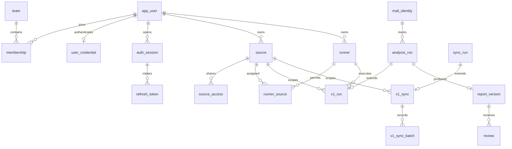

# 데이터 모델과 보존 규칙

현재 PostgreSQL schema의 논리 구조다. Supabase 배포는 `triage_private`를 사용한다. SQL 원본은 [baseline](../../src/migration.sql)과 `apps/history-api/migrations/`에 있다. 버전별 SQL은 [계정·권한](../../apps/history-api/migrations/001_identity.sql), [Runner](../../apps/history-api/migrations/002_runner.sql), [동기화](../../apps/history-api/migrations/003_sync.sql), [문서 접근 권한](../../apps/history-api/migrations/004_collection_access.sql), [사용자명 인증](../../apps/history-api/migrations/005_username_auth.sql)을 참조한다.

## 1. 주요 관계

위 관계명은 설명용이며 실제 정합성은 SQL의 외부 키와 unique 제약을 따른다.

## 2. 계정·권한

| 테이블 | 주요 키·내용 |
|---|---|
| `team` | 팀 UUID·이름 |
| `app_user` | 사용자 UUID·username·display_name·active. 과거 issuer/subject/email은 nullable 보존 |
| `membership` | `(user_id,team_id)`, admin/analyst/viewer·active |
| `user_credential` | user_id PK, Argon2id hash·must_change·temporary_until |
| `auth_session` | 세션 UUID, 사용자·제한 세션 여부·만료·폐기 시각 |
| `refresh_token` | SHA-256 token hash PK, session_id·사용 시각. 원 토큰 평문 저장 안 함 |
| `auth_throttle` | 로그인 bucket·횟수·창 시작 시각 |
| `audit_event` | actor·고정 action·대상 UUID·시각. 비밀번호·본문 기록용 아님 |

현재 런타임은 활성 membership이 둘 이상이면 모호한 주체로 거절한다. 여러 팀을 자유롭게 전환하는 제품으로 해석하지 않는다. 기존 사용자명 매핑은 UUID를 명시하며 이메일·표시 이름으로 자동 병합하지 않는다.

## 3. 출처·장치·메일 식별

| 테이블 | 주요 키·내용 |
|---|---|
| `source` | UUID, 팀·소유자, 유일한 instance_id·store_id, active |
| `source_access` | `(source_id,user_id)`, can_write. 행 존재는 공유 읽기 권한 |
| `runner` | UUID, 소유자, credential hash, 유일한 등록 request_id, Agent 목록, executor_kind=local |
| `runner_source` | 장치가 사용할 수 있는 source 목록 |
| `mail_identity` | UUID, store_id·mail_id·Message-ID·제목, 처리 완료 시각, 외부 예외 식별 필드 |
| `manual_thread_link` | 같은 저장소의 두 메일을 잇는 표시 관계. 식별자·조회 시각 보존 |
| `related_mail` | 분석 대상 메일에 명시적으로 연결한 다른 메일의 식별·metadata |

`mail_identity`의 `(store_id,mail_id)`가 기본 원본 식별 범위다. 제목만으로 자료를 합치지 않는다. 새 v1 source는 자신의 UUID를 store_id로 사용하며 기존 store 문자열은 운영자 매핑 절차로 연결한다. source 소유와 앱 admin 역할은 별개다.

## 4. 분석·보고서

`analysis_run`은 공통 실행 정보, `v1_run`은 팀/Runner 실행 계약이다. 기존 v0 실행에는 `v1_run` 행이 없을 수 있으므로 v1 이력으로 자동 공개하지 않는다.

| 테이블 | 주요 내용 |
|---|---|
| `analysis_run` | run UUID, mail_key, request_id/hash, status, parent_id/answer, lease/heartbeat·최근 진행·시각 |
| `v1_run` | run_id PK/FK, source·requested_by·target_runner, Agent, generation, claim/result requestId·result hash·취소 시각 |
| `report_version` | run_id PK/FK, 공통 결과 JSON, 생성 시각 |
| `review` | review UUID, 보고서 run_id, 유일한 request_id, 작성자·본문 |

- `one_active_mail` 부분 unique index로 같은 메일의 queued/running 분석 하나를 보장한다.
- 등록 requestId와 입력 hash를 함께 검사한다. 다른 입력·요청자가 같은 ID를 재사용하면 충돌한다.
- 결과 저장은 lease·장치·권한을 검사하고 result requestId/hash로 중복을 확인한다.
- report_version은 한 run당 한 결과다. 재분석·복구는 새 실행을 만들고 이전 결과를 덮어쓰지 않는다.
- `handled_at`은 고객 문의 처리 상태이며 분석 status와 독립적이다.

보고서 JSON은 outcome/project/report/question/knowledge/evidence를 갖는다. 메일 원문 전용 대량 복제 테이블은 아니지만 보고서·질문·답변·제목에도 업무 내용이 저장된다.

## 5. 동기화와 기존 문서

`sync_run`은 저장·실패·남음·재시도·uncertain 등 공통 상태다. `v1_sync`는 source·장치·요청·lease/generation·중지 요청을 연결한다. `v1_sync_batch`는 batch 시작과 결과 확인을 분리한다. batch의 실행 여부를 모르면 성공으로 간주하거나 새 ID로 무작정 반복하지 않는다.

기존 문서는 `legacy_document`의 namespace/path/hash/body로 보존한다. `legacy_collection`과 `legacy_collection_document`, `legacy_collection_access`가 소유·공유 경계를 정한다. `legacy_link`는 메일 연결 근거를 저장한다. `knowledge_proposal`은 문서 반영 제안이며 현재 v1 API가 ERP 파일을 자동 수정하는 구조는 아니다.

`worker_state` 등 baseline의 v0 테이블도 schema에 남아 있다. runtime 역할이 모든 테이블을 읽는 것은 아니다. 실제 hosted dump 시 이 테이블의 권한 부족을 확인했으며 앱 계정의 권한을 백업 목적으로 넓히지 않았다.

## 6. migration·권한·복원

baseline을 논리 ID `000_baseline.sql`로 적용하고 `001_identity`부터 `005_username_auth`까지 순서대로 적용한다. `schema_migration`에 파일 내용 SHA-256을 기록하며 이미 적용된 파일의 내용이 바뀌면 거절한다. 이후 변경은 새 migration으로 추가한다.

Supabase 운영자는 schema를 먼저 준비하고 별도 migration 자격으로 적용한다. API 일반 시작은 migration을 수행하지 않는다. [private-grants.sql](../../deploy/supabase/private-grants.sql)은 DDL·ledger 쓰기를 runtime에 주지 않고 보고서/감사 등 불변 영역은 제한된 권한으로 다룬다. 정확한 테이블별 권한은 SQL 원본을 따른다.

백업 시 앱 DB·메일 MCP 원본·AI 자격·로컬 outbox를 별도 대상으로 본다. DB 복원은 격리 DB에서 내용·관계·보고서 hash를 확인하고 공개 전 세션을 폐기한다. 앱 버전 롤백과 DB 데이터 롤백을 혼동하지 않는다. 현재 hosted 백업·복원은 [보류 상태](../current-status.md)다.

## 7. 후속 모델과 현재 schema의 구분

아래는 [통합 계획](../implementation-plan.md)의 미구현 모델 요구이며 이번 문서 갱신에서 migration이나 grants를 변경하지 않았다.

- 대화/메시지/결정, 편집 보고서 ID·head·불변 revision·기준 분석 참조가 필요하다. 현재 run당 결과 하나인 `report_version`과 구분하며 기존 결과를 덮어쓰지 않는다. `expectedVersion` 비교와 새 revision/head 저장은 하나의 트랜잭션으로 처리하고 충돌한 초안은 클라이언트에 보존한다.
- 구현 작업 등록부는 업무 ID·대상 repo/프로젝트·작업 종류의 활성 unique 제약, 요청 ID/입력 hash, brief/report revision, 담당자·Agent·진행 상태를 연결한다. 메일 분석의 `one_active_mail`과 별도이며 8절의 attempt/lease/발행 계약으로 확장한다.
- 업데이트 catalog에는 Release/asset 식별자·버전/채널·플랫폼·API 호환·서명/digest·제공/중단 정책과 변경 감사가 필요하다. 사용자별 제공 정책과 설치 진행 기록의 저장 범위/보존 기간은 D13에서 확정한다. GitHub 토큰을 클라이언트 조회 가능한 행에 넣지 않는다.
- 모든 추가 모델은 새 migration·최소 grants·ACL·구/신 클라이언트 호환 검증을 거친다. 앱 업데이트나 문서 변경만으로 hosted DB가 갱신되는 것은 아니다.
