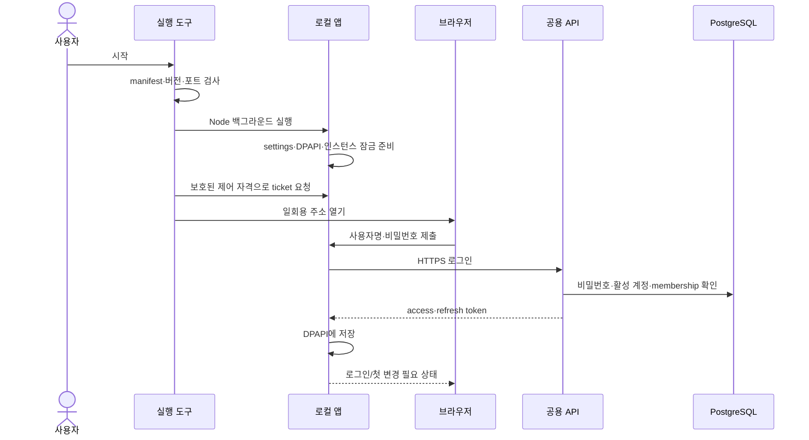
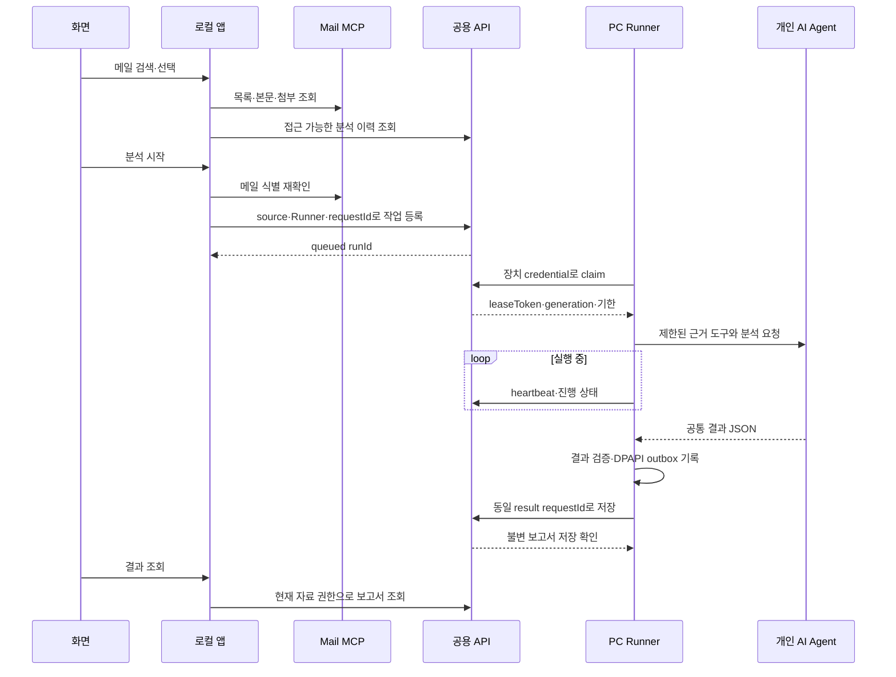
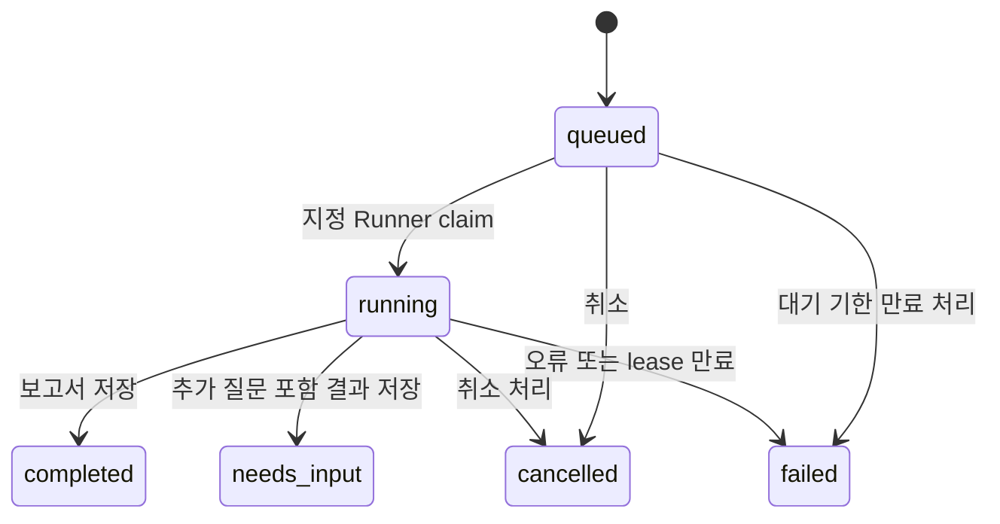

# 주요 실행 흐름

현재 사용자명 인증·로컬 Runner 기준이다. 공용 웹·원격 SR 구현·PR은 이 흐름에 아직 포함하지 않는다.

## 1. 설치·시작·로그인

임시 비밀번호로 로그인하면 비밀번호 변경 전 자료 API를 차단한다. 변경 성공 시 이전 세션을 폐기하고 새 비밀번호로 다시 로그인한다. refresh는 로컬 앱 한 프로세스가 직렬화하며, 갱신 응답 유실 시 옛 refresh token을 자동 재사용하지 않는다.

## 2. 원본·장치 등록

1. `settings.json`에서 Mail MCP·개인 Agent·읽기 자료를 준비한다.
2. 앱 계정으로 로그인하고 현재 MCP에 대응하는 source를 등록한다. 로컬 `instanceId`와 공용 `sourceId`를 연결한다.
3. 자신이 접근할 수 있는 source와 지원 Agent를 지정해 Runner를 등록한다. 장치 credential은 브라우저에 반환하지 않고 DPAPI에 저장한다.
4. source·Runner·Agent를 선택한다. 다른 사용자로 바꾸거나 출처를 바꾸면 실행 loop를 중지하고 현재 권한을 재확인한다.
5. 분석/sync loop는 명시적으로 시작한다. 등록했다고 자동 업무 분석이 시작되는 것은 아니다.

MCP 주소를 바꿔 기존 source를 재사용하려면 최대 10개 기존 메일의 ID·Message-ID·제목 대조와 같은 저장소라는 명시적 확인이 필요하다. 근거가 없으면 새 source를 등록하며 기존 공유 이력은 보존한다.

## 3. 메일 조회와 분석

동일 메일에 활성 분석은 하나다. 추가 답변은 `parentId/answer`로 이전 보고서 맥락을 전달해 새 분석을 만든다. 메일 처리 완료(`handled_at`)는 분석 완료와 별개이며, 처리 완료 상태에서는 새 분석이 거절된다. 취소 후 새 분석을 등록해도 이전 보고서를 덮어쓰지 않는다.

## 4. 작업 상태와 중복 방지

만료는 관련 서버 작업에서 확인·정리한다. Edge에 상시 sweep 타이머가 있는 것으로 가정하지 않는다. heartbeat의 취소 통지는 로컬 실행 중단에 사용하며, 늦은 결과는 현재 lease·generation·취소 상태로 다시 검사한다.

| 중복/실패 상황 | 처리 |
|---|---|
| 등록 응답 유실 | 같은 requestId·같은 입력으로 조회/재전송. 다른 입력은 충돌 |
| claim 응답 유실 | 같은 claim requestId로 회수. generation과 lease를 갱신해 이전 소유자 차단 |
| 결과 저장 응답 유실 | outbox에 기록한 같은 결과·requestId 재전송. AI 재실행 불필요 |
| 분석 중 앱 종료 | interrupted/running 기록 보존, 자동 새 분석 대신 복구 상태 확인 |
| lease 만료 후 결과 존재 | 원본 식별·권한을 다시 확인해 별도 복구 실행과 불변 보고서 생성 |
| 사용자·source·Runner 변경 | 잘못된 계정의 결과 전송 거절. 기존 receipt 삭제로 우회하지 않음 |

## 5. 메일 동기화

동기화는 분석과 별도 사용자 동작이다. 공용 API에 sync 작업 등록 → 지정 PC의 SyncRunner claim → batch 시작 기록 → Mail MCP `sync` 호출 → 결과 저장 순서다. 한 묶음은 최대 100건이며 다음 묶음을 반복한다.

사용자 중지는 현재 묶음 처리와 이미 확인한 결과를 보존한다. MCP 동기화가 수행됐는지 확정할 수 없는 실패는 `uncertain`으로 남기고 임의 재실행하지 않는다. 결과가 확보된 batch의 서버 저장 응답만 유실된 경우 같은 식별자로 결과를 재전송한다. 메일 발송·삭제·읽음 변경은 이 동기화 기능이 아니다.

## 6. 공유·원본 부재·기존 문서

source 소유자가 같은 팀 사용자에게 read/write를 부여한다. 계정의 admin 역할은 다른 사람의 source 접근을 자동 허용하지 않는다. 조회 API뿐 아니라 목록·검색·건수·export·리뷰에도 권한을 확인한다.

PC B에 PC A의 MCP 원본이 없어도 공유 보고서는 조회할 수 있다. 본문·첨부를 조회하려면 현재 PC에서 검증된 원본 연결이 있어야 한다. 제목 일치로 메일이나 기존 문서를 자동 병합하지 않는다. 기존 문서는 collection 귀속·명시적 연결 근거를 확인한 후 공유한다.

## 7. 종료·업데이트·복원

| 동작 | 결과 |
|---|---|
| 브라우저 닫기 | 화면만 닫힘. 앱과 이미 시작한 loop는 계속 동작 가능 |
| 로그아웃 | loop 중지, 로컬 세션 정리, 서버 세션 폐기 요청. 통신 실패 시 서버 폐기는 확인되지 않을 수 있음 |
| 앱 정상 종료 | loop→HTTP listener→제어 정보→잠금 정리. 설정·세션·outbox는 보존 |
| PC 절전·종료 | 해당 PC의 실행 중단. 복귀 후 상태 확인 필요 |
| 앱 업데이트 | 실행 중에는 거절. 새 버전 진단 후 active 전환, 개인 상태 보존 |
| 앱 버전 롤백 | 설치 코드 버전만 전환. 공용 DB를 이전 상태로 되돌리지 않음 |
| DB 복원 | 별도 운영 절차. 격리 복원·내용 대조·세션 폐기 필요. 현재 hosted 백업은 보류 |

실제 명령은 [Windows 안내](operations/windows.md), API 세부 계약은 [API 문서](reference/api.md)를 본다.
